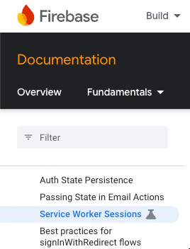

# 1. Remix / React Router の SPAモードの利用について

Date: 2025-03-11

# Context

- Remix / React Router / Firebase Authについて
  - 認証は安価かつある程度慣れているFirebase Authを使いたい
  - RemixのSSRでFirebase Authを利用するためにはFirebaseのSessionCookie機能を使うのが王道と思うが、これは最長2週間でログアウトされてしまうためUXがやや悪い
  - RemixのSSRでFirebase+JWTを利用するためにはServiceWorkerを使う必要がある(一方でSPAモードなら手軽にJWTを扱える)
  - [実際にRemix+ServiceWorkerを実装してみた](https://github.com/ToyB0x/in-put.dev/blob/10570d9bfe905b43d8a4a069a157a5f2c9a96337/apps/web/vite.config.ts#L50-L80)が、設定が複雑な上にServiceWorkerの実行タイミングやコード更新の反映挙動が直感的ではなくバグを作り込みやすい印象がある
  - Remix / React Router がフレームワークとして公式ドキュメントなどでServiceWorkerのサポートをしっかりしているというわけではない
  - 一方でRemix / React Router の公式ドキュメントではSPAモードの説明がある程度しっかり記載されている
  - ADR執筆時点で、FirebaseとしてはServiceWorker機能は実験的機能で今後の運用にやや不安がある  
    (Firebaseのメニューで実験的を意味するアイコンがついている)

# Decision

- ひとまずRemix / React Router の SPAモードで開発を行う
- しかし、必要に応じてSSRにも戻れるよう配慮されたコードを書く

## Notes

- Hono RPC + ClientLoader 等を使えば、SPAモードでもRemix / React Router の SSR に近い書き味で開発できるかもしれない
