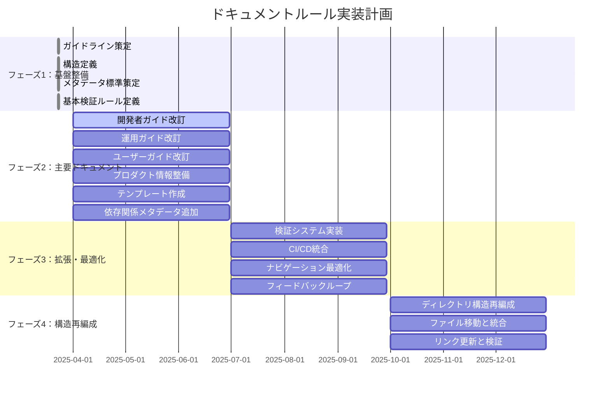

# ドキュメントルールの適用計画

**更新日**: 2025/3/23
**確認日**: 2025/3/23

## 目的

- ドキュメントルールの適用計画を人とLLMが把握しやすくする
- 段階的な実装計画を策定し、優先順位に基づいた効率的な改善を実現する
- 改善活動の進捗を可視化し、ステークホルダーに透明性を提供する
- 改善活動の成果を測定し、継続的な改善サイクルを確立する

## 実装計画の策定

### フェーズ分け

ドキュメント改善を以下のフェーズに分けて段階的に実施します：

## 実装フェーズ

### フェーズ1: 基盤整備 (完了)

- [x] ドキュメントガイドラインの策定
  - [x] 基本方針の策定 (docs/README.md)
  - [x] ドキュメント種別の定義 (docs/rules/types.md)
  - [x] ドキュメント配置構造の定義 (docs/rules/structure.md)
  - [x] ドキュメントリンク方法の定義 (docs/rules/links.md)
- [x] メタデータ標準の策定
  - [x] メタデータ標準の定義 (docs/rules/documents/metadata.md)
- [x] 基本的な検証ルールの定義
  - [x] ドキュメント検証システムの定義 (docs/rules/validation.md)

### フェーズ2: 主要ドキュメントの整備 (2025/04/01 - 2025/06/30)

- [ ] 開発者ガイドの改訂
  - [ ] `docs/guide/developer/README.md`の作成
  - [ ] `docs/guide/developer/getting-started/README.md`の作成
  - [ ] `docs/guide/developer/development-flow/README.md`の作成
  - [ ] `docs/guide/developer/packages/README.md`の作成
  - [ ] `docs/guide/developer/architecture/README.md`の作成
  - [ ] `docs/guide/developer/architecture/adr/README.md`の作成
- [ ] 運用ガイドの改訂
  - [ ] `docs/guide/operator/README.md`の作成
  - [ ] `docs/guide/operator/deployment/README.md`の作成
  - [ ] `docs/guide/operator/monitoring/README.md`の作成
  - [ ] `docs/guide/operator/maintenance/README.md`の作成
- [ ] ユーザーガイドの改訂
  - [ ] `docs/guide/users/README.md`の作成
  - [ ] `docs/guide/users/basics/README.md`の作成
  - [ ] `docs/guide/users/integration/README.md`の作成
- [ ] プロダクト情報の整備
  - [ ] `docs/product/README.md`の作成
  - [ ] `docs/product/vision.md`の作成
  - [ ] `docs/product/product-goal.md`の作成
  - [ ] `docs/product/value-proposition.md`の作成
  - [ ] `docs/product/members.md`の作成
  - [ ] `docs/product/features/README.md`の作成
- [ ] テンプレートの作成
  - [ ] 各ドキュメント種別のテンプレート作成
  - [ ] テンプレート使用ガイドラインの作成
- [ ] 依存関係メタデータの追加
  - [ ] 既存の主要ドキュメントに依存関係メタデータを追加

### フェーズ3: 拡張と最適化 (2025/07/01 - 2025/09/30)

- [ ] 検証システムの完全実装
  - [ ] メタデータ検証ルールの実装
  - [ ] リンク切れチェックの実装
  - [ ] ドキュメント構造の検証ルールの実装
- [ ] CI/CDパイプラインへの統合
  - [ ] コミット前フックの実装
  - [ ] CI/CDパイプラインでの検証実装
- [ ] ナビゲーション構造の最適化
  - [ ] 相互参照の最適化（既存ドキュメントへの相互参照追加）
- [ ] フィードバックループの確立
  - [ ] ドキュメント品質評価プロセスの確立
  - [ ] ユーザーフィードバック収集の仕組み構築

### フェーズ4: ドキュメント構造の再編成 (2025/10/01 - 2025/12/31)

- [x] ドキュメント構造の再編成 (一部完了)
  - [x] 各ルールを専用ディレクトリに移動し、README.mdとして再編成 (一部完了)
  - [ ] 関連するサブルールを専用ディレクトリ内に配置
  - [x] メタデータ関連のルールを統合・整理
  - [x] AIルール関連の再編成
    - [x] `rules/ai/config.md`と`docs/rules/ai/config-files.md`を後者に統合
    - [x] `docs/rules/ai/meta-directory.md` を `docs/rules/ai/index.md` にリネーム
    - [x] `docs/rules/ai/tools`に`README.md`を作成
  - [ ] ドキュメント関連の再編成

## 優先順位付けの基準

1. **影響範囲**: より多くのステークホルダーに影響するドキュメントを優先
2. **更新頻度**: 頻繁に参照・更新されるドキュメントを優先
3. **技術的依存**: 他のドキュメントから多く参照されるドキュメントを優先
4. **実装容易性**: 短期間で大きな改善が見込める項目を初期に実施

## 実装計画のガントチャート

## 実装計画の進捗管理

- 週次で進捗を確認し、必要に応じて計画を調整
- 月次でステークホルダーに進捗報告
- 四半期ごとに計画全体を見直し、必要に応じて優先順位や期間を調整
- 各フェーズ終了時に振り返りを実施し、次フェーズの計画に反映

## 成功指標

- **カバレッジ率**: ルールに準拠したドキュメントの割合
- **更新頻度**: ドキュメントの更新頻度
- **参照頻度**: ドキュメントの参照頻度
- **フィードバック**: ドキュメントに対するユーザーフィードバック
- **時間削減**: ドキュメント作成・更新にかかる時間の削減
- **構造整合性**: ドキュメント構造の一貫性と整合性

## AIインストラクション

このルールを読んだAIは以下の行動をとってください：

- 最新のドキュメントガイドライン（`docs/README.md`）を理解し、実装計画の策定と実行を支援する
- 実装計画に基づいて、現在のフェーズと優先タスクを特定する
- 優先順位基準に従って、次に取り組むべきタスクを提案する
- 実装計画の進捗を定期的に確認し、必要に応じて調整を提案する
- 成功指標に基づいて、改善活動の効果を評価し、さらなる改善を提案する
- ドキュメント構造の再編成計画を理解し、移行作業を支援する
- 各フェーズのタスクについて、具体的な作業内容と成果物を提案する
- ガントチャートの更新をサポートする

## Changelog

- 2025/3/23: [変更] フェーズ2, 3, 4のタスクと日付を更新
- 2025/3/23: [変更] ガントチャートを更新
- 2025/3/23: [変更] AIインストラクションを更新
- 2025/3/23: [追加] フェーズ4：ドキュメント構造の再編成を追加
- 2025/3/23: [追加] メタデータを追加
- 2025/3/23: [変更] ドキュメントリンク方法の定義を追加
- 2025/3/20: 初回作成