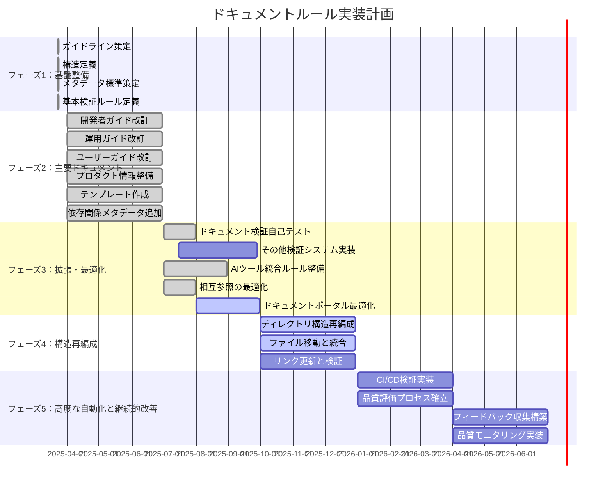

# ドキュメントルールの適用計画

**更新日**: 2025/3/23
**確認日**: 2025/3/23

## 目的

- ドキュメントルールの適用計画を人とLLMが把握しやすくする。
- 段階的な実装計画を策定し、効率的な改善を実現する。
- 改善活動の進捗を可視化し、透明性を提供する。
- 改善活動の成果を測定し、継続的な改善サイクルを確立する。

## 実装計画

### フェーズ分け

ドキュメント改善を以下のフェーズに分けて段階的に実施します：

### 実装フェーズ

#### フェーズ1: 基盤整備 (完了)

- [x] ドキュメントガイドラインの策定
  - [x] 基本方針の策定 (docs/README.md)
  - [x] ドキュメント種別の定義 (docs/rules/types.md)
  - [x] ドキュメント配置構造の定義 (docs/rules/structure.md)
  - [x] ドキュメントリンク方法の定義 (docs/rules/links.md)
- [x] メタデータ標準の策定
  - [x] メタデータ標準の定義 (docs/rules/documents/metadata.md)
- [x] 基本的な検証ルールの定義
  - [x] ドキュメント検証システムの定義 (docs/rules/validation.md)

#### フェーズ2: 主要ドキュメントの整備 (2025/04/01 - 2025/06/30)

- [x] 開発者ガイドの改訂
  - [x] `docs/guide/developer/README.md`の作成
  - [x] `docs/guide/developer/getting-started/README.md`の作成
  - [x] `docs/guide/developer/development-flow/README.md`の作成
  - [x] `docs/guide/developer/packages/README.md`の作成
  - [x] `docs/guide/developer/architecture/README.md`の作成
  - [x] `docs/guide/developer/architecture/adr/README.md`の作成
- [x] 運用ガイドの改訂
  - [x] `docs/guide/operator/README.md`の作成
  - [x] `docs/guide/operator/deployment/README.md`の作成
  - [x] `docs/guide/operator/monitoring/README.md`の作成
  - [x] `docs/guide/operator/maintenance/README.md`の作成
- [x] ユーザーガイドの改訂
  - [x] `docs/guide/users/README.md`の作成
  - [x] `docs/guide/users/basics/README.md`の作成
  - [x] `docs/guide/users/integration/README.md`の作成
- [x] プロダクト情報の整備
  - [x] `docs/product/README.md`の作成
  - [x] `docs/product/vision.md`の作成
  - [x] `docs/product/product-goal.md`の作成
  - [x] `docs/product/value-proposition.md`の作成
  - [x] `docs/product/members.md`の作成
  - [x] `docs/product/features/README.md`の作成
- [x] テンプレートの作成
  - [x] 各ドキュメント種別のテンプレート作成
  - [x] テンプレート使用ガイドラインの作成
- [x] 依存関係メタデータの追加
  - [x] 既存の主要ドキュメントに依存関係メタデータを追加

#### フェーズ3: 拡張と最適化 (2025/07/01 - 2025/09/30)

- [x] 検証システムの完全実装
  - [x] ドキュメント検証システムの自己テストの整備
    - [x] `docs/rules/self-check/README.md`の作成
    - [x] テストケースディレクトリとファイルの作成（機能仕様書、API仕様書など）
    - [x] 検証プロセスの実装（個別ドキュメント検証、複数パターン横断検証）
    - [x] 自己評価機能の実装（理解度スコア算出、改善点特定）
  - [ ] メタデータ検証ルールの実装
    - [ ] `docs/rules/documents/metadata.md`の拡張（検証ルール追加）
    - [ ] メタデータフィールドの必須チェック機能の実装
    - [ ] メタデータフォーマットの検証機能の実装
  - [ ] リンク切れチェックの実装
    - [ ] `docs/rules/links.md`の拡張（検証ルール追加）
    - [ ] 相対パスリンクの検証機能の実装
    - [ ] 外部リンクの検証機能の実装
  - [ ] ドキュメント構造の検証ルールの実装
    - [ ] `docs/rules/structure.md`の拡張（検証ルール追加）
    - [ ] ディレクトリ構造の検証機能の実装
    - [ ] ファイル命名規則の検証機能の実装
- [x] AIツール統合のためのルール整備
  - [x] .clinerules ファイルの実装
    - [x] バリデーションすべき項目一覧と概要の定義
    - [x] Cline/RooCode向け自動読み込みルールの実装
  - [ ] AIツールでのチェック方法の定義
    - [ ] `docs/rules/validation.md`の拡張（AIツールでのチェック部分の追加）
    - [ ] チェック結果の解釈と対応方法の定義
- [x] ナビゲーション構造の最適化
  - [x] 相互参照の最適化（既存ドキュメントへの相互参照追加）
  - [ ] ドキュメントポータルの最適化
    - [ ] `docs/index.md`の作成
    - [ ] カテゴリ別ナビゲーションの実装

#### フェーズ4: ドキュメント構造の再編成 (2025/10/01 - 2025/12/31)

- [ ] ドキュメント構造の再編成
  - [ ] 関連するサブルールを専用ディレクトリ内に配置
  - [x] メタデータ関連のルールを統合・整理 (`rules/documents/metadata.md`と`rules/documents/meta-data.md`を統合完了)
  - [x] AIルール関連の再編成
    - [x] `rules/ai/config.md`と`docs/rules/ai/config-files.md`を後者に統合
    - [x] `docs/rules/ai/meta-directory.md` を `docs/rules/ai/index.md` にリネーム
    - [x] `docs/rules/ai/tools`に`README.md`を作成

#### フェーズ5: 高度な自動化と継続的改善 (2026/01/01 - 2026/06/30)

- [ ] CI/CDパイプラインでの検証実装
  - [ ] `docs/rules/validation.md`の拡張（CI/CD部分の追加）
  - [ ] GitHub Actionsワークフローの実装
  - [ ] 自動検証レポートの生成機能の実装
  - [ ] 修正提案の自動生成機能の実装
- [ ] フィードバックループの確立
  - [ ] ドキュメント品質評価プロセスの確立
    - [ ] `docs/rules/validation.md`の拡張（品質評価プロセス部分の追加）
    - [ ] 評価基準と評価方法の定義
    - [ ] 評価結果の記録と共有方法の定義
    - [ ] 改善アクションの特定と優先順位付けプロセスの定義
  - [ ] ユーザーフィードバック収集の仕組み構築
    - [ ] `docs/rules/documents/relations.md`の拡張（フィードバック関連部分の追加）
    - [ ] フィードバック収集チャネルの定義
    - [ ] フィードバックテンプレートの作成
    - [ ] フィードバック分析と対応プロセスの定義
- [ ] ドキュメント品質の継続的モニタリング
  - [ ] 品質メトリクスの定義と測定方法の確立
  - [ ] ダッシュボードの実装
  - [ ] 定期的なレポート生成の自動化

## 優先順位付け

1. **影響範囲**: より多くの関係者に影響するドキュメントを優先
2. **更新頻度**: 頻繁に参照・更新されるドキュメントを優先
3. **技術的依存**: 他のドキュメントから多く参照されるドキュメントを優先
4. **実装容易性**: 短期間で大きな改善が見込める項目を初期に実施

## ガントチャート

## 進捗管理

- 週次で進捗を確認し、必要に応じて計画を調整する。
- 月次で関係者に進捗を報告する。
- 四半期ごとに計画全体を見直し、必要に応じて優先順位や期間を調整する。
- 各フェーズ終了時に振り返りを実施し、次フェーズの計画に反映する。

## 成功指標

- **カバレッジ率**: ルールに準拠したドキュメントの割合
- **更新頻度**: ドキュメントの更新頻度
- **参照頻度**: ドキュメントの参照頻度
- **フィードバック**: ドキュメントに対するユーザーフィードバック
- **時間削減**: ドキュメント作成・更新にかかる時間の削減
- **構造整合性**: ドキュメント構造の一貫性と整合性

## AIインストラクション

この計画を読んだAIは、以下の行動をとってください：

- 最新のドキュメントガイドライン（`docs/README.md`）を理解し、実装計画の策定と実行を支援する。
- ドキュメントシステムの3層構造（ガイドライン、ルール、検証システム）を理解し、各層の役割と関係性を把握する。
- 実装計画に基づいて、現在のフェーズと優先タスクを特定する。
- 優先順位に従って、次に取り組むべきタスクを提案する。
- 実装計画の進捗を定期的に確認し、必要に応じて調整を提案する。
- 成功指標に基づいて、改善活動の効果を評価し、さらなる改善を提案する。
- ドキュメント構造の再編成計画を理解し、移行作業を支援する。
- 各フェーズのタスクについて、具体的な作業内容と成果物を提案する。
- ガントチャートの更新をサポートする。
- 人間との協働を前提とし、それぞれの強みを活かした役割分担を意識する。

## メタデータ

**更新・確認情報**:
- 最終更新日: 2025/03/23 14:19
- 最終確認日: 2025/03/23

**文書情報**:
- ステータス: 承認済み
- バージョン: 1.0.0

## 関連ドキュメント

- [ドキュメントガイドライン](../README.md)
- [ドキュメントルール](./rules/README.md)
- [ドキュメントルールの適用状況](./PROGRESS.md)
## Changelog
- 2025/3/23: [更新] AIツール統合のためのルール整備の「.clinerules ファイル」のRepomixに関する記述を簡潔にし、詳細は専用ドキュメントを参照するように変更
- 2025/3/23: [更新] AIツール統合のためのルール整備の「.clinerules ファイルの実装」を再実装し、マークダウン形式でAIの知識のエントリポイントとして機能するように変更し、不要な`docs/rules/ai/clinerules.md`ファイルを削除
- 2025/3/23: [更新] AIツール統合のためのルール整備の「.clinerules ファイルの実装」を再実装し、YAMLフォーマットでAIツール連携機能を強化
- 2025/3/23: [完了] AIツール統合のためのルール整備の「.clinerules ファイルの実装」を完了し、ガントチャートを更新
- 2025/3/23: [完了] フェーズ3の検証システム実装に「ドキュメント検証システムの自己テスト」を完了し、ガントチャートを更新
- 2025/3/23: [完了] フェーズ3の検証システム実装に「ドキュメント検証システムの自己テスト」を完了し、ガントチャートを更新
- 2025/3/23: [変更] 「CI/CDパイプラインへの統合」を「AIツール統合のためのルール整備」に変更し、.clinerules ファイルの実装に焦点を当てる
- 2025/3/23: [変更] 「CI/CDパイプラインへの統合」を「AIツール統合のためのルール整備」に変更し、.clinerules ファイルの実装に焦点を当てる
- 2025/3/23: [変更] 「CI/CDパイプラインへの統合」を「AIツール統合のためのルール整備」に変更し、.clinerules ファイルの実装に焦点を当てる
- 2025/3/23: [追加] フェーズ5「高度な自動化と継続的改善」を追加し、CI/CD検証実装とフィードバックループ確立を移動
- 2025/3/23: [修正] 検証システム実装、フィードバックループ確立のタスクを既存ファイル拡張方式に変更
- 2025/3/23: [更新] フェーズ3のタスク詳細を追加し、相互参照の最適化を完了としてマーク
- 2025/3/23: [更新] ガントチャートを更新し、フェーズ3のタスクスケジュールを詳細化
- 2025/3/23: [追加] 関連ドキュメントセクションにドキュメントルールへのリンクを追加
- 2025/3/23: [変更] フェーズ2のタスクを完了としてマーク
- 2025/3/23: [変更] ガントチャートを更新
- 2025/3/23: [追加] メタデータと関連ドキュメントセクションを追加
- 2025/3/23: [変更] フェーズ2, 3, 4のタスクと日付を更新
- 2025/3/23: [変更] AIインストラクションを更新
- 2025/3/23: [追加] フェーズ4：ドキュメント構造の再編成を追加
- 2025/3/23: [追加] メタデータを追加
- 2025/3/23: [変更] ドキュメントリンク方法の定義を追加
- 2025/3/20: 初回作成