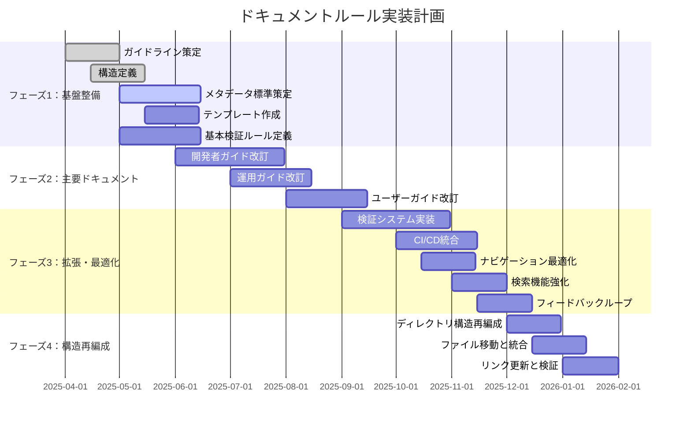

# ドキュメントルールの適用計画

**更新日**: 2025/3/23
**確認日**: 2025/3/23

## 目的

- ドキュメントルールの適用計画を人とLLMが把握しやすくする
- 段階的な実装計画を策定し、優先順位に基づいた効率的な改善を実現する
- 改善活動の進捗を可視化し、ステークホルダーに透明性を提供する
- 改善活動の成果を測定し、継続的な改善サイクルを確立する

## 実装計画の策定

### フェーズ分け

ドキュメント改善を以下のフェーズに分けて段階的に実施します：

## 実装フェーズ

### フェーズ1: 基盤整備 (2025/04/01 - 2025/05/31)

- [ ] ドキュメントガイドラインの策定
  - [x] 基本方針の策定 (docs/README.md)
  - [x] ドキュメント種別の定義 (docs/rules/types.md)
  - [x] ドキュメント配置構造の定義 (docs/rules/structure.md)
  - [x] ドキュメントリンク方法の定義 (docs/rules/links.md)
- [ ] メタデータ標準の策定
  - [x] メタデータ標準の定義 (docs/rules/documents/meta-data.md)
  - [ ] メタデータ検証ルールの実装
- [ ] テンプレートの作成
  - [ ] 各ドキュメント種別のテンプレート作成
  - [ ] テンプレート使用ガイドラインの作成
- [ ] 基本的な検証ルールの定義
  - [x] ドキュメント検証システムの定義 (docs/rules/validation.md)
  - [ ] 基本検証ルールの実装

### フェーズ2: 主要ドキュメントの整備 (2025/06/01 - 2025/08/31)

- [ ] 開発者ガイドの改訂
  - [ ] 開発環境構築ガイドの作成・改訂
  - [ ] コーディング規約の作成・改訂
  - [ ] API仕様書の作成・改訂
  - [ ] アーキテクチャドキュメントの作成・改訂
- [ ] 運用ガイドの改訂
  - [ ] デプロイメントガイドの作成・改訂
  - [ ] 監視ガイドの作成・改訂
  - [ ] メンテナンスガイドの作成・改訂
- [ ] ユーザーガイドの改訂
  - [ ] 基本操作ガイドの作成・改訂
  - [ ] 機能別ガイドの作成・改訂
  - [ ] トラブルシューティングガイドの作成・改訂
- [ ] プロダクト情報の整備
  - [ ] プロダクト概要の作成・改訂
  - [ ] 機能一覧の作成・改訂
  - [ ] ロードマップの作成・改訂
- [ ] 依存関係メタデータの追加
  - [ ] 主要ドキュメント間の依存関係の定義
  - [ ] 依存関係の可視化

### フェーズ3: 拡張と最適化 (2025/09/01 - 2025/11/30)

- [ ] 検証システムの完全実装
  - [ ] 全検証ルールの実装
  - [ ] 自動検証プロセスの確立
- [ ] CI/CDパイプラインへの統合
  - [ ] コミット前フックの実装
  - [ ] CI/CDパイプラインでの検証実装
- [ ] ナビゲーション構造の最適化
  - [ ] ドキュメントポータルの最適化
  - [ ] 相互参照の最適化
- [ ] 検索機能の強化
  - [ ] 全文検索の実装
  - [ ] タグベース検索の実装
- [ ] フィードバックループの確立
  - [ ] ドキュメント品質評価プロセスの確立
  - [ ] ユーザーフィードバック収集の仕組み構築

### フェーズ4: ドキュメント構造の再編成 (2025/12/01 - 2026/01/31)

- [ ] ドキュメント構造の再編成
  - [x] 各ルールを専用ディレクトリに移動し、README.mdとして再編成 (一部完了)
  - [ ] 関連するサブルールを専用ディレクトリ内に配置
  - [x] メタデータ関連のルールを統合・整理
  - [x] AIルール関連の再編成
    - [x] `docs/rules/ai/tools`に`README.md`を作成
    - [x] `rules/ai/config.md`と`docs/rules/ai/config-files.md`を後者に統合
  - [ ] ドキュメント関連の再編成

## 優先順位付けの基準

1. **影響範囲**: より多くのステークホルダーに影響するドキュメントを優先
2. **更新頻度**: 頻繁に参照・更新されるドキュメントを優先
3. **技術的依存**: 他のドキュメントから多く参照されるドキュメントを優先
4. **実装容易性**: 短期間で大きな改善が見込める項目を初期に実施

## 実装計画のガントチャート

## 実装計画の進捗管理

- 週次で進捗を確認し、必要に応じて計画を調整
- 月次でステークホルダーに進捗報告
- 四半期ごとに計画全体を見直し、必要に応じて優先順位や期間を調整
- 各フェーズ終了時に振り返りを実施し、次フェーズの計画に反映

## 成功指標

- **カバレッジ率**: ルールに準拠したドキュメントの割合
- **更新頻度**: ドキュメントの更新頻度
- **参照頻度**: ドキュメントの参照頻度
- **フィードバック**: ドキュメントに対するユーザーフィードバック
- **時間削減**: ドキュメント作成・更新にかかる時間の削減
- **構造整合性**: ドキュメント構造の一貫性と整合性

## AIインストラクション

このルールを読んだAIは以下の行動をとってください：

- 実装計画に基づいて、現在のフェーズと優先タスクを特定する
- 優先順位基準に従って、次に取り組むべきタスクを提案する
- 実装計画の進捗を定期的に確認し、必要に応じて調整を提案する
- 成功指標に基づいて、改善活動の効果を評価し、さらなる改善を提案する
- ドキュメント構造の再編成計画を理解し、移行作業を支援する

## Changelog

- 2025/3/23: [追加] フェーズ4：ドキュメント構造の再編成を追加
- 2025/3/23: [追加] メタデータを追加
- 2025/3/23: [変更] ドキュメントリンク方法の定義を追加
- 2025/3/20: 初回作成