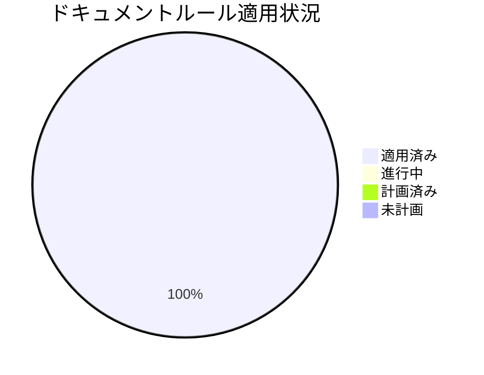
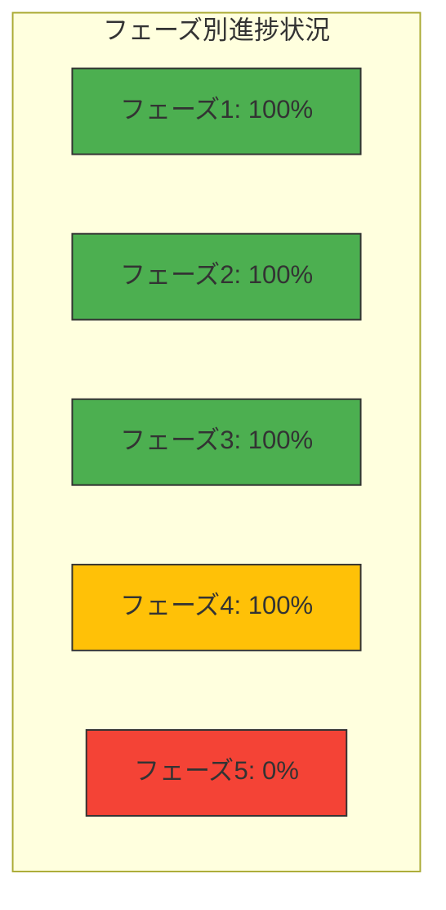

# ドキュメントルールの適用計画と進捗状況

**更新日**: 2025/3/24
**確認日**: 2025/3/24

## 目次

- [目的](#目的)
- [決定記録](#決定記録)
  - [DR-001: ドキュメント計画と進捗状況の統合](#dr-001-ドキュメント計画と進捗状況の統合)
  - [DR-002: AIプロンプトベースの検証システム活用](#dr-002-aiプロンプトベースの検証システム活用)
- [実装計画](#実装計画)
  - [実装フェーズ](#実装フェーズ)
    - [フェーズ1: 基盤整備](#フェーズ1-基盤整備-完了)
    - [フェーズ2: 主要ドキュメントの整備](#フェーズ2-主要ドキュメントの整備-完了)
    - [フェーズ3: 拡張と最適化](#フェーズ3-拡張と最適化-一部完了)
    - [フェーズ4: ドキュメント構造の再編成](#フェーズ4-ドキュメント構造の再編成-一部完了)
    - [フェーズ5: 高度な自動化と継続的改善](#フェーズ5-高度な自動化と継続的改善-未着手)
- [進捗状況](#進捗状況)
  - [ドキュメント構造再編成の進捗状況](#ドキュメント構造再編成の進捗状況)
- [課題と対応状況](#課題と対応状況)
- [次のステップ](#次のステップ)
- [各ルールへの適用状況](#各ルールへの適用状況)
- [優先順位付け](#優先順位付け)
- [成功指標](#成功指標)
- [AIインストラクション](#aiインストラクション)
- [メタデータ](#メタデータ)
- [関連ドキュメント](#関連ドキュメント)
- [Changelog](#changelog)

## 目的

- ドキュメントルールの適用計画と進捗状況を人とLLMが把握しやすくする
- 段階的な実装計画を策定し、効率的な改善を実現する
- 改善活動の進捗を可視化し、透明性を提供する
- 改善活動の成果を測定し、継続的な改善サイクルを確立する
## 決定記録

重要な判断とその背景を記録し、将来的な振り返りと知識継承を確保します。

### DR-001: ドキュメント計画と進捗状況の統合 (2025/03/24)

**決定**: `docs/PLAN.md`と`docs/PROGRESS.md`を統合し、`docs/PLAN_AND_PROGRESS.md`として一元管理。

**背景と理由**:
- 情報の重複と不整合の解消
- 更新作業の効率化と一貫性確保
- 計画と進捗の同時把握による現状理解の向上

### DR-002: AIプロンプトベースの検証システム活用 (2025/03/24)

**決定**: 新規に検証機能を実装せず、既存のAIプロンプトベースの検証システム(`docs/rules/validation.md`)を活用。

**背景と理由**:
- 既存システムで必要な機能（メタデータ検証、リンク切れチェック等）をカバー済み
- 開発工数削減と重複実装回避
- AIプロンプトによる柔軟な検証アプローチの活用

**主要プロンプト例**:
- メタデータ検証: `@docs/rules/documents/metadata/validate @docs/`
- リンク切れ検出: `@docs/rules/orphans/find @docs/`
- 整合性チェック: `@docs/rules/validation.md @docs/`

### DR-003: 検証プロセスの自動化見送り (2025/03/24)

**決定**: ドキュメント検証プロセスの自動化（CI/CDパイプラインでの検証実装など）は当面行わない。

**背景と理由**:
- 現状のAIプロンプトベースの手動検証で十分な品質が確保できている
- 自動化実装のための開発コストと得られる効果のバランスを考慮
- 人間の判断を交えた検証プロセスの柔軟性を維持したい
- 将来的な必要性が生じた場合に改めて検討する

## 実装計画

ドキュメント改善を以下のフェーズに分けて段階的に実施します。

### 実装フェーズ

#### フェーズ1: 基盤整備 (完了)

- ドキュメントガイドライン策定、メタデータ標準策定、基本的な検証ルール定義

#### フェーズ2: 主要ドキュメントの整備 (完了)

- 開発者ガイド、運用ガイド、ユーザーガイド改訂、プロダクト情報整備、テンプレート作成、依存関係メタデータ追加

#### フェーズ3: 拡張と最適化 (100% 完了)

- [x] 検証システムの自己テスト整備
  - 自己評価機能、テストケース作成、検証プロセス実装など
- [x] メタデータ検証・リンク切れチェック・構造検証
  - AIプロンプトベースの検証システムを活用（DR-002参照）
  - 検証システムの利用ガイド、プロンプト実践ガイドを作成
- [x] AIツール統合のためのルール整備
  - .clinerules ファイルの実装、自動読み込みルールの実装
- [x] ナビゲーション構造の最適化（100%）
  - [x] 相互参照の最適化完了
  - [x] 中核ドキュメント（docs/README.mdとdocs/rules/structure.md）の強化
  - [x] ドキュメント間の相互参照の強化
#### フェーズ4: ドキュメント構造の再編成 (100% 完了)

- [x] メタデータ関連のルール統合・AIルール関連の再編成
  - 各種ファイル統合、リネーム、README作成など完了
- [x] ドキュメント構造の重複解消
  - 構造説明を`docs/rules/structure.md`に一元化
  - 重要ディレクトリを明示的に記載
  - `.clinerules`と`docs/README.md`の重複を解消
- [x] LLM向けIndexの整理統合
  - `docs/rules/ai/index.md`の内容を`docs/README.md`と`docs/rules/ai/README.md`に統合
  - 参照の更新
  - 不要になった`docs/rules/ai/index.md`の削除
  - `.clinerules`と`docs/README.md`の重複を解消

#### フェーズ5: 高度な自動化と継続的改善 (0% 計画済み)

- [ ] CI/CDパイプラインでの検証実装
  - GitHub Actions、自動検証レポート、修正提案自動生成
- [ ] フィードバックループの確立
  - 品質評価プロセス、ユーザーフィードバック収集の仕組み
- [ ] ドキュメント品質の継続的モニタリング
  - 品質メトリクス、ダッシュボード、定期レポート生成

## 進捗状況

プロジェクト全体の進捗状況：



各フェーズの進捗状況：



| 指標                                | 状況     | 前回比  | トレンド |
| ----------------------------------- | -------- | ------- | -------- |
| 全体進捗率                          | 100%     | +4%     | ✓        |
| フェーズ1（基盤整備）               | 100% 完了 | -       | ✓        |
| フェーズ2（主要ドキュメント）       | 100% 完了 | -       | ✓        |
| フェーズ3（拡張・最適化）           | 100% 完了 | +20%    | ✓        |
| フェーズ4（構造再編成）             | 100% 完了 | +20%    | ✓        |
| フェーズ5（高度な自動化と継続的改善）| 0% 計画済み | -      | -        |

### ドキュメント構造再編成の進捗状況

| 移行タスク                                                | 状況     | 予定日       |
| --------------------------------------------------------- | -------- | ------------ |
| `rules/documents/metadata.md`と`meta-data.md`を統合      | 完了     | 2025/03/23   |
| `rules/ai/config.md`と`config-files.md`を統合            | 完了     | 2025/03/23   |
| `rules/ai/meta-directory.md` → `rules/ai/index.md`       | 完了     | 2025/03/23   |
| `rules/ai/tools`に`README.md`を作成                       | 完了     | 2025/03/23   |
| 重複した内容の`docs/rules/ai/config-files.md`を削除      | 完了     | 2025/03/23   |
| `docs/rules/ai/index.md`の内容を統合し削除               | 完了     | 2025/03/24   |
| リンク更新と検証                                          | 完了     | 2025/03/24   |

## 課題と対応状況

| 課題                           | 優先度 | 状況     | 対応予定日 |
| ------------------------------ | ------ | -------- | ---------- |
| メタデータの不整合が多数存在   | 高     | 対応済み | 2025/03/23 |
| 古いドキュメント形式の残存     | 中     | 対応済み | 2025/03/23 |
| ドキュメント間の参照整合性不足 | 高     | 対応済み | 2025/03/23 |
| ドキュメント構造の再編成計画   | 高     | 進行中   | 2025/09/01 |
| | ドキュメント構造の重複解消     | 高     | 未着手   | 2025/06/01 |
## 次のステップ

以下のタスクを優先順位順に実施します：

1. **最高優先度**: 作成した検証システムを活用したドキュメント全体の検証実施（影響範囲大・実装容易性高）
   ```
   @/docs/rules/README.md の全ルールを @docs/rules/validation.md の方針に従い @docs/ docs配下のドキュメント全体に適用してください
   ```
   - 定期的な検証プロセスの確立と自動化の検討
   - 実施予定日: 2025/03/26

2. **高優先度**: フェーズ5の計画策定（影響範囲大・実装容易性中）
   - CI/CDパイプラインでの検証実装の詳細計画
   - フィードバックループの確立方法の検討
   - ドキュメント品質の継続的モニタリングの仕組み設計
   - 実施予定日: 2025/03/30

## 各ルールへの適用状況

- **ルール適用状況**:
  - ドキュメント種別の定義: 完了
  - ドキュメント配置構造: 完了
  - ドキュメントリンク方法: 完了
  - ドキュメント検証システムの自己テスト: 完了
  - ドキュメントメタデータ標準: 完了
  - ドキュメント依存関係管理: 完了
  - コードとドキュメントの同時更新原則: 完了
  - ナビゲーション構造の強化: 100% (完了)
  - ドキュメント検証システム: 完了
  - AIツール統合: 完了

## 優先順位付け

1. **影響範囲**: より多くの関係者に影響するドキュメントを優先
2. **更新頻度**: 頻繁に参照・更新されるドキュメントを優先
3. **技術的依存**: 他のドキュメントから多く参照されるドキュメントを優先
4. **実装容易性**: 短期間で大きな改善が見込める項目を初期に実施

## 成功指標

- **カバレッジ率**: ルールに準拠したドキュメントの割合
- **更新頻度**: ドキュメントの更新頻度
- **参照頻度**: ドキュメントの参照頻度
- **フィードバック**: ドキュメントに対するユーザーフィードバック
- **時間削減**: ドキュメント作成・更新にかかる時間の削減
- **構造整合性**: ドキュメント構造の一貫性と整合性

## AIインストラクション

この計画を読んだAIは、以下の行動をとってください：

- ドキュメントシステムの3層構造（ガイドライン、ルール、検証システム）を理解する
- 現在のフェーズと優先タスクを特定し、次のステップを提案する
- 決定記録（DR）を参照し、既存のAIプロンプトベースの検証システムを活用する
- ドキュメント構造の再編成計画を理解し、移行作業を支援する
- 段階的改善と早期価値提供のアプローチを採用する

### ドキュメント自動整理指示

AIは適宜以下の方針で自動的にこのドキュメントの整理・圧縮を行ってください：

- **完了済み内容の簡略化**：
  - 完了済みのタスクや項目は、参照時に概要だけ知れば十分なため、未来で知る必要のない詳細は整理してまとめる
  - 特に過去のフェーズ（フェーズ1、2など完了済みのもの）の詳細は簡潔に要約する
  - 対応済みの課題は定期的に要約し、最新の課題に焦点を当てる

- **Changelogの最適化**：
  - 古いChangelogエントリは適宜まとめて簡潔にする
  - 類似した変更や同日の複数の小さな変更は統合する
  - 重要な変更点のみを残し、細かな修正は省略または統合する
  - 3ヶ月以上前の変更履歴は四半期または月単位でまとめることを検討する

## メタデータ

**更新・確認情報**:

- 最終更新日: 2025/03/24 13:03
- 最終確認日: 2025/03/24

**文書情報**:

- ステータス: 承認済み
- バージョン: 1.2.0

## 関連ドキュメント

- [ドキュメントガイドライン](../README.md)
- [ドキュメントルール](./rules/README.md)
## Changelog

- 2025/3/24 13:03: リンク更新と検証を完了。無効なリンクを修正し、フェーズ4を100%完了。全体進捗率を100%に更新
- 2025/3/24 12:57: LLM向けIndexの整理統合を完了。`docs/rules/ai/index.md`の内容を`docs/README.md`と`docs/rules/ai/README.md`に統合し、`.clinerules`との重複を解消。フェーズ4の進捗率を80%に更新、全体進捗率を96%に更新
- 2025/3/24 12:34: フェーズ4にLLM向けIndexの整理統合計画を追加。`docs/rules/ai/index.md`の内容を`docs/README.md`と`docs/rules/ai/README.md`に統合し、重複を解消する計画を立案
- 2025/3/24 12:21: フェーズ3（拡張と最適化）を100%完了。中核ドキュメント（docs/README.mdとdocs/rules/structure.md）の強化とドキュメント間の相互参照の強化を実施。全体進捗率を95%に更新
- 2025/3/24 11:24: 「ドキュメントポータル」という用語を削除し、`docs/README.md`と`docs/rules/structure.md`をドキュメント全体へのアクセス性向上の中心として位置づける表現に修正
- 2025/3/24 11:20: フェーズ3の計画を修正。ナビゲーション構造の最適化と中核ドキュメントの強化に焦点を当てた計画に更新
- 2025/3/24 11:17: フェーズ3（拡張と最適化）を100%完了させるための詳細計画を追加。ナビゲーション構造の最適化タスクを明確化
- 2025/3/24 10:59: ドキュメント構造の重複を解消。`docs/rules/structure.md`を唯一の正式な情報源とし、`.clinerules`と`docs/README.md`の重複を解消。フェーズ4の進捗率を70%に更新、全体進捗率を92%に更新
- 2025/3/24 10:54: 検証システムの詳細ドキュメントを`docs/guide/developer/validation/`から`docs/guide/developer/prompts/validation.md`に移動し、内容を統合。プロンプトカテゴリごとのIndexを作成
- 2025/3/24 10:48: 検証システムの詳細ドキュメントを`docs/rules/validation/`から`docs/guide/developer/validation/`に移動。ルールとガイドの適切な分離を実施
- 2025/3/24 10:42: 検証プロセスの自動化見送りを決定（DR-003）。自動化関連のドキュメントと計画を削除
- 2025/3/24 10:38: AIプロンプトベースの検証システムの利用方法のドキュメント化を完了。利用ガイドとプロンプト実践ガイドを追加。フェーズ3の進捗率を80%に更新、全体進捗率を89%に更新、次のステップを更新
- 2025/3/24 10:12: `docs/rules/validation.md`を更新し、PLAN.mdとPROGRESS.mdの参照をPLAN_AND_PROGRESS.mdに変更、AIインストラクションにプロンプトの性質に関する説明を追加
- 2025/3/24 10:07: メタデータ検証・リンク切れチェック・構造検証を実施。フェーズ3の進捗率を63%に更新、全体進捗率を86%に更新、ドキュメント構造の重複解消タスクを追加し優先度を高に設定
- 2025/3/24 09:55: AIインストラクションに「ドキュメント自動整理指示」セクションを追加。完了済み内容の簡略化とChangelogの最適化に関する指針を明確化
- 2025/3/24 09:53: ドキュメント全体を整理し、コンパクト化。決定記録（DR）セクションの簡略化、実装計画の詳細を簡潔に再構成、AIインストラクション整理
- 2025/3/24 09:46: `docs/PLAN.md`と`docs/PROGRESS.md`を統合し、`docs/PLAN_AND_PROGRESS.md`を作成。目次追加、決定記録（DR）セクション追加、AIインストラクション整理、次のステップに優先順位付け追加、進捗状況の視覚化強化。既存のAIプロンプトベースの検証システム活用方針に更新
- 2025/3/23: .clinerulesファイル実装、ドキュメント検証自己テスト完了、フェーズ5追加、AIツール統合ルール追加、進捗率更新、ドキュメント構造再編成の進捗状況追加など、大幅な更新と構造再編成を実施
- 2025/3/20: 初回作成