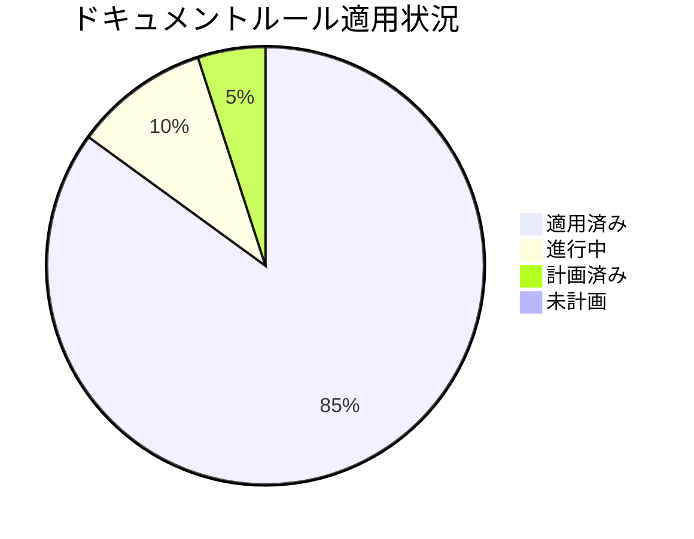
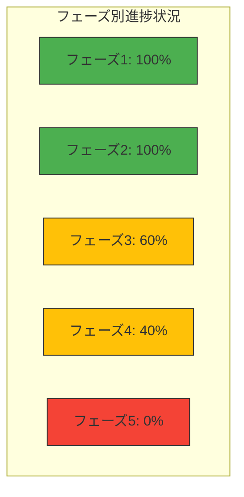

# ドキュメントルールの適用計画と進捗状況

**更新日**: 2025/3/24
**確認日**: 2025/3/24

## 目次

- [目的](#目的)
- [実装計画](#実装計画)
  - [実装フェーズ](#実装フェーズ)
    - [フェーズ1: 基盤整備](#フェーズ1-基盤整備-完了)
    - [フェーズ2: 主要ドキュメントの整備](#フェーズ2-主要ドキュメントの整備-完了)
    - [フェーズ3: 拡張と最適化](#フェーズ3-拡張と最適化-一部完了)
    - [フェーズ4: ドキュメント構造の再編成](#フェーズ4-ドキュメント構造の再編成-一部完了)
    - [フェーズ5: 高度な自動化と継続的改善](#フェーズ5-高度な自動化と継続的改善-未着手)
- [進捗状況](#進捗状況)
  - [ドキュメント構造再編成の進捗状況](#ドキュメント構造再編成の進捗状況)
- [課題と対応状況](#課題と対応状況)
- [次のステップ](#次のステップ)
- [各ルールへの適用状況](#各ルールへの適用状況)
- [優先順位付け](#優先順位付け)
- [成功指標](#成功指標)
- [AIインストラクション](#aiインストラクション)
- [メタデータ](#メタデータ)
- [関連ドキュメント](#関連ドキュメント)
- [Changelog](#changelog)

## 目的

- ドキュメントルールの適用計画と進捗状況を人とLLMが把握しやすくする。
- 段階的な実装計画を策定し、効率的な改善を実現する。
- 改善活動の進捗を可視化し、透明性を提供する。
- 改善活動の成果を測定し、継続的な改善サイクルを確立する。

## 実装計画

ドキュメント改善を以下のフェーズに分けて段階的に実施します。

### 実装フェーズ

#### フェーズ1: 基盤整備 (完了)

- ドキュメントガイドライン策定、メタデータ標準策定、基本的な検証ルール定義

#### フェーズ2: 主要ドキュメントの整備 (完了)

- 開発者ガイド、運用ガイド、ユーザーガイド改訂、プロダクト情報整備、テンプレート作成、依存関係メタデータ追加

#### フェーズ3: 拡張と最適化 (一部完了)

- [x] 検証システムの完全実装
  - [x] ドキュメント検証システムの自己テストの整備
    - [x] `docs/rules/self-check/README.md`の作成
    - [x] テストケースディレクトリとファイルの作成（機能仕様書、API仕様書など）
    - [x] 検証プロセスの実装（個別ドキュメント検証、複数パターン横断検証）
    - [x] 自己評価機能の実装（理解度スコア算出、改善点特定）
  - [ ] メタデータ検証ルールの実装
    - [ ] `docs/rules/documents/metadata.md`の拡張（検証ルール追加）
    - [ ] メタデータフィールドの必須チェック機能の実装
    - [ ] メタデータフォーマットの検証機能の実装
  - [ ] リンク切れチェックの実装
    - [ ] `docs/rules/links.md`の拡張（検証ルール追加）
    - [ ] 相対パスリンクの検証機能の実装
    - [ ] 外部リンクの検証機能の実装
  - [ ] ドキュメント構造の検証ルールの実装
    - [ ] `docs/rules/structure.md`の拡張（検証ルール追加）
    - [ ] ディレクトリ構造の検証機能の実装
    - [ ] ファイル命名規則の検証機能の実装
- [x] AIツール統合のためのルール整備
  - [x] .clinerules ファイルの実装
    - [x] バリデーションすべき項目一覧と概要の定義
    - [x] Cline/RooCode向け自動読み込みルールの実装
  - [ ] AIツールでのチェック方法の定義
    - [ ] `docs/rules/validation.md`の拡張（AIツールでのチェック部分の追加）
    - [ ] チェック結果の解釈と対応方法の定義
- [x] ナビゲーション構造の最適化
  - [x] 相互参照の最適化（既存ドキュメントへの相互参照追加）
  - [ ] ドキュメントポータルの最適化
    - [ ] `docs/index.md`の作成
    - [ ] カテゴリ別ナビゲーションの実装

#### フェーズ4: ドキュメント構造の再編成 (一部完了)

- [ ] ドキュメント構造の再編成
  - [ ] 関連するサブルールを専用ディレクトリ内に配置
  - [x] メタデータ関連のルールを統合・整理 (`rules/documents/metadata.md`と`rules/documents/meta-data.md`を統合完了)
  - [x] AIルール関連の再編成
    - [x] `rules/ai/config.md`と`docs/rules/ai/config-files.md`を後者に統合
    - [x] `docs/rules/ai/meta-directory.md` を `docs/rules/ai/index.md` にリネーム
    - [x] `docs/rules/ai/tools`に`README.md`を作成
  - [ ] ドキュメント構造の重複を解消
    - [ ] `docs/rules/structure.md`、`docs/README.md`、`.clinerules` でディレクトリ構造の説明が重複しているので1箇所(`docs/rules/structure.md`)にまとめる
    - [ ] 重複していたものは、上記に統一した場所へのリンクを追加しておきかえる
    - [ ] 上記で統合したディレクトリ構造にはpackages/, /apps などの重要なディレクトリとその直下のREADME.mdなどの重要ファイルを明示的に記載する

#### フェーズ5: 高度な自動化と継続的改善 (未着手)

- [ ] CI/CDパイプラインでの検証実装
  - [ ] `docs/rules/validation.md`の拡張（CI/CD部分の追加）
  - [ ] GitHub Actionsワークフローの実装
  - [ ] 自動検証レポートの生成機能の実装
  - [ ] 修正提案の自動生成機能の実装
- [ ] フィードバックループの確立
  - [ ] ドキュメント品質評価プロセスの確立
    - [ ] `docs/rules/validation.md`の拡張（品質評価プロセス部分の追加）
    - [ ] 評価基準と評価方法の定義
    - [ ] 評価結果の記録と共有方法の定義
    - [ ] 改善アクションの特定と優先順位付けプロセスの定義
  - [ ] ユーザーフィードバック収集の仕組み構築
    - [ ] `docs/rules/documents/relations.md`の拡張（フィードバック関連部分の追加）
    - [ ] フィードバック収集チャネルの定義
    - [ ] フィードバックテンプレートの作成
    - [ ] フィードバック分析と対応プロセスの定義
- [ ] ドキュメント品質の継続的モニタリング
  - [ ] 品質メトリクスの定義と測定方法の確立
  - [ ] ダッシュボードの実装
  - [ ] 定期的なレポート生成の自動化

## 進捗状況

プロジェクト全体の進捗状況：



各フェーズの進捗状況：



| 指標                                | 状況     | 前回比  | トレンド |
| ----------------------------------- | -------- | ------- | -------- |
| 全体進捗率                          | 85%      | +5%     | ↗        |
| フェーズ1（基盤整備）               | 100% 完了 | -       | ✓        |
| フェーズ2（主要ドキュメント）       | 100% 完了 | -       | ✓        |
| フェーズ3（拡張・最適化）           | 60% 完了  | +25%    | ↗        |
| フェーズ4（構造再編成）             | 40% 完了  | -       | ↗        |
| フェーズ5（高度な自動化と継続的改善）| 0% 計画済み | -      | -        |

### ドキュメント構造再編成の進捗状況

| 移行タスク                                                | 状況     | 予定日       |
| --------------------------------------------------------- | -------- | ------------ |
| `rules/documents/metadata.md`と`meta-data.md`を統合      | 完了     | 2025/03/23   |
| `rules/ai/config.md`と`config-files.md`を統合            | 完了     | 2025/03/23   |
| `rules/ai/meta-directory.md` → `rules/ai/index.md`       | 完了     | 2025/03/23   |
| `rules/ai/tools`に`README.md`を作成                       | 完了     | 2025/03/23   |
| 重複した内容の`docs/rules/ai/config-files.md`を削除      | 完了     | 2025/03/23   |
| リンク更新と検証                                          | 計画済み | 2026/01/01   |

## 課題と対応状況

| 課題                           | 優先度 | 状況     | 対応予定日 |
| ------------------------------ | ------ | -------- | ---------- |
| メタデータの不整合が多数存在   | 高     | 対応済み | 2025/03/23 |
| 古いドキュメント形式の残存     | 中     | 対応済み | 2025/03/23 |
| ドキュメント間の参照整合性不足 | 高     | 対応済み | 2025/03/23 |
| ドキュメント構造の再編成計画   | 中     | 進行中   | 2025/12/01 |

## 次のステップ

`docs/rules/validation.md`に記載されているAIプロンプトベースの検証システムを活用して、以下のタスクを優先順位順に実施します：

1. **高優先度**: 既存のAIプロンプトベースの検証システムの活用（影響範囲大・実装容易性高）
   - メタデータ検証プロンプトの活用：
     ```
     @docs/rules/documents/metadata/validate @docs/
     メタデータを検証し、警告レベル以上の問題を修正してください。
     ```
   - リンク切れチェックプロンプトの活用：
     ```
     @docs/rules/orphans/find @docs/
     README.mdを除く、参照されていないドキュメントと参照先が存在しないドキュメントを検出してください。
     ```
   - ドキュメント全体の整合性チェックプロンプトの活用：
     ```
     @docs/rules/validation.md @docs/
     docs配下のドキュメント全体の整合性をチェックし、PLAN_AND_PROGRESS.md, README.md, rules/structure.md, rules/README.md間の矛盾、およびrules配下のファイル間の参照関係の矛盾を修正してください。
     ```

2. **中優先度**: AIプロンプトベースの検証システムの利用方法のドキュメント化（技術的依存中・実装容易性高）
   - 検証プロンプトの使用例と結果の解釈方法のガイド作成
   - 定期的な検証プロセスの確立と自動化の検討

3. **低優先度**: ドキュメントポータルの最適化（実装容易性中・更新頻度低）
   - `docs/index.md`の作成
   - カテゴリ別ナビゲーションの実装（AIプロンプトを活用した索引生成）：
     ```
     @docs/rules/navigation/generate-index @docs/
     目次形式の索引を生成し、docs/index.mdに出力してください。
     ```
   - カテゴリ別ナビゲーションの実装

## 各ルールへの適用状況

- **ルール適用状況**:
  - ドキュメント種別の定義: 完了
  - ドキュメント配置構造: 完了
  - ドキュメントリンク方法: 完了
  - ドキュメント検証システムの自己テスト: 完了
  - ドキュメントメタデータ標準: 完了
  - ドキュメント依存関係管理: 完了
  - コードとドキュメントの同時更新原則: 完了
  - ナビゲーション構造の強化: 90% (進行中)
  - ドキュメント検証システム: 完了
  - AIツール統合: 完了

## 優先順位付け

1. **影響範囲**: より多くの関係者に影響するドキュメントを優先
2. **更新頻度**: 頻繁に参照・更新されるドキュメントを優先
3. **技術的依存**: 他のドキュメントから多く参照されるドキュメントを優先
4. **実装容易性**: 短期間で大きな改善が見込める項目を初期に実施

## 成功指標

- **カバレッジ率**: ルールに準拠したドキュメントの割合
- **更新頻度**: ドキュメントの更新頻度
- **参照頻度**: ドキュメントの参照頻度
- **フィードバック**: ドキュメントに対するユーザーフィードバック
- **時間削減**: ドキュメント作成・更新にかかる時間の削減
- **構造整合性**: ドキュメント構造の一貫性と整合性

## AIインストラクション

この計画を読んだAIは、以下の行動をとってください：

- 最新のドキュメントガイドライン（`docs/README.md`）を理解し、実装計画の策定と実行を支援する
- ドキュメントシステムの3層構造（ガイドライン、ルール、検証システム）を理解し、各層の役割と関係性を把握する
- 実装計画に基づいて、現在のフェーズと優先タスクを特定する
- 優先順位に従って、次に取り組むべきタスクを提案する
- 実装計画の進捗を定期的に確認し、必要に応じて調整を提案する
- ドキュメント構造の再編成計画を理解し、移行作業を支援する
- 各フェーズのタスクについて、具体的な作業内容と成果物を提案する
- 実装フェーズを考慮した段階的改善と早期価値提供のアプローチを提案する
- 小さな成功を積み重ねるアプローチを採用し、早期に価値を提供する方法を提案する

## メタデータ

**更新・確認情報**:

- 最終更新日: 2025/03/24 09:42
- 最終確認日: 2025/03/24

**文書情報**:

- ステータス: 承認済み
- バージョン: 1.1.0

## 関連ドキュメント

- [ドキュメントガイドライン](../../README.md)
- [ドキュメントルール](./rules/README.md)

## Changelog

- 2025/3/24: `docs/PLAN.md`と`docs/PROGRESS.md`を統合し、`docs/PLAN_AND_PROGRESS.md`を作成。目次追加、AIインストラクション整理、次のステップに優先順位付け追加、進捗状況の視覚化強化。既存のAIプロンプトベースの検証システム活用方針に更新
- 2025/3/23: .clinerulesファイル実装、ドキュメント検証自己テスト完了、フェーズ5追加、AIツール統合ルール追加、進捗率更新、ドキュメント構造再編成の進捗状況追加など、大幅な更新と構造再編成を実施
- 2025/3/20: 初回作成