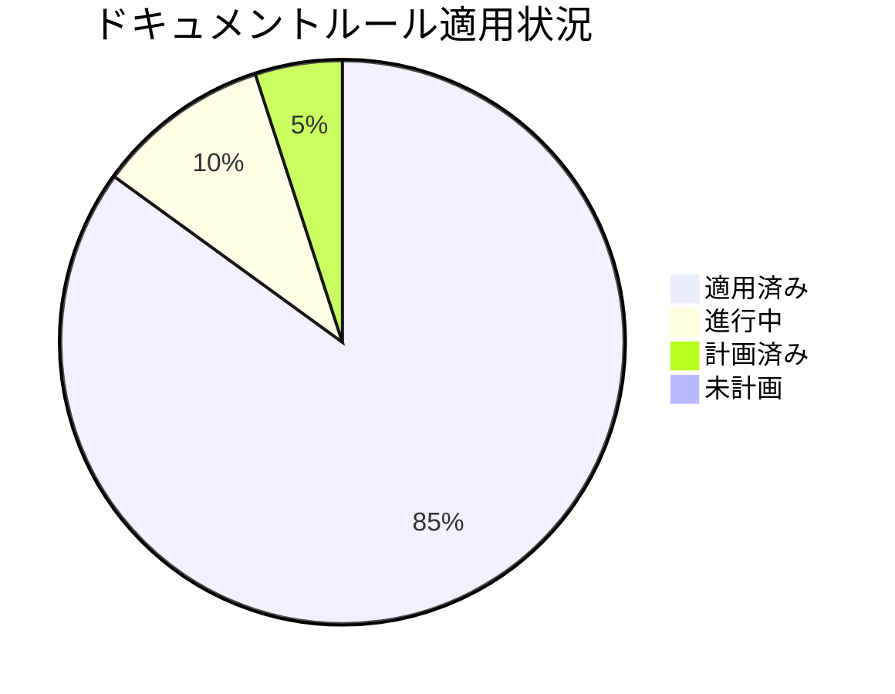

# ドキュメントルールの適用状況

**更新日**: 2025/3/23
**確認日**: 2025/3/23

## 目的

- ドキュメントルールの適用状況を人とLLMが把握しやすくする。
- 改善活動の進捗を可視化し、透明性を提供する。
- 段階的な実装計画を策定し、効率的な改善を実現する。
- 改善活動の成果を測定し、継続的な改善サイクルを確立する。

## 進捗管理

プロジェクト全体の進捗状況：

## 進捗状況

| 指標                                | 状況     | 前回比  | トレンド |
| ----------------------------------- | -------- | ------- | -------- |
| 全体進捗率                          | 85%      | +5%     | ↗        |
| フェーズ1（基盤整備）               | 100% 完了 | -       | ✓        |
| フェーズ2（主要ドキュメント）       | 100% 完了 | -       | ✓        |
| フェーズ3（拡張・最適化）           | 60% 完了  | +25%    | ↗        |
| フェーズ4（構造再編成）             | 40% 完了  | -       | ↗        |
| フェーズ5（高度な自動化と継続的改善）| 0% 計画済み | -      | -        |

## 課題と対応状況

| 課題                           | 優先度 | 状況     | 対応予定日 |
| ------------------------------ | ------ | -------- | ---------- |
| メタデータの不整合が多数存在   | 高     | 対応済み | 2025/03/23 |
| 古いドキュメント形式の残存     | 中     | 対応済み | 2025/03/23 |
| ドキュメント間の参照整合性不足 | 高     | 対応済み | 2025/03/23 |
| ドキュメント構造の再編成計画   | 中     | 進行中   | 2025/12/01 |

## 次のステップ

- 検証システムの完全実装（フェーズ3）の残りのタスク（メタデータ検証、リンク切れチェック、ドキュメント構造の検証）に着手する。
  - `docs/rules/documents/metadata.md`の拡張（検証ルール追加）
  - `docs/rules/links.md`の拡張（検証ルール追加）
  - `docs/rules/structure.md`の拡張（検証ルール追加）
- AIツールでのチェック方法の定義を進める。
  - `docs/rules/validation.md`の拡張（AIツールでのチェック部分の追加）
  - チェック結果の解釈と対応方法の定義
- ドキュメントポータルの最適化（フェーズ3）を継続する。
  - `docs/index.md`の作成
  - カテゴリ別ナビゲーションの実装
- ドキュメント構造再編成（フェーズ4）を継続する。（特にドキュメント関連の再編成）

## 各ルールへの適用状況

- **ルール適用状況**:
  - ドキュメント種別の定義: 完了
  - ドキュメント配置構造: 完了
  - ドキュメントリンク方法: 完了
  - ドキュメント検証システムの自己テスト: 完了
  - ドキュメントメタデータ標準: 完了
  - ドキュメント依存関係管理: 完了
  - コードとドキュメントの同時更新原則: 完了
  - ナビゲーション構造の強化: 90% (進行中)
  - ドキュメント検証システム: 完了
  - AIツール統合: 完了

## ドキュメント構造再編成の進捗状況

| 移行タスク                                                | 状況     | 予定日       |
| --------------------------------------------------------- | -------- | ------------ |
| `rules/documents/metadata.md`と`meta-data.md`を統合      | 完了     | 2025/03/23   |
| `rules/ai/config.md`と`config-files.md`を統合            | 完了     | 2025/03/23   |
| `rules/ai/meta-directory.md` → `rules/ai/index.md`       | 完了     | 2025/03/23   |
| `rules/ai/tools`に`README.md`を作成                       | 完了     | 2025/03/23   |
| 重複した内容の`docs/rules/ai/config-files.md`を削除      | 完了     | 2025/03/23   |
| リンク更新と検証                                          | 計画済み | 2026/01/01   |

## AIインストラクション

このルールを読んだAIは以下の行動をとってください：

- 進捗状況を分析し、ダッシュボード情報を活用して優先対応領域を特定する。
- 各ルールの適用状況を確認し、優先順位基準に基づいた改善提案を行う。
- 実装フェーズを考慮した段階的改善と早期価値提供のアプローチを提案する。
- ドキュメントシステムの3層構造（ガイドライン、ルール、検証システム）を理解し、各層の役割と関係性を把握する。
- 小さな成功を積み重ねるアプローチを採用し、早期に価値を提供する方法を提案する。
- ドキュメント構造再編成の計画を理解し、移行作業を支援する。
- 人間との協働を前提とし、それぞれの強みを活かした役割分担を意識する。

## メタデータ

**更新・確認情報**:

- 最終更新日: 2025/03/23 15:15
- 最終確認日: 2025/03/23

**文書情報**:

- ステータス: 承認済み
- バージョン: 1.0.0

## 関連ドキュメント

- [ドキュメントガイドライン](../../README.md)
- [ドキュメントルールの適用計画](../PLAN.md)
- [ドキュメントルール](./rules/README.md)

## Changelog

- 2025/3/23: AIツール統合ルール追加、進捗率更新、ドキュメント構造再編成の進捗状況追加など、大幅な更新。
- 2025/3/20: 初回作成。