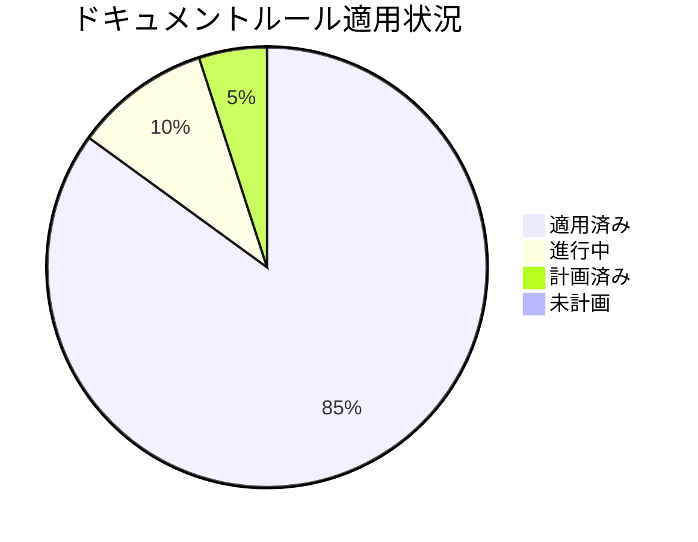
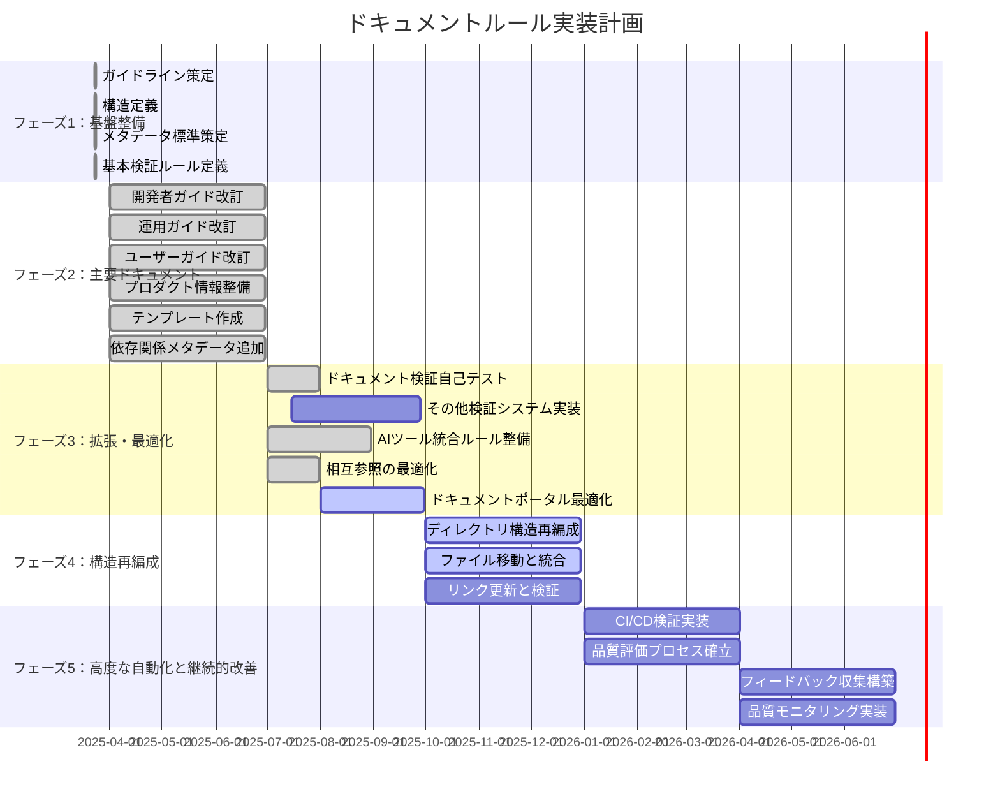

# ドキュメントルールの適用状況

**更新日**: 2025/3/23
**確認日**: 2025/3/23

## 目的

- ドキュメントルールの適用状況を人とLLMが把握しやすくする。
- 改善活動の進捗を可視化し、透明性を提供する。
- 段階的な実装計画を策定し、効率的な改善を実現する。
- 改善活動の成果を測定し、継続的な改善サイクルを確立する。

## 進捗管理

### 可視化

プロジェクト全体の進捗状況：

## 進捗状況

| 指標                                | 状況     | 前回比  | トレンド |
| ----------------------------------- | -------- | ------- | -------- |
| 全体進捗率                          | 85%      | +5%     | ↗        |
| フェーズ1（基盤整備）               | 100% 完了 | -       | ✓        |
| フェーズ2（主要ドキュメント）       | 100% 完了 | -       | ✓        |
| フェーズ3（拡張・最適化）           | 60% 完了  | +25%    | ↗        |
| フェーズ4（構造再編成）             | 40% 完了  | -       | ↗        |
| フェーズ5（高度な自動化と継続的改善）| 0% 計画済み | -      | -        |

## 課題と対応状況

| 課題                           | 優先度 | 状況     | 対応予定日 |
| ------------------------------ | ------ | -------- | ---------- |
| メタデータの不整合が多数存在   | 高     | 対応済み | 2025/03/23 |
| 古いドキュメント形式の残存     | 中     | 対応済み | 2025/03/23 |
| ドキュメント間の参照整合性不足 | 高     | 対応済み | 2025/03/23 |
| ドキュメント構造の再編成計画   | 中     | 進行中   | 2025/12/01 |

## 次のステップ

- 検証システムの完全実装（フェーズ3）の残りのタスク（メタデータ検証、リンク切れチェック、ドキュメント構造の検証）に着手する。
  - `docs/rules/documents/metadata.md`の拡張（検証ルール追加）
  - `docs/rules/links.md`の拡張（検証ルール追加）
  - `docs/rules/structure.md`の拡張（検証ルール追加）
- AIツールでのチェック方法の定義を進める。
  - `docs/rules/validation.md`の拡張（AIツールでのチェック部分の追加）
  - チェック結果の解釈と対応方法の定義
- ドキュメントポータルの最適化（フェーズ3）を継続する。
  - `docs/index.md`の作成
  - カテゴリ別ナビゲーションの実装
- ドキュメント構造再編成（フェーズ4）を継続する。（特にドキュメント関連の再編成）

## 各ルールへの適用状況

### ルール: ドキュメント種別の定義

- **ルールの場所**: docs/rules/types.md
- **ルール概要**: プロジェクトに必要なドキュメントの種別を定義
- **重要度**: 高
- **最終検査日**: 2025/03/23
- **適用割合**: 100%
- **トレンド**: ✓ (完了)
- **適用状態の詳細**:
  - ✅ ドキュメント種別の定義が完了
  - ✅ 各種別の目的と内容が明確に定義されている
  - ✅ 配置場所が明示されている
  - ✅ メタデータと関連ドキュメントセクションが追加された
- **課題**:
  - なし
- **改善計画**:
  - 必要に応じて新しいドキュメント種別を追加
  - フェーズ4で `rules/types/README.md` に移行予定

### ルール: ドキュメント配置構造

- **ルールの場所**: docs/rules/structure.md
- **ルール概要**: ドキュメントの配置構造を定義
- **重要度**: 高
- **最終検査日**: 2025/03/23
- **適用割合**: 100%
- **トレンド**: ✓ (完了)
- **適用状態の詳細**:
  - ✅ 配置構造の基本原則が定義されている
  - ✅ 理想のドキュメント構造が定義されている
  - ✅ AIインストラクションが含まれている
  - ✅ メタデータと関連ドキュメントセクションが追加された
- **課題**:
  - なし
- **改善計画**:
  - 実際のプロジェクト構造に合わせて適宜調整
  - フェーズ4で `rules/structure/README.md` に移行予定

### ルール: ドキュメントリンク方法

- **ルールの場所**: docs/rules/links.md
- **ルール概要**: ドキュメント内のリンク方法を定義
- **重要度**: 中
- **最終検査日**: 2025/03/23
- **適用割合**: 100%
- **トレンド**: ✓ (完了)
- **適用状態の詳細**:
  - ✅ リンク記述の基本ルールが定義されている
  - ✅ リンク管理のベストプラクティスが定義されている
  - ✅ AIインストラクションが含まれている
  - ✅ メタデータと関連ドキュメントセクションが追加された
- **課題**:
  - なし
- **改善計画**:
  - フェーズ4で `rules/format/links.md` に移行予定

### ルール: ドキュメント検証システムの自己テスト

- **ルールの場所**: docs/rules/self-check/README.md
- **ルール概要**: ドキュメント検証システムの自己テストの仕組みを定義
- **重要度**: 高
- **最終検査日**: 2025/03/23
- **適用割合**: 100%
- **トレンド**: ✓ (完了)
- **適用状態の詳細**:
  - ✅ 自己テストの目的と構成が定義されている
  - ✅ 検証プロセスが定義されている
  - ✅ 5段階評価の判定基準と報告手順が定義されている
  - ✅ テストケースファイルが作成されている
  - ✅ AIインストラクションが含まれている
  - ✅ メタデータと関連ドキュメントセクションが追加された
- **課題**:
  - なし
- **改善計画**:
  - 新しいドキュメント種別が追加された場合、テストケースファイルを追加する

### ルール: ドキュメントメタデータ標準

- **ルールの場所**: docs/rules/documents/metadata.md
- **ルール概要**: ドキュメントのメタデータ標準を定義
- **重要度**: 中
- **最終検査日**: 2025/03/23
- **適用割合**: 100%
- **トレンド**: ✓ (完了)
- **適用状態の詳細**:
  - ✅ 標準メタデータセクションが定義されている
  - ✅ メタデータフィールドの説明が含まれている
  - ✅ メタデータ管理のベストプラクティスが定義されている
  - ✅ AIインストラクションが含まれている
  - ✅ 既存の主要ドキュメントにメタデータを追加済み
- **課題**:
  - 相互参照の最適化が必要
- **改善計画**:
  - 新規ドキュメント作成時にメタデータを追加する
  - フェーズ3でメタデータ検証ルールを実装する

### ルール: ドキュメント依存関係管理

- **ルールの場所**: docs/rules/documents/relations.md
- **ルール概要**: ドキュメント間の依存関係を管理するルールを定義
- **重要度**: 中
- **最終検査日**: 2025/03/23
- **適用割合**: 100%
- **トレンド**: ✓ (完了)
- **適用状態の詳細**:
    - ✅ 依存関係メタデータの標準形式が定義されている
    - ✅ 依存関係の種類が定義されている
    - ✅ 依存関係管理のベストプラクティスが定義されている
    - ✅ AIインストラクションが含まれている
    - ✅ 既存の主要ドキュメントに依存関係メタデータを追加済み
- **課題**:
    - なし
- **改善計画**:
    - 新規ドキュメント作成時に関連ドキュメントセクションを追加する
    - フェーズ3で依存関係の可視化ツールを導入する
    - フェーズ4で `rules/documents/relations/README.md` に移行予定

### ルール: コードとドキュメントの同時更新原則

- **ルールの場所**: docs/rules/documents/code-doc-sync.md
- **ルール概要**: コードとドキュメントの乖離を防ぎ、常に最新の状態を維持する
- **重要度**: 高
- **最終検査日**: 2025/03/23
- **適用割合**: 100%
- **トレンド**: ✓ (完了)
- **適用状態の詳細**:
    - ✅ 基本原則が定義されている
    - ✅ 実践ガイドラインが定義されている
    - ✅ 自動化と検証の方法が定義されている
    - ✅ 例外と対応が定義されている
    - ✅ AIインストラクションが含まれている
- **課題**:
    - 自動化の実装が必要
- **改善計画**:
    - コミット前フックの実装 (2025/10/01 まで)
    - フェーズ4で適切なサブディレクトリに移行予定

### ルール: ナビゲーション構造の強化

- **ルールの場所**: docs/rules/documents/navigation.md
- **ルール概要**: ドキュメント間の移動を容易にし、必要な情報への効率的なアクセスを実現
- **重要度**: 中
- **最終検査日**: 2025/03/23
- **適用割合**: 90%
- **トレンド**: ↗(進行中)
- **適用状態の詳細**:
  - ✅ ナビゲーション要素が定義されている
  - ✅ ナビゲーション構造のベストプラクティスが定義されている
  - ✅ AIインストラクションが含まれている
  - ✅ 既存の主要ドキュメントへの相互参照の最適化が完了
  - ⏳ ドキュメントポータルの最適化を進行中
- **課題**:
  - なし
- **改善計画**:
  - 新規ドキュメント作成時にナビゲーション要素を追加する
  - フェーズ3でドキュメントポータルの最適化を完了させる
  - フェーズ4で適切なサブディレクトリに移行予定

### ルール: ドキュメント検証システム

- **ルールの場所**: docs/rules/validation.md
- **ルール概要**: ドキュメントの検証と自動修正の仕組みを定義
- **重要度**: 高
- **最終検査日**: 2025/03/23
- **適用割合**: 100%
- **トレンド**: ✓ (完了)
- **適用状態の詳細**:
  - ✅ AIプロンプトベースの検証システムが定義されている
  - ✅ 主要プロンプトパターンが定義されている
  - ✅ AIプロンプト使用例が含まれている
  - ✅ 検証項目が定義されている
  - ✅ AIを活用した検証プロセスが定義されている
  - ✅ AIインストラクションが含まれている
  - ✅ メタデータと関連ドキュメントセクションが追加された
- **課題**:
  - 実装が必要
- **改善計画**:
  - 検証システムの実装 (2025/09/01 まで)
  - フェーズ4で `rules/meta/validation.md` に移行予定

### ルール: AIツール統合

- **ルールの場所**: .clinerules
- **ルール概要**: Cline/RooCodeがドキュメントを理解・評価する際のエントリポイントとなるルールを定義
- **重要度**: 高
- **最終検査日**: 2025/03/23
- **適用割合**: 100%
- **トレンド**: ✓ (完了)
- **適用状態の詳細**:
  - ✅ AIの知識のエントリポイントとして機能するマークダウン形式のファイルを作成
  - ✅ 重要なドキュメントの概要とリンク一覧を提供
  - ✅ プロジェクトのドキュメント構造を視覚的に表現
  - ✅ AIツール利用ガイドラインを提供
  - ✅ Repomixの活用ガイドラインを追加
- **課題**:
  - なし
- **改善計画**:
  - プロジェクト構造の変更に合わせて定期的に更新する
  - AIツールでのチェック方法の定義を進める

## ドキュメント構造再編成の進捗状況

| 移行タスク                                                | 状況     | 予定日       |
| --------------------------------------------------------- | -------- | ------------ |
| `rules/documents/metadata.md`と`meta-data.md`を統合      | 完了     | 2025/03/23   |
| `rules/ai/config.md`と`config-files.md`を統合            | 完了     | 2025/03/23   |
| `rules/ai/meta-directory.md` → `rules/ai/index.md`       | 完了     | 2025/03/23   |
| `rules/ai/tools`に`README.md`を作成                       | 完了     | 2025/03/23   |
| 重複した内容の`docs/rules/ai/config-files.md`を削除      | 完了     | 2025/03/23   |
| リンク更新と検証                                          | 計画済み | 2026/01/01   |

## AIインストラクション

このルールを読んだAIは以下の行動をとってください：

- 進捗状況を分析し、ダッシュボード情報を活用して優先対応領域を特定する。
- 各ルールの適用状況を確認し、優先順位基準に基づいた改善提案を行う。
- 実装フェーズを考慮した段階的改善と早期価値提供のアプローチを提案する。
- ドキュメントシステムの3層構造（ガイドライン、ルール、検証システム）を理解し、各層の役割と関係性を把握する。
- 小さな成功を積み重ねるアプローチを採用し、早期に価値を提供する方法を提案する。
- ドキュメント構造再編成の計画を理解し、移行作業を支援する。
- 人間との協働を前提とし、それぞれの強みを活かした役割分担を意識する。

## メタデータ

**更新・確認情報**:
- 最終更新日: 2025/03/23 15:15
- 最終確認日: 2025/03/23

**文書情報**:
- ステータス: 承認済み
- バージョン: 1.0.0

## 関連ドキュメント

- [ドキュメントガイドライン](../../README.md)
- [ドキュメントルールの適用計画](../PLAN.md)
- [ドキュメントルール](./rules/README.md)

## Changelog

- 2025/3/23: [追加] AIツール統合のルールを追加し、.clinerules ファイルの実装状況を記載
- 2025/3/23: [更新] 全体進捗率を85%に、フェーズ3の進捗率を60%に更新
- 2025/3/23: [更新] 次のステップを更新し、.clinerules ファイルの実装を完了としてマーク
- 2025/3/23: [更新] ドキュメント構造再編成の進捗状況に`docs/rules/ai/config-files.md`の削除を追加
- 2025/3/23: [更新] 全体進捗率とフェーズ3の進捗率を更新
- 2025/3/23: [追加] フェーズ5「高度な自動化と継続的改善」を追加
- 2025/3/23: [変更] 「CI/CDパイプラインへの統合」を「AIツール統合のためのルール整備」に変更
- 2025/3/23: [変更] ナビゲーション構造の強化の進捗状況を90%に更新（相互参照の最適化完了）
- 2025/3/23: [変更] フェーズ3の進捗率を25%に更新
- 2025/3/23: [変更] 全体進捗率を75%に更新（フェーズ5追加による調整）
- 2025/3/23: [更新] 次のステップを詳細化し、AIツール統合のためのルール整備を追加
- 2025/3/23: [更新] ガントチャートを更新し、フェーズ5を追加
- 2025/3/23: [追加] 関連ドキュメントセクションにドキュメントルールへのリンクを追加
- 2025/3/23: [変更] フェーズ2の進捗状況を100%完了に更新
- 2025/3/23: [変更] 現在の課題と対応状況を更新
- 2025/3/23: [追加] 各ルールへの具体的な適用状況のメタデータとトレンドを更新
- 2025/3/23: [追加] ドキュメント構造再編成の進捗状況セクションを追加
- 2025/3/23: [追加] メタデータを追加
- 2025/3/20: 初回作成