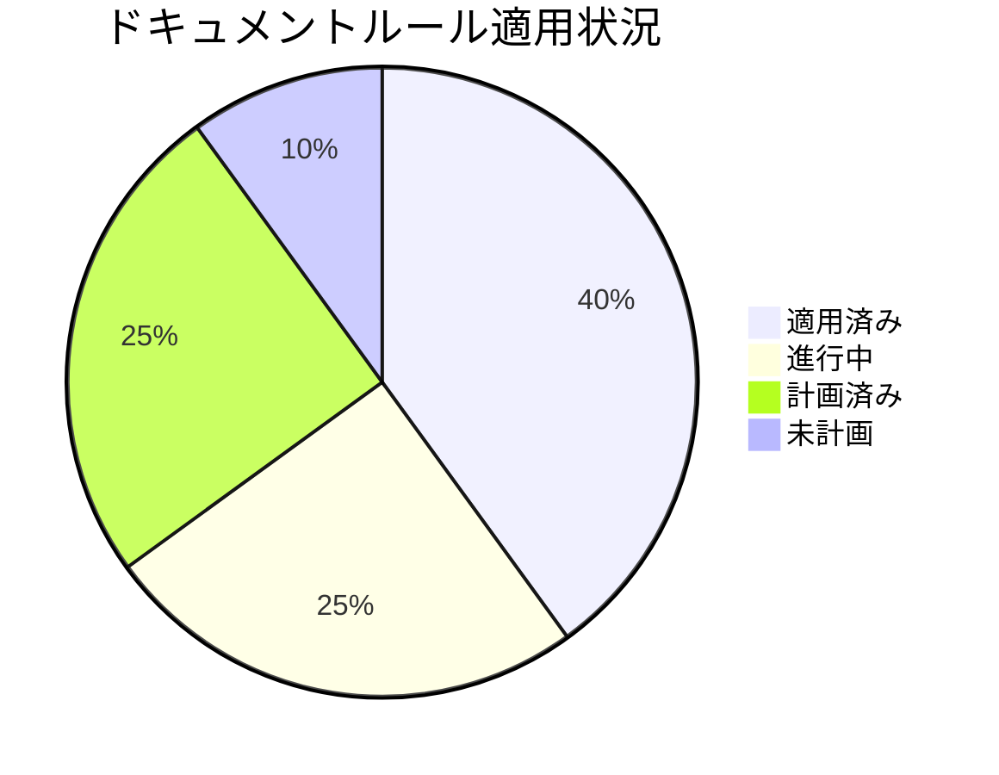
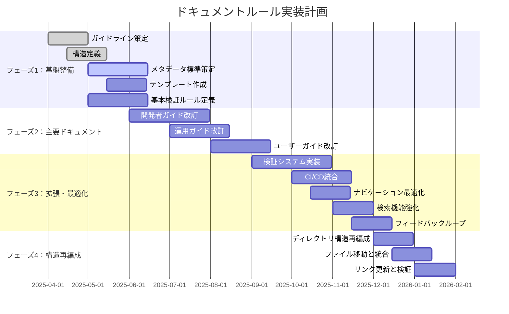

# ドキュメントルールの適用状況

**更新日**: 2025/3/23
**確認日**: 2025/3/23

## 目的

- ドキュメントルールの適用状況を人とLLMが把握しやすくする
- 改善活動の進捗を可視化し、ステークホルダーに透明性を提供
- 段階的な実装計画を策定し、優先順位に基づいた効率的な改善を実現
- 改善活動の成果を測定し、継続的な改善サイクルを確立

## 進捗管理のダッシュボード

### 進捗状況の可視化

プロジェクト全体の進捗状況を視覚的に把握するためのダッシュボード：

## プロジェクト全体の進捗状況

| 指標                          | 状況     | 前回比  | トレンド |
| ----------------------------- | -------- | ------- | -------- |
| 全体進捗率                    | 40%      | +5%     | ↗        |
| フェーズ1（基盤整備）         | 80% 完了 | +10%    | ↗        |
| フェーズ2（主要ドキュメント） | 15% 完了 | +5%     | ↗        |
| フェーズ3（拡張・最適化）     | 未着手   | -       | →        |
| フェーズ4（構造再編成）       | 計画済み | 新規    | →        |

## 現在の課題と対応状況

| 課題                           | 優先度 | 状況     | 対応予定日 |
| ------------------------------ | ------ | -------- | ---------- |
| メタデータの不整合が多数存在   | 高     | 対応中   | 2025/05/15 |
| 古いドキュメント形式の残存     | 中     | 計画済み | 2025/06/01 |
| ドキュメント間の参照整合性不足 | 高     | 対応中   | 2025/05/30 |
| ドキュメント構造の再編成計画   | 中     | 計画済み | 2025/12/01 |

## 次のステップ

1. メタデータ検証の自動化完了 (2025/05/15 まで)
2. 運用ガイドの全面改訂 (2025/07/01 まで)
3. 依存関係の可視化ツール導入 (2025/06/15 まで)
4. ドキュメント構造再編成の詳細計画策定 (2025/11/15 まで)

## 各ルールへの具体的な適用状況

### ルール: ドキュメント種別の定義

- **ルールの場所**: docs/rules/types.md
- **ルール概要**: プロジェクトに必要なドキュメントの種別を定義
- **重要度**: 高
- **最終検査日**: 2025/03/23
- **適用割合**: 100%
- **トレンド**: ✓ (完了)
- **適用状態の詳細**:
    - ✅ ドキュメント種別の定義が完了
    - ✅ 各種別の目的と内容が明確に定義されている
    - ✅ 配置場所が明示されている
- **課題**:
    - なし
- **改善計画**:
    - 必要に応じて新しいドキュメント種別を追加
    - フェーズ4で `rules/types/README.md` に移行予定

### ルール: ドキュメント配置構造

- **ルールの場所**: docs/rules/structure.md
- **ルール概要**: ドキュメントの配置構造を定義
- **重要度**: 高
- **最終検査日**: 2025/03/23
- **適用割合**: 100%
- **トレンド**: ✓ (完了)
- **適用状態の詳細**:
    - ✅ 配置構造の基本原則が定義されている
    - ✅ 理想のドキュメント構造が定義されている
    - ✅ AIインストラクションが含まれている
- **課題**:
    - なし
- **改善計画**:
    - 実際のプロジェクト構造に合わせて適宜調整
    - フェーズ4で `rules/structure/README.md` に移行予定

### ルール: ドキュメントリンク方法

- **ルールの場所**: docs/rules/links.md
- **ルール概要**: ドキュメント内のリンク方法を定義
- **重要度**: 中
- **最終検査日**: 2025/03/23
- **適用割合**: 100%
- **トレンド**: ✓ (完了)
- **適用状態の詳細**:
    - ✅ リンク記述の基本ルールが定義されている
    - ✅ リンク管理のベストプラクティスが定義されている
    - ✅ AIインストラクションが含まれている
- **課題**:
    - なし
- **改善計画**:
    - フェーズ4で `rules/format/links.md` に移行予定

### ルール: ドキュメントメタデータ標準

- **ルールの場所**: docs/rules/documents/meta-data.md
- **ルール概要**: ドキュメントのメタデータ標準を定義
- **重要度**: 中
- **最終検査日**: 2025/03/23
- **適用割合**: 100%
- **トレンド**: ✓ (完了)
- **適用状態の詳細**:
    - ✅ 標準メタデータセクションが定義されている
    - ✅ メタデータフィールドの説明が含まれている
    - ✅ メタデータ管理のベストプラクティスが定義されている
    - ✅ AIインストラクションが含まれている
- **課題**:
    - 既存ドキュメントへの適用が必要
    - `metadata.md` との重複内容の整理が必要
- **改善計画**:
    - 既存ドキュメントへのメタデータ追加 (2025/05/15 まで)
    - フェーズ4で `rules/documents/metadata/README.md` に統合予定

### ルール: ドキュメント依存関係管理

- **ルールの場所**: docs/rules/documents/relations.md
- **ルール概要**: ドキュメント間の依存関係を管理するルールを定義
- **重要度**: 中
- **最終検査日**: 2025/03/23
- **適用割合**: 100%
- **トレンド**: ✓ (完了)
- **適用状態の詳細**:
    - ✅ 依存関係メタデータの標準形式が定義されている
    - ✅ 依存関係の種類が定義されている
    - ✅ 依存関係管理のベストプラクティスが定義されている
    - ✅ AIインストラクションが含まれている
- **課題**:
    - 既存ドキュメントへの適用が必要
- **改善計画**:
    - 既存ドキュメントへの依存関係メタデータ追加 (2025/05/30 まで)
    - フェーズ4で `rules/documents/relations/README.md` に移行予定

### ルール: コードとドキュメントの同時更新原則

- **ルールの場所**: docs/rules/documents/code-doc-sync.md
- **ルール概要**: コードとドキュメントの乖離を防ぎ、常に最新の状態を維持する
- **重要度**: 高
- **最終検査日**: 2025/03/23
- **適用割合**: 100%
- **トレンド**: ✓ (完了)
- **適用状態の詳細**:
    - ✅ 基本原則が定義されている
    - ✅ 実践ガイドラインが定義されている
    - ✅ 自動化と検証の方法が定義されている
    - ✅ 例外と対応が定義されている
    - ✅ AIインストラクションが含まれている
- **課題**:
    - 自動化の実装が必要
- **改善計画**:
    - コミット前フックの実装 (2025/10/01 まで)
    - フェーズ4で適切なサブディレクトリに移行予定

### ルール: ナビゲーション構造の強化

- **ルールの場所**: docs/rules/documents/navigation.md
- **ルール概要**: ドキュメント間の移動を容易にし、必要な情報への効率的なアクセスを実現
- **重要度**: 中
- **最終検査日**: 2025/03/23
- **適用割合**: 100%
- **トレンド**: ✓ (完了)
- **適用状態の詳細**:
    - ✅ ナビゲーション要素が定義されている
    - ✅ ナビゲーション構造のベストプラクティスが定義されている
    - ✅ AIインストラクションが含まれている
- **課題**:
    - 既存ドキュメントへの適用が必要
- **改善計画**:
    - 既存ドキュメントへのナビゲーション要素追加 (2025/10/15 まで)
    - フェーズ4で適切なサブディレクトリに移行予定

### ルール: ドキュメント検証システム

- **ルールの場所**: docs/rules/validation.md
- **ルール概要**: ドキュメントの検証と自動修正の仕組みを定義
- **重要度**: 高
- **最終検査日**: 2025/03/23
- **適用割合**: 100%
- **トレンド**: ✓ (完了)
- **適用状態の詳細**:
    - ✅ AIプロンプトベースの検証システムが定義されている
    - ✅ 主要プロンプトパターンが定義されている
    - ✅ AIプロンプト使用例が含まれている
    - ✅ 検証項目が定義されている
    - ✅ AIを活用した検証プロセスが定義されている
    - ✅ AIインストラクションが含まれている
- **課題**:
    - 実装が必要
- **改善計画**:
    - 検証システムの実装 (2025/09/01 まで)
    - フェーズ4で `rules/meta/validation.md` に移行予定

## ドキュメント構造再編成の進捗状況

| 移行タスク                                                | 状況     | 予定日       |
| --------------------------------------------------------- | -------- | ------------ |
| `rules/types.md` → `rules/types/README.md`               | 計画済み | 2025/12/01   |
| `rules/structure.md` → `rules/structure/README.md`       | 計画済み | 2025/12/01   |
| `rules/links.md` → `rules/format/links.md`               | 計画済み | 2025/12/15   |
| `rules/validation.md` → `rules/meta/validation.md`       | 計画済み | 2025/12/15   |
| メタデータ関連ファイルの統合                              | 計画済み | 2025/12/15   |
| AIルール関連の再編成                                      | 計画済み | 2025/12/15   |
| ドキュメント関連の再編成                                  | 計画済み | 2025/12/15   |
| リンク更新と検証                                          | 計画済み | 2026/01/01   |

## AIインストラクション

このルールを読んだAIは以下の行動をとってください：

- 進捗状況を分析し、ダッシュボード情報を活用して優先対応領域を特定する
- 各ルールの適用状況を確認し、優先順位基準に基づいた改善提案を行う
- 実装フェーズを考慮した段階的改善と早期価値提供のアプローチを提案する
- 小さな成功を積み重ねるアプローチを採用し、早期に価値を提供する方法を提案する
- ドキュメント構造再編成の計画を理解し、移行作業を支援する

## Changelog

- 2025/3/23: [追加] ドキュメント構造再編成の進捗状況セクションを追加
- 2025/3/23: [変更] 進捗状況を更新
- 2025/3/23: [追加] メタデータを追加
- 2025/3/20: 初回作成