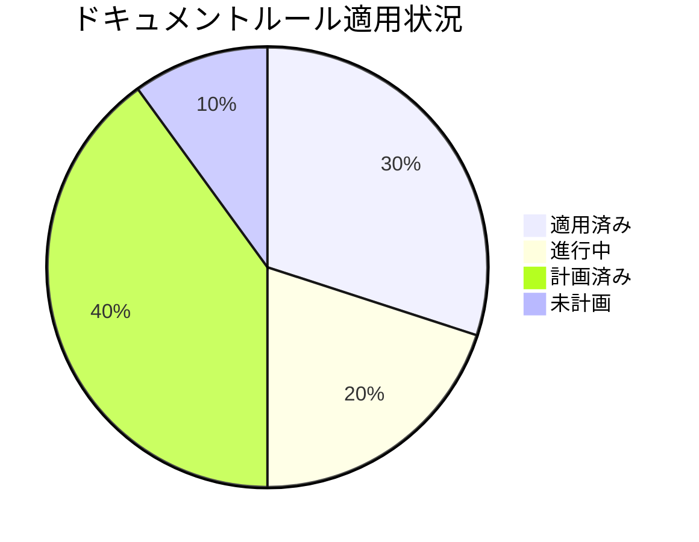
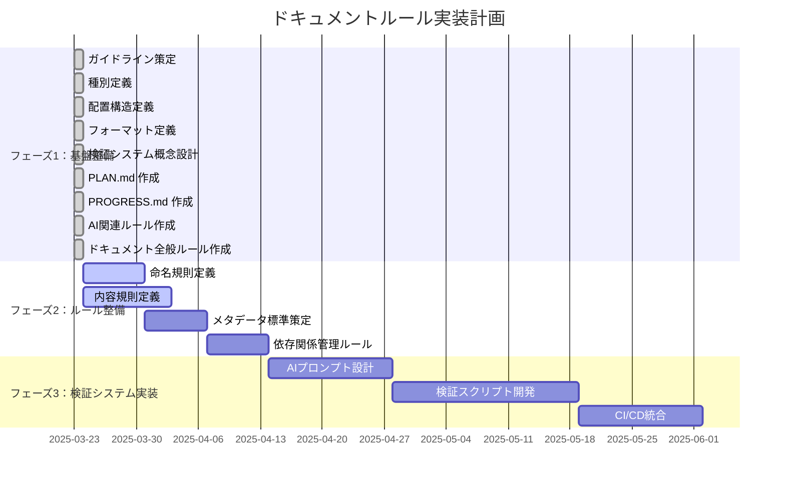

# ドキュメントルールの適用状況

**更新日**: 2025/3/23
**確認日**: 2025/3/23

## 目的

- ドキュメントルールの適用状況を人とLLMが把握しやすくする
- 改善活動の進捗を可視化し、ステークホルダーに透明性を提供する
- 段階的な実装計画を策定し、優先順位に基づいた効率的な改善を実現する
- 改善活動の成果を測定し、継続的な改善サイクルを確立する

## 進捗管理のダッシュボード

### 進捗状況の可視化

プロジェクト全体の進捗状況を視覚的に把握するためのダッシュボード：

## プロジェクト全体の進捗状況

| 指標                          | 状況     | 前回比  | トレンド |
| ----------------------------- | -------- | ------- | -------- |
| 全体進捗率                    | 30%      | +10%    | ↗        |
| フェーズ1（基盤整備）         | 完了     | -       | ✓        |
| フェーズ2（ルール整備）       | 開始     | -       | →        |
| フェーズ3（検証システム実装） | 未着手   | -       | →        |

## 現在の課題と対応状況

| 課題                                  | 優先度 | 状況     | 対応予定日 |
| ------------------------------------- | ------ | -------- | ---------- |
| ドキュメント種別の詳細定義が不十分    | 中     | 対応中   | 2025/3/30  |
| 既存ドキュメントが新ルールに未対応    | 高     | 計画済み | 2025/4/15  |
| ドキュメント間の参照整合性不足        | 高     | 計画済み | 2025/4/07  |
| AIによるドキュメント検証の自動化不足  | 中     | 計画済み | 2025/4/28  |

## 次のステップ

1. 命名規則に関するルールの策定（2025/3/24 - 2025/3/31）
2. 内容規則に関するルールの策定（2025/3/24 - 2025/4/03）
3. メタデータ標準の拡充（2025/3/31 - 2025/4/07）
4. 依存関係管理ルールの拡充（2025/4/07 - 2025/4/14）

## 実装計画の詳細

### フェーズ1: 基盤整備（2025/3/23、完了）

- [x] ドキュメンテーションシステムのガイドライン策定（`docs/README.md`）
- [x] ドキュメント種別の定義（`docs/rules/types.md`）
- [x] ドキュメントの配置構造の定義（`docs/rules/structure.md`）
- [x] ドキュメントフォーマットの定義（`docs/rules/format/README.md`）
- [x] ドキュメント検証システムの概念設計（`docs/rules/validation.md`）
- [x] ドキュメントルールの適用計画（`docs/PLAN.md`）
- [x] ドキュメントルールの適用状況（`docs/PROGRESS.md`）
- [x] AI関連ルールの作成
  - [x] コミットメッセージルール（`docs/rules/ai/commit.md`）
  - [x] 設定ファイルルール（`docs/rules/ai/config-files.md`）
- [x] ドキュメント全般ルールの作成
  - [x] ドキュメント全般ルールの概要（`docs/rules/documents/README.md`）
  - [x] メタデータ標準（`docs/rules/documents/meta-data.md`）
  - [x] 依存関係管理（`docs/rules/documents/relations.md`）

### フェーズ2: ルール整備（2025/3/24 - 2025/4/14）

- [ ] 命名規則に関するルール
  - [ ] ファイル命名規則（`docs/rules/naming/files.md`）
  - [ ] 見出し命名規則（`docs/rules/naming/headings.md`）
- [ ] 内容規則に関するルール
  - [ ] ドキュメントの更新ルール（`docs/rules/content/update-rules.md`）
  - [ ] コードとドキュメントの同時更新原則（`docs/rules/content/code-doc-sync.md`）
  - [ ] レビュープロセス（`docs/rules/content/review-process.md`）
- [ ] メタルール
  - [ ] LLM向けメタドキュメントディレクトリ（`docs/rules/ai/meta-directory/README.md`）
- [ ] AI関連ルールの拡充
  - [ ] ツール活用ルール（`docs/rules/ai/tools/README.md`）
  - [ ] 最小変更ルール（`docs/rules/ai/minimum-change/README.md`）
  - [ ] 質問ルール（`docs/rules/ai/ask/README.md`）
- [ ] ドキュメント全般ルールの拡充
  - [ ] ナビゲーション構造ルール（`docs/rules/documents/navigation/README.md`）

### フェーズ3: 検証システム実装（2025/4/14 - 2025/6/02）

- [ ] AIプロンプト設計
  - [ ] 検証コマンドとプロンプトのマッピング定義
  - [ ] 各検証項目に対するプロンプトテンプレート作成
- [ ] 検証スクリプト開発
  - [ ] Node.jsベースの検証スクリプト作成
  - [ ] 結果解析とレポート生成機能
  - [ ] 自動修正機能
- [ ] CI/CD統合
  - [ ] GitHub Actionsワークフロー設定
  - [ ] 定期実行と結果通知の仕組み

## 既存ドキュメント対応計画

既存ドキュメントを新しいルールに適応させるための計画：

1. **分析フェーズ**（2025/4/15 - 2025/4/22）
   - 既存ドキュメントのインベントリ作成
   - 各ドキュメントの現状とギャップ分析
   - 優先順位付け

2. **適用フェーズ**（2025/4/23 - 2025/5/21）
   - 高優先度ドキュメントの更新（README.md、主要ガイド）
   - 中優先度ドキュメントの更新（機能説明、アーキテクチャドキュメント）
   - 低優先度ドキュメントの更新（補足的なドキュメント）

3. **検証フェーズ**（2025/5/22 - 2025/5/29）
   - 更新されたドキュメントの検証
   - 問題点の特定と修正
   - 最終確認

## 成果指標と測定方法

ドキュメンテーション改善の効果を測定するための指標：

1. **遵守率**: ルールに準拠したドキュメントの割合
   - 測定方法: 自動検証ツールによるチェック
   - 目標: 90%以上（2025/6/30までに）

2. **アクセシビリティ**: 必要な情報へのアクセスのしやすさ
   - 測定方法: 開発者アンケート、検索時間の測定
   - 目標: 検索時間30%削減（2025/6/30までに）

3. **最新性**: ドキュメントの更新頻度と最新状態の維持
   - 測定方法: 更新日の分析、コード変更とドキュメント更新の相関
   - 目標: コード変更の95%に対応するドキュメント更新（2025/12/31までに）

4. **品質**: ドキュメントの正確性と完全性
   - 測定方法: エラー報告数、ドキュメント関連の質問頻度
   - 目標: ドキュメント関連の質問50%削減（2025/12/31までに）

## Changelog

- 2025/3/23: 進捗状況を更新し、完了したタスクをマーク
- 2025/3/23: ドキュメント構造を最新化
- 2025/3/23: 初回作成