# ドキュメントガイドライン

**更新日**: 2025/3/24
**確認日**: 2025/3/24

## 目次

- [目的](#目的)
- [前提と背景](#前提と背景)
- [用語](#用語)
- [ドキュメントシステムの概念モデル](#ドキュメントシステムの概念モデル)
- [ドキュメント体系の理想像](#ドキュメント体系の理想像)
- [ドキュメントガイドラインの利用フロー](#ドキュメントガイドラインの利用フロー)
- [LLMとのコラボレーション](#llmとのコラボレーション)
- [ドキュメントガイドラインを実現するルールの一覧と概要](#ドキュメントガイドラインを実現するルールの一覧と概要)
- [ドキュメント構造](#ドキュメント構造)
- [AIインストラクション](#aiインストラクション)
- [メタデータ](#メタデータ)
- [関連ドキュメント](#関連ドキュメント)
- [Changelog](#changelog)

## クイックアクセスガイド

### 対象読者別エントリーポイント

| 対象読者 | 主要ドキュメント | 概要 |
|---------|----------------|------|
| **開発者** | [開発者ガイド](./guide/developer/README.md) | 開発環境構築、API仕様、実装ガイドライン |
| **運用者** | [運用者ガイド](./guide/operator/README.md) | デプロイメント、監視、メンテナンス |
| **ユーザー** | [ユーザーガイド](./guide/users/README.md) | 基本操作、機能説明、トラブルシューティング |

### 主要カテゴリ

| カテゴリ | リンク | 概要 |
|---------|-------|------|
| **プロダクト情報** | [製品情報](./product/README.md) | ビジョン、機能一覧、ロードマップ |
| **ルール** | [ドキュメントルール](./rules/README.md) | ドキュメント作成・管理のルール |
| **テンプレート** | [テンプレート](./templates/README.md) | 各種ドキュメントのテンプレート |
| **計画と進捗** | [適用計画と進捗状況](./PLAN_AND_PROGRESS.md) | ドキュメントルールの適用計画と進捗状況 |

## 目的

- 人とLLMがドキュメントを作成・更新するためのガイドラインを策定する
- プロジェクトの持続的な発展と効率的な知識共有を実現する
- 異なるステークホルダーの必要性に応じたドキュメント構造を確立する
- LLM（Clineなど）の活用を含めた、ドキュメント作成・維持の効率化を実現する
- プロジェクトの知識資産としてのドキュメントの価値を最大化する

## 前提と背景

- 人もLLMもコンテキストサイズに制約があるため、ドキュメントを適切に分割・整理し効率的にアクセスできるようにする必要がある
- LLMと人間の協働には、双方が理解できるドキュメント形式が必要
- ドキュメントの品質と一貫性を確保するためには、明確なルールと検証メカニズムが必要

## 用語

- **AI/LLM**: Cline、Roo Codeなどの大規模言語モデルを活用したツール
- **ドキュメント**: テキスト資料や画像資料。プログラムコードもドキュメントとみなす
- **ドキュメントガイドライン**: 目的、価値観、長期的ビジョンを定義するもの（本ドキュメント）
- **ドキュメントルール**: 作成・更新・管理のための具体的で検証可能なルール
- **ドキュメント検証システム**: ルールの適用状況をチェックし、必要に応じて強制適用するシステム

## ドキュメントシステムの概念モデル

このドキュメントシステムは、ESLintなどのリンティングツールに着想を得た概念モデルに基づく3つの主要コンポーネントで構成され、高品質なドキュメントを確保します。

```mermaid
graph TB
  subgraph "レベル 1"
    A["ドキュメントガイドライン"]
  end
  
  subgraph "レベル 2"
    B1["ルール: 種別定義"]
    B2["ルール: 配置構造"]
    B3["ルール: リンク方法"]
    B4["ルール: 更新ルール"]
    B5["ルール: 依存関係管理"]
    B6["ルール: メタデータ標準"]
    B7["ルール: ナビゲーション"]
    B8["ルール: 検証システム"]
    B9["ルール: 自己チェック"]
  end
  
 subgraph "レベル 3"
    D["ドキュメント検証システム (Linter)"]
  end
  
  subgraph "レベル 4"
    E1["ドキュメント1"]
    E2["ドキュメント2"]
  end
  
  A --> B1
  A --> B2
  A --> B3
  A --> B4
  A --> B5
  A --> B6
  A --> B7
  A --> B8
  A --> B9
  
  D -.-> |"参照"| B1
  D -.-> |"参照"| B2
  D -.-> |"参照"| B3
  D -.-> |"参照"| B4
  D -.-> |"参照"| B5
  D -.-> |"参照"| B6
  D -.-> |"参照"| B7
  D -.-> |"参照"| B8
  D -.-> |"参照"| B9
  
  D -.-> |"ルールを使って検証 & 修正"| E1
  D -.-> |"ルールを使って検証 & 修正"| E2
  
  style A fill:#f9f,stroke:#333,stroke-width:2px
  style B1 fill:#bbf,stroke:#333,stroke-width:1px
  style B2 fill:#bbf,stroke:#333,stroke-width:1px
  style B3 fill:#bbf,stroke:#333,stroke-width:1px
  style B4 fill:#bbf,stroke:#333,stroke-width:1px
  style B5 fill:#bbf,stroke:#333,stroke-width:1px
  style B6 fill:#bbf,stroke:#333,stroke-width:1px
  style B7 fill:#bbf,stroke:#333,stroke-width:1px
  style B8 fill:#bbf,stroke:#333,stroke-width:1px
  style B9 fill:#bbf,stroke:#333,stroke-width:1px
  style D fill:#fbb,stroke:#333,stroke-width:2px
  style E1 fill:#ddd,stroke:#333,stroke-width:1px
  style E2 fill:#ddd,stroke:#333,stroke-width:1px
```

- [ルール: 種別定義](./rules/types.md)
- [ルール: 配置構造](./rules/structure.md)
- [ルール: リンク方法](./rules/links.md)
- [ルール: 更新ルール](./rules/documents/code-doc-sync.md)
- [ルール: 依存関係管理](./rules/documents/relations.md)
- [ルール: メタデータ標準](./rules/documents/metadata.md)
- [ルール: ナビゲーション](./rules/documents/navigation.md)
- [ルール: 検証システム](./rules/validation.md)
  - [自己チェック](./rules/self-check/README.md)

### 主要コンポーネント

1.  **ドキュメントガイドライン**（レベル1）
    -   目的、価値観、長期的ビジョンを定義
    -   「なぜ」「何のために」ドキュメントを管理するかを示す
    -   例：「人間とLLMが理解できる形式で最新の状態を維持し、必要情報に素早くアクセスできるようにする」

2.  **ドキュメントルール**（レベル2）
    -   ガイドラインから導出された具体的で検証可能なルール
    -   種別定義、配置構造、リンク方法、更新ルール、依存関係管理などの基準
    -   例：「マークダウンファイルは最上部に更新日時を記載し、目次を含める」

3.  **ドキュメント検証システム (Linter)**（レベル3）
    -   ルールの適用状況をチェックし、必要に応じて強制適用
    -   LLMを活用した検証と自動修正
    -   例：「ドキュメントリンター」がコミット前にマークダウンファイルをチェックし違反を報告または修正

### ソフトウェアエンジニアリング実践との関係

この概念モデルは、ソフトウェアエンジニアリングツールと実践に対応します：

1.  **ドキュメントガイドライン** ≈ アーキテクチャ原則・設計思想
2.  **ドキュメントルール** ≈ コーディング規約・ESLintルール
3.  **ドキュメント検証システム** ≈ ESLint（`--check`と`--fix`機能）

## ドキュメント体系の理想像

1.  **網羅性**: 必要な情報が容易に見つかる
2.  **一貫性**: 標準化された表現と構造
3.  **保守性**: 更新が容易で、コードとの乖離が最小限
4.  **対象者別アクセス**: 効率的な情報アクセス
5.  **プロセス統合**: 持続可能なドキュメンテーションフロー
6.  **依存関係の透明性**: 変更の影響範囲が容易に把握できる

## ドキュメントガイドラインの利用フロー

1.  **ドキュメントガイドラインの策定**: ベストプラクティスとプロジェクト特性を理解し、ガイドライン策定・改善
2.  **現状とのギャップ分析**: 基本方針と現状を比較し、ギャップを特定・分析
3.  **適用計画の策定**: ギャップの優先順位付け、段階的な適用計画を作成
4.  **適用計画の実行**: 計画に基づく改善実施、必要に応じた計画の見直し
5.  **定期的な検査と更新**: ガイドラインの定期的な見直し、遵守状況の確認と修正

## LLMとのコラボレーション

### LLMがドキュメントを作成・更新する際のガイドライン

1.  **事前の理解と計画**: 既存のドキュメント構造と内容を理解、更新の目的と範囲を明確化、人間に更新計画を提示し承認を得る
2.  **ドキュメント作成・更新時**: 既存の書式やスタイルを一貫して適用、冒頭のメタデータを必ず更新、Changelogに変更内容を記録、客観的で正確な情報を提供、適切な相互参照リンクを含める
3.  **レビューと確認**: 変更箇所を明示して人間のレビューを依頼、フィードバックを適切に反映、最終確認を行った上で確定

### LLMと人間の役割分担

**LLMの強み**:

-   大量のドキュメントの高速処理と分析
-   パターン認識と一貫性チェック
-   標準フォーマットの適用と維持
-   クロスリファレンスの自動生成と検証

**人間の強み**:

-   戦略的判断と優先順位付け
-   暗黙知や組織文化の反映
-   創造的な構造設計と改善
-   最終的な品質保証と承認

## ドキュメントガイドラインを実現するルールの一覧と概要

- [ドキュメント種別](./rules/types.md): プロジェクトに必要なドキュメントの種別を定義
- [ドキュメント配置構造](./rules/structure.md): ドキュメントの配置構造を定義
- [ドキュメントリンク方法](./rules/links.md): ドキュメント内のリンク方法を定義
- [ドキュメントの更新ルール](./rules/documents/code-doc-sync.md): ドキュメントの更新ルールを定義
- [ドキュメント依存関係管理](./rules/documents/relations.md): ドキュメント間の依存関係を管理するルールを定義
- [ドキュメントメタデータ標準](./rules/documents/metadata.md): ドキュメントのメタデータ標準を定義
- [ドキュメントナビゲーション](./rules/documents/navigation.md): ドキュメント間の移動を容易にするルールを定義
- [ドキュメント検証システム](./rules/validation.md): ドキュメントの検証と自動修正の仕組みを定義
- [最小変更ルール](./rules/ai/minimum-change.md): AIによるドキュメント変更時の最小変更ルールを定義
- [質問ルール](./rules/ai/ask.md): AIが質問を行う際のルールを定義
- [ドキュメント更新ルール](./rules/ai/maintenance.md): AIによるドキュメント更新ルールを定義

## ドキュメント構造

プロジェクトの詳細なディレクトリ構造については、[ドキュメント配置構造](./rules/structure.md)を参照してください。

このプロジェクトでは、ドキュメントを以下の主要なディレクトリに整理しています：

- `/docs/`: すべてのドキュメントのルートディレクトリ
  - `/docs/guide/`: 対象者別のガイド（開発者、運用者、ユーザー向け）
  - `/docs/rules/`: ドキュメント作成・管理のルール
  - `/docs/templates/`: 各種ドキュメントのテンプレート
  - `/docs/product/`: プロダクト情報（ビジョン、機能、ロードマップなど）
- `/apps/`: アプリケーションコード
- `/packages/`: 共有パッケージ（モノレポ構造）
- `/infra/`: インフラストラクチャ関連ファイル

> 注: ドキュメント構造の詳細と各ディレクトリの役割については、[ドキュメント配置構造](./rules/structure.md)を参照してください。

詳細な移行計画と進捗状況については、以下のドキュメントを参照してください：

-   [ドキュメントルールの適用計画と進捗状況](./PLAN_AND_PROGRESS.md)

## AIインストラクション

このガイドラインを読んだAIは以下の行動をとってください：

-   ドキュメントシステムの3層構造（ガイドライン、ルール、検証システム）を理解し、各層の役割と関係性を把握する
-   ドキュメント作成・更新時には、関連するルールを参照し、一貫性と品質を確保する
-   既存のドキュメント構造と内容を理解した上で、更新計画を提示し、人間の承認を得てから実行する
-   メタデータの更新、Changelogの記録、相互参照の維持など、ドキュメント管理のベストプラクティスを実践する
-   ドキュメント間の依存関係を把握し、変更の影響範囲を明確にする
-   ドキュメント検証システムの自己テストを活用し、自身のドキュメントルール理解度を評価する
-   `.clinerules`ファイルを参照し、AIの知識のエントリポイントとして活用する
-   人間との協働を前提とし、それぞれの強みを活かした役割分担を意識する
## メタデータ

**更新・確認情報**:
- 最終更新日: 2025/03/24
- 最終確認日: 2025/03/24

**文書情報**:
- ステータス: 承認済み
- バージョン: 1.1.0

## 関連ドキュメント

### 主要関連ドキュメント

- [ドキュメントルール](./rules/README.md) - ドキュメント作成・管理のための具体的なルール集
- [ドキュメント配置構造](./rules/structure.md) - ドキュメントの配置構造の定義と詳細
- [ドキュメントルールの適用計画と進捗状況](./PLAN_AND_PROGRESS.md) - 実装計画と現在の進捗状況

### 対象者別ガイド

- [開発者ガイド](./guide/developer/README.md) - 開発者向けの技術情報
- [運用者ガイド](./guide/operator/README.md) - システム運用に関する情報
- [ユーザーガイド](./guide/users/README.md) - エンドユーザー向けの使用方法

### 被参照ドキュメント

- [LLM向けIndex](./rules/ai/index.md) - AIツールのためのインデックス
- [ドキュメントナビゲーション](./rules/documents/navigation.md) - ドキュメント間の移動を容易にするルール

## Changelog

- 2025/3/24: [強化] 目次、クイックアクセスガイド、関連ドキュメントセクションを強化し、ドキュメント全体へのアクセス性を向上
- 2025/3/24: [変更] 参照ドキュメントのリンクを更新し、PLAN.mdとPROGRESS.mdをPLAN_AND_PROGRESS.mdに統合
- 2025/3/24: [追加] メタデータセクションを追加
- 2025/3/23: [変更] ドキュメントシステムの概念モデル詳細化、利用フロー追加、.clinerulesファイル参照に関する記述追加など、大幅な更新
- 2025/3/20: [追加] 初回作成
