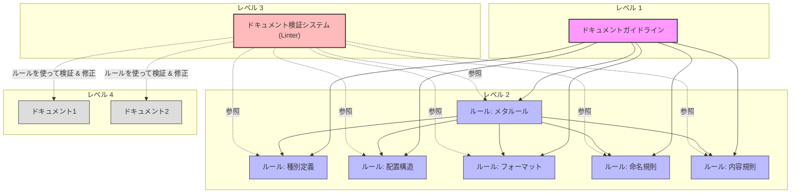

# ドキュメンテーションシステム - 人とLLMの協働ガイドライン

**更新日**: 2025/3/23
**確認日**: 2025/3/23

このガイドは、git-resumeプロジェクトにおいて、人とLLM（Large Language Model）の両方が参考にすべきドキュメンテーションの原則、ベストプラクティス、および具体的な手順を提供します。一貫した高品質なドキュメントを作成・維持することで、プロジェクトの理解性と持続可能性を確保します。

## 目的

このガイドの目的は以下の通りです：

1. プロジェクト全体のドキュメンテーション方針を統一する
2. 新規開発者のオンボーディングを効率化する
3. 人間とLLM（Clineなど）の協働をスムーズにする
4. ドキュメントの品質と一貫性を確保する
5. プロジェクトの長期的な維持管理をサポートする

## ドキュメント管理の概念モデル

このドキュメントシステムは、ESLintなどのリンティングツールに着想を得た概念モデルに基づく3つの主要コンポーネントで構成され、高品質なドキュメントを確保します。



### 主要コンポーネント

1. **ドキュメントガイドライン**（レベル1）
   - 目的、価値観、長期的ビジョンを定義
   - 「なぜ」「何のために」ドキュメントを管理するかを示す
   - 例：「人間とLLMが理解できる形式で最新の状態を維持し、必要情報に素早くアクセスできるようにする」

2. **ドキュメントルール**（レベル2）
   - ガイドラインから導出された具体的で検証可能なルール
   - 種別定義、配置構造、フォーマット、命名規則、内容規則などの基準
   - **メタルール**: 他のルールを管理・制御するルール
   - 例：「マークダウンファイルは最上部に更新日時を記載し、目次を含める」

3. **ドキュメント検証システム (Linter)**（レベル3）
   - ルールの適用状況をチェックし、必要に応じて強制適用
   - LLMを活用した検証と自動修正
   - 例：「ドキュメントリンター」がコミット前にマークダウンファイルをチェックし違反を報告または修正

### ソフトウェアエンジニアリング実践との関係

この概念モデルは、ソフトウェアエンジニアリングツールと実践に対応します：

1. **ドキュメントガイドライン** ≈ アーキテクチャ原則・設計思想
2. **ドキュメントルール** ≈ コーディング規約・ESLintルール
3. **ドキュメント検証システム** ≈ ESLint（`--check`と`--fix`機能）

ESLintがルールと自動チェック/修正でコード品質を確保するように、ドキュメント検証システムは同様のメカニズムでドキュメント品質を確保し、LLMを活用したコンテキスト認識検証を行います。

## ドキュメント体系の理想像

1. **網羅性**: プロジェクト全体の知識が適切に文書化され、必要な情報が容易に見つかる
2. **一貫性**: 標準化されたテンプレートとルールに基づいた、一貫性のある表現と構造
3. **保守性**: 更新が容易で、コードとドキュメントの乖離が最小限に抑えられる
4. **対象者別アクセス**: 各ステークホルダーが必要な情報に効率的にアクセスできる
5. **プロセス統合**: 開発プロセスと緊密に統合された、持続可能なドキュメンテーションフロー
6. **依存関係の透明性**: ドキュメント間の依存関係が明示され、変更の影響範囲が容易に把握できる

## ドキュメンテーションの基本原則

### 1. ドキュメントの種類と目的を明確にする

各ドキュメントは明確な目的を持ち、以下のカテゴリに分類されます：

- **概要ドキュメント**: プロジェクトの目的、背景、全体像を提供
- **技術ドキュメント**: アーキテクチャ、データモデル、APIなどの技術的な詳細を説明
- **ユーザーガイド**: エンドユーザー向けの使用方法や機能説明
- **開発者ガイド**: 開発環境のセットアップ、コーディング規約、貢献方法など
- **リファレンス**: APIリファレンス、設定リファレンスなど

### 2. 一貫した構造とフォーマットを維持する

すべてのドキュメントは以下の一貫した構造を持つべきです：

- ドキュメントの冒頭に**更新日**と**確認日**を記載
- 明確な見出しと階層構造（Markdownの見出しレベルを適切に使用）
- 必要に応じたコード例、図表、スクリーンショット
- 関連するドキュメントへのリンク
- Changelogセクション（変更履歴）

### 3. 内容の正確性と最新性を確保する

- 実装と一致した正確な情報を提供する
- 定期的なレビューと更新を行う
- 古くなった情報や非推奨機能には明確な注記を付ける
- コード例は実際に動作するものを使用する

### 4. 読者を意識した書き方をする

- 技術レベルに応じた適切な説明の詳細度を選択する
- 専門用語を使用する場合は初出時に説明を加える
- 簡潔で明瞭な言葉遣いを心がける
- 箇条書きや表を効果的に活用して読みやすさを向上させる

## ドキュメントの種類と配置

git-resumeプロジェクトでは、以下のドキュメント構造を採用しています：

### プロジェクトルート

- `README.md`: プロジェクトの概要、インストール方法、基本的な使用方法
- `.env.sample`: 環境変数のサンプルと説明

### docs/ ディレクトリ

- `docs/README.md`: 本ドキュメント（ドキュメンテーションガイド）

- `docs/guide/`: ユーザー向けガイドライン
  - `README.md`: 一般ユーザー向けの操作方法や機能説明の概要
  - `developer/`: 開発者向けガイド
    - `README.md`: 開発者向けガイドのメインページ
  - `operator/`: 運用者向けガイド
    - `README.md`: 運用者向けガイドのメインページ
  -  `users/`: ユーザー向けガイド
    - `README.md`: ユーザー向けガイドのメインページ
  - `features/`: 機能詳細説明
    - `resume-generation.md`: レジュメ生成機能の詳細
  - `usage/`: インターフェース別の使用方法
    - `api-guide.md`: APIの使用方法
    - `cli-guide.md`: CLIツールの使用方法
    - `web-guide.md`: Webアプリケーションの使用方法
  - `troubleshooting.md`: 一般的な問題とその解決方法
  - `releases/`: リリース情報
    - `CHANGELOG.md`: バージョンごとの変更点や新機能の説明

- `docs/templates/`: 開発ドキュメントテンプレート
    - `README.md`: テンプレートの概要と使用方法
    - `prd-template.md`: Product Requirement Document テンプレート
    - `tech-template.md`: Technical Design Document テンプレート

- `docs/rules/`: ドキュメントルール
  - `README.md`: ドキュメントルール一覧と概要
  - `types.md`: 種別定義に関するルール
  - `structure.md`: 配置構造に関するルール
  - `format/`: フォーマットに関するルール
    - `README.md`: フォーマットルールの概要
    - `links.md`: リンク方法に関するルール
  - `validation.md`: ドキュメント検証システム

### アプリケーションとパッケージ

- `apps/api/README.md`: APIアプリケーションの説明、実装詳細、使用方法
- `apps/cli/README.md`: CLIツールの説明と使用方法
- `apps/web/README.md`: Webアプリケーションの説明と使用方法
- `packages/*/README.md`: 各共有パッケージの説明と使用方法

### .clinerules/ ディレクトリ

- `README.md`: .clinerules全体の目次
- `important-docs.md`: プロジェクトの重要な資料の場所をまとめたリスト
- `commit-rules.md`: プロンプト履歴の記録ルール
- `repomix.md`: リポジトリコードを効率的に理解するための方法
- `prompts/update-docs.md`: ドキュメント更新時のルールとテンプレート

## ドキュメンテーションプロセス

### 新規機能開発時のドキュメント作成フロー

1. **要件定義ステップ**
   - Product Requirement Document (PRD) を作成
   - 機能の「なぜ」と「何を」を明確にする
   - ユーザーストーリー、要件、目的を記述

2. **技術検討ステップ**
   - Technical Design Document (TDD) を作成
   - 機能の「どのように」を設計
   - アーキテクチャ、データフロー、API設計を記述
   - 必要に応じてサブディレクトリに分割（アーキテクチャ、実装詳細、テスト計画など）

3. **実装ステップ**
   - コードと並行して実装ドキュメントを更新
   - APIドキュメントやユーザーガイドのドラフトを作成

4. **テストステップ**
   - テスト計画と結果を文書化
   - トラブルシューティングガイドを更新

5. **リリースステップ**
   - CHANGELOGを更新
   - ユーザーガイドを完成
   - リリースノートを作成

6. **リリース後の振り返りステップ**
   - ドキュメントの改善点を特定
   - フィードバックに基づいて更新

### ドキュメント更新の原則

- 機能やコードを変更する際は、関連するドキュメントも同時に更新する
- 大きな変更の場合は、事前にドキュメント更新計画を作成する
- 既存のドキュメント構造を尊重し、突然の大きな変更は避ける
- 更新日とChangelogを必ず更新する
- 内容に意味的な大きな変化がない場合は確認日のみを更新する

## LLMとのコラボレーションにおけるドキュメンテーション

### LLMがドキュメントを作成・更新する際のガイドライン

1. **事前の理解と計画**
   - 既存のドキュメント構造と内容を理解する
   - 更新の目的と範囲を明確にする
   - 人間に更新計画を提示し、承認を得る

2. **ドキュメント作成・更新時**
   - 既存の書式やスタイルを一貫して適用する
   - 冒頭の更新日と確認日を必ず更新する
   - Changelogに変更内容を記録する
   - 客観的で正確な情報を提供する
   - 適切な相互参照リンクを含める

3. **レビューと確認**
   - 変更箇所を明示して人間のレビューを依頼する
   - フィードバックを適切に反映する
   - 最終確認を行った上で確定する

### LLMがドキュメントを参照する際の効率化

LLM（Clineなど）がプロジェクトを効率的に理解するために：

- `.clinerules/important-docs.md` を最初に参照して全体像を把握
- `.clinerules/repomix.md` のガイドラインに従ってコードを効率的に分析
- 各ドキュメント間の相互参照リンクを活用して関連情報に素早くアクセス
- `.clinerules/prompts/update-docs.md` のテンプレートとルールに従ってドキュメントを更新

## ベストプラクティスと具体例

### 効果的なドキュメント例

1. **明確な構造と見出し**
   ```markdown
   # 機能タイトル

   **更新日**: 2025/3/21
   **確認日**: 2025/3/21

   ## 概要

   [簡潔な説明]

   ## 動作詳細

   ### ユースケース1
   [説明]

   ### ユースケース2
   [説明]

   ## 実装方法

   [コード例やアーキテクチャ図]

   ## 関連ドキュメント

   - [リンク1]
   - [リンク2]

   ## Changelog

   - 2025/3/21: 初回作成
   ```

2. **適切な図表の使用**
   - シーケンス図、アーキテクチャ図、データフロー図などを活用
   - Mermaidなどのマークダウン内で描画可能な図表ツールを活用

3. **コード例と説明の組み合わせ**
   ```markdown
   ## API使用例

   ```typescript
   // ユーザー情報を取得
   const user = await githubService.getUserDetail('username');
   console.log(user.repositories);  // リポジトリ一覧にアクセス
   ```

   上記の例では、`getUserDetail` メソッドを使用してGitHubユーザーの情報を取得し、
   その結果から `repositories` プロパティにアクセスしています。
   ```

## トラブルシューティングとFAQ

### ドキュメント作成・更新時の一般的な問題

1. **ドキュメントとコードの乖離**
   - 解決策: 機能実装とドキュメント更新を同時に行う
   - 定期的なドキュメントレビューを実施する

2. **過剰または不足した情報量**
   - 解決策: 対象読者と目的を明確にし、それに適した詳細度を選択する
   - 基本情報と詳細情報を適切に分離する

3. **リンク切れや古い参照**
   - 解決策: ドキュメント更新時にリンクの有効性を確認する
   - 相対パスを使用して、ファイル移動時の影響を最小化する

4. **検索性の低さ**
   - 解決策: 適切な見出しと明確な構造を使用する
   - キーワードを意識した記述を心がける

## 利用フロー

1. **ドキュメントガイドラインの策定**
   - ベストプラクティスの理解
   - プロジェクト特性の理解（規模に応じた必要ドキュメントの違いなど）
   - ガイドライン策定（構造、規約など）
   - 既存ガイドラインの改善検討

2. **現状とのギャップ分析**
   - 基本方針と現状の比較
   - ギャップの特定と分析

3. **適用計画の策定**
   - ギャップの優先順位付け
   - 段階的な適用計画の作成

4. **適用計画の実行**
   - 計画に基づく改善実施
   - 必要に応じた計画の見直し

5. **定期的な検査と更新**
   - ガイドラインの定期的な見直し
   - 目的や機能変化に応じた調整
   - 遵守状況の確認と修正

## ドキュメントガイドラインを実現するルールの一覧と概要

今後、以下のドキュメントルールファイルを作成・整備していく予定です：

- [ドキュメント種別](docs/rules/types.md): プロジェクトに必要なドキュメントの種別を定義
- [ドキュメント配置構造](docs/rules/structure.md): ドキュメントの配置構造を定義
- [ドキュメントフォーマット](docs/rules/format/README.md): ドキュメントのフォーマットを定義
- [ドキュメントの更新ルール](docs/rules/documents/meta-data.md): ドキュメントの更新ルールを定義
- [ドキュメント依存関係管理](docs/rules/documents/relations.md): ドキュメント間の依存関係を管理するルールを定義
- [ドキュメントメタデータ標準](docs/rules/documents/meta-data.md): ドキュメントのメタデータ標準を定義
- [ドキュメント検証システム](docs/rules/validation.md): ドキュメントの検証と自動修正の仕組みを定義

## Changelog

- 2025/3/23: 3階層モデルの概念を導入し、ドキュメント管理の概念モデル、ドキュメント体系の理想像、利用フロー、ドキュメントガイドラインを実現するルールの一覧を追加
- 2025/3/21: ドキュメント構造の説明を最新化（docs/guide と docs/dev-guide の分離構造を反映）
- 2025/3/21: .clinerules/documentation-guide.md から docs/README.md に移動
- 2025/3/21: 初回作成
