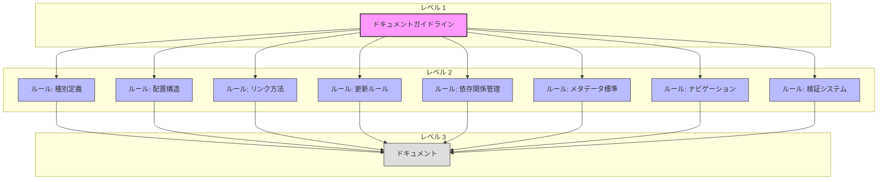

# ドキュメントガイドライン

**更新日**: 2025/3/23
**確認日**: 2025/3/23

## 目的

- 人とLLMがドキュメントを作成・更新するためのガイドラインを策定する
- プロジェクトの持続的な発展と効率的な知識共有を実現する
- 異なるステークホルダーの必要性に応じたドキュメント構造を確立する
- LLM（Clineなど）の活用を含めた、ドキュメント作成・維持の効率化を実現する
- プロジェクトの知識資産としてのドキュメントの価値を最大化する

## ドキュメントシステムの概念モデル

このドキュメントシステムは、以下の3つの主要コンポーネントで構成されています。

1.  **ドキュメントガイドライン**: ドキュメント作成・管理の目的、価値観、長期的ビジョンを定義します。（本ドキュメント）
2.  **ドキュメントルール**: ガイドラインから導出された具体的で検証可能なルール群。（`docs/rules`配下の各ドキュメント）
3.  **ドキュメント検証システム**: ドキュメントがルールに準拠しているかをチェックし、必要に応じて修正するシステム。（`docs/rules/validation.md`参照）

この概念モデルは、ESLintなどのリンティングツールに着想を得ています。
ESLintがルールと自動チェック/修正でコード品質を確保するように、ドキュメント検証システムは同様のメカニズムでドキュメント品質を確保します。

## ドキュメント体系の理想像

1. **網羅性**: プロジェクト全体の知識が適切に文書化され、必要な情報が容易に見つかる
2. **一貫性**: 標準化されたテンプレートとルールに基づいた、一貫性のある表現と構造
3. **保守性**: 更新が容易で、コードとドキュメントの乖離が最小限に抑えられる
4. **対象者別アクセス**: 各ステークホルダーが必要な情報に効率的にアクセスできる
5. **プロセス統合**: 開発プロセスと緊密に統合された、持続可能なドキュメンテーションフロー
6. **依存関係の透明性**: ドキュメント間の依存関係が明示され、変更の影響範囲が容易に把握できる

## ドキュメントガイドラインの利用フロー

1. **ドキュメントガイドラインの策定**: プロジェクトの特性に合わせて、ドキュメントガイドラインを策定します。
2. **現状とのギャップ分析**: ガイドラインと現状のドキュメントを比較し、ギャップを特定します。
3. **適用計画の策定**: ギャップを解消するための計画を立て、優先順位を付けます。
4. **適用計画の実行**: 計画に基づいて、ドキュメントの改善を実施します。
5. **定期的な検査と更新**: 定期的にドキュメントの状況を検査し、ガイドラインを更新します。

## ドキュメントガイドラインを実現するルールの一覧と概要

- [ドキュメント種別](./rules/types.md): プロジェクトに必要なドキュメントの種別を定義
- [ドキュメント配置構造](./rules/structure.md): ドキュメントの配置構造を定義
- [ドキュメントリンク方法](./rules/links.md): ドキュメント内のリンク方法を定義
- [ドキュメントの更新ルール](./rules/documents/code-doc-sync.md): ドキュメントの更新ルールを定義
- [ドキュメント依存関係管理](./rules/documents/relations.md): ドキュメント間の依存関係を管理するルールを定義
- [ドキュメントメタデータ標準](./rules/documents/metadata.md): ドキュメントのメタデータ標準を定義
- [ドキュメントナビゲーション](./rules/documents/navigation.md): ドキュメント間の移動を容易にするルールを定義
- [ドキュメント検証システム](./rules/validation.md): ドキュメントの検証と自動修正の仕組みを定義

各ルールの詳細については、`docs/rules/README.md`を参照してください。

## ドキュメント構造の移行計画

現在のドキュメント構造を以下のように再編成する計画があります：

1. 各ルールを専用ディレクトリに移動し、README.mdとして再編成
   - 例: `rules/types.md` → `rules/types/README.md`
2. 関連するサブルールを専用ディレクトリ内に配置
   - 例: `rules/format/links.md`
3. メタデータ関連のルールを統合・整理
   - `rules/documents/metadata.md`と`rules/documents/meta-data.md`を統合

詳細な移行計画と進捗状況については、以下のドキュメントを参照してください：

- [ドキュメントルールの適用計画](./PLAN.md)
- [ドキュメントルールの適用状況](./PROGRESS.md)

## Changelog

- 2025/3/23: [追加] ドキュメントシステムの概念モデル、利用フローを追加
- 2025/3/23: [追加] ドキュメント構造の移行計画を追加
- 2025/3/23: [変更] リンクを相対パスに修正
- 2025/3/23: [追加] メタデータを追加
- 2025/3/20: 初回作成
