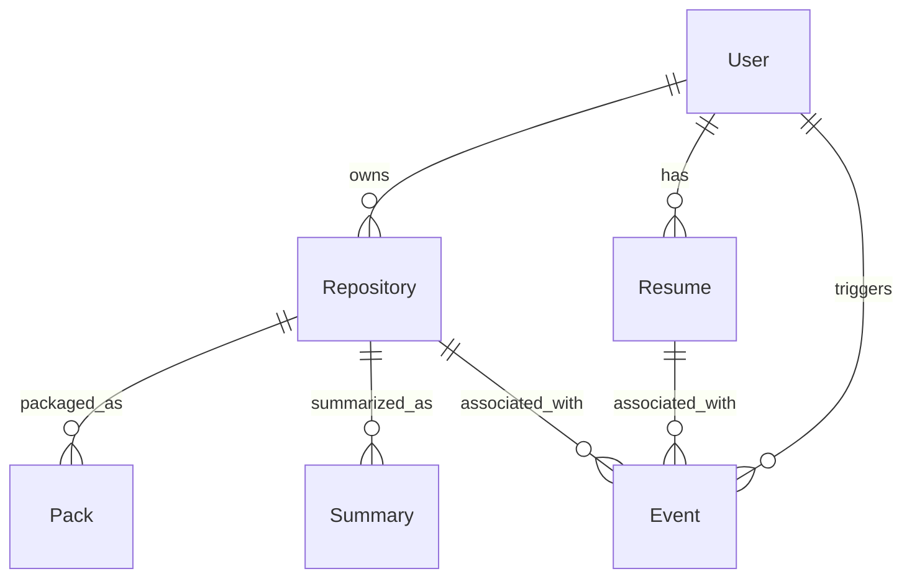

# データモデル図

**更新日**: 2025/3/21
**確認日**: 2025/3/21

## 概要

git-resumeプロジェクトで使用される主要なデータモデルとその関連性を説明します。これらのモデルは、`packages/models`パッケージで定義され、各アプリケーション（API、CLI、Web）で共通して使用されています。

## 主要データモデル

### User

GitHubユーザーの情報を表すモデルです。

```typescript
type User = {
  id: number;           // GitHubユーザーID
  userName: string;     // GitHubユーザー名
  displayName: string | null; // 表示名
  blog: string | null;  // ブログURL
  avatarUrl: string;    // アバター画像URL
};
```

### Repository

GitHubリポジトリの情報を表すモデルです。

```typescript
type Repository = {
  id: number;           // リポジトリID
  name: string;         // リポジトリ名
  fullName: string;     // 所有者/リポジトリ名の形式
  description: string | null; // リポジトリの説明
  url: string;          // リポジトリのURL
  language: string | null; // 主要プログラミング言語
  stars: number;        // スター数
  forks: number;        // フォーク数
  lastUpdated: string;  // 最終更新日時
  owner: User;          // リポジトリ所有者
};
```

### Resume

ユーザーのレジュメ情報を表すモデルです。

```typescript
type Resume = {
  id: string;           // レジュメID
  userName: string;     // GitHubユーザー名
  generatedAt: string;  // 生成日時
  content: string;      // レジュメの内容
  metadata: {           // メタデータ
    repositoriesAnalyzed: number; // 分析したリポジトリ数
    commitsAnalyzed: number;     // 分析したコミット数
    skillsDetected: string[];    // 検出したスキル
  };
};
```

### Pack

リポジトリのコードパッケージング情報を表すモデルです。

```typescript
type Pack = {
  id: string;           // パックID
  repositoryId: number; // リポジトリID
  createdAt: string;    // 作成日時
  files: Array<{        // 含まれるファイル
    path: string;       // ファイルパス
    language: string;   // プログラミング言語
    loc: number;        // コード行数
  }>;
  metrics: {            // コードメトリクス
    totalLoc: number;   // 総コード行数
    languages: Record<string, number>; // 言語別の割合
  };
};
```

### Summary

リポジトリやユーザー活動のサマリー情報を表すモデルです。

```typescript
type Summary = {
  id: string;           // サマリーID
  repositoryName: string; // リポジトリ名
  generatedAt: string;  // 生成日時
  languages: Record<string, number>; // 言語別の割合
  codeMetrics: {        // コードメトリクス
    linesOfCode: number; // コード行数
    functions: number;   // 関数数
    classes: number;     // クラス数
  };
  topContributors: Array<{  // 主要貢献者
    userName: string;    // ユーザー名
    contributions: number; // 貢献数
  }>;
};
```

### Events

システム内のイベント情報を表すモデルです。

```typescript
type EventType = 'RESUME_GENERATED' | 'SUMMARY_CREATED' | 'REPOSITORY_ANALYZED';

type Event = {
  id: string;           // イベントID
  type: EventType;      // イベントタイプ
  timestamp: string;    // タイムスタンプ
  data: any;            // イベントデータ
  userId?: string;      // 関連ユーザーID（オプション）
};
```

## データモデル関連図

以下の図は、主要なデータモデル間の関連性を示しています：



### モデル関連性の説明

- **User** (ユーザー)
  - 一人のユーザーは複数のリポジトリを所有できます
  - 一人のユーザーは複数のレジュメを持つことができます
  - ユーザーは様々なイベントをトリガーします

- **Repository** (リポジトリ)
  - 各リポジトリは一人のオーナーを持ちます
  - リポジトリはパッケージ化してPackとして保存できます
  - リポジトリの分析結果はSummaryとして保存できます
  - リポジトリに関連する様々なイベントが発生します

- **Resume** (レジュメ)
  - レジュメはユーザーのGitHub活動から生成されます
  - レジュメの生成はイベントとして記録されます

- **Pack** (パッケージ)
  - パックはリポジトリのコード分析結果です
  - 一つのリポジトリは複数のパックを持つことができます（異なる時点での分析）

- **Summary** (サマリー)
  - サマリーはリポジトリの要約情報です
  - 一つのリポジトリは複数のサマリーを持つことができます（更新による変化）

- **Event** (イベント)
  - システム内の様々なアクションを記録します
  - ユーザー、リポジトリ、レジュメなどと関連付けられます

## 実装上の考慮事項

1. **型安全性**
   - すべてのモデルはTypeScriptの型定義により、型安全性を確保しています
   - 共有パッケージとして実装されているため、アプリケーション間で一貫した型定義が維持されます

2. **拡張性**
   - 将来的な機能追加に対応できるよう、モデルは拡張性を考慮して設計されています
   - 破壊的変更を行う場合は、影響範囲の評価とマイグレーション計画が必要です

3. **バリデーション**
   - モデルには型以外のバリデーションルールも含まれる場合があります
   - 実際の実装ではZodなどのスキーマバリデーションライブラリの使用が推奨されます

## Changelog

- 2025/3/21: 初回作成
