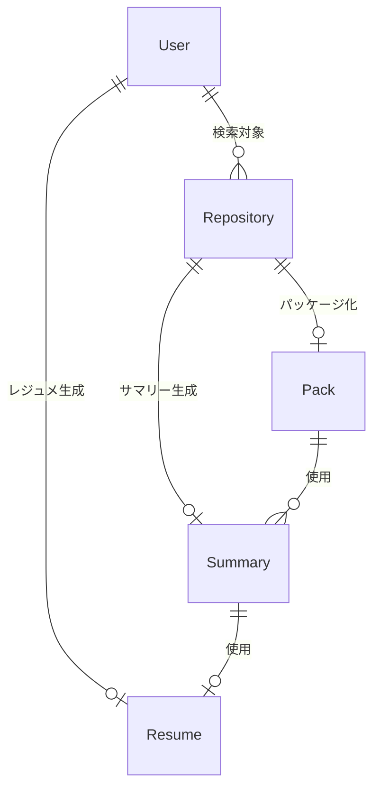

# データモデル図

**更新日**: 2025/3/21
**確認日**: 2025/3/21

## 概要

git-resumeプロジェクトで使用される主要なデータモデルとその関連性を説明します。これらのモデルは、`packages/models`パッケージで定義され、各アプリケーション（API、CLI、Web）で共通して使用されています。

## 主要データモデル

### User

GitHubユーザーの情報を表すモデルです。

```typescript
type User = {
  id: number;           // GitHubユーザーID
  userName: string;     // GitHubユーザー名
  displayName: string | null; // 表示名
  blog: string | null;  // ブログURL
  avatarUrl: string;    // アバター画像URL
};
```

### Repository

GitHubリポジトリの情報を表すモデルです。

```typescript
type Repository = {
  id: number;           // リポジトリID
  owner: string;        // オーナー名
  name: string;         // リポジトリ名
  isPrivate: boolean;   // プライベートリポジトリかどうか
};
```

### Resume

ユーザーのレジュメ情報を表すモデルです。

```typescript
type Resume = {
  body: string;         // レジュメの内容(マークダウン形式)
};
```

### Pack

リポジトリのコードパッケージング情報を表すモデルです。

```typescript
type Pack = {
  meta: {               // メタデータ
    owner: string;      // リポジトリオーナー
    repo: string;       // リポジトリ名
  };
  body: string;         // パッケージ化されたコード内容
};
```

### Summary

リポジトリのサマリー情報を表すモデルです。

```typescript
type Summary = string;  // リポジトリのサマリー内容(マークダウン形式)
```

### Events

レジュメ生成プロセスの状態管理に使用されるイベント型です。Server-Sent Events (SSE)でクライアントに進捗状況をリアルタイムに配信するために使用されます。

```typescript
// イベントタイプの列挙型
enum EventType {
  CONNECTED = "connected",
  RESUME_PROGRESS = "resume_progress"
}

// レジュメ生成プロセスの状態タイプの列挙型
enum ResumeEventType {
  GIT_SEARCH = "GitSearch",
  GIT_CLONE = "GitClone",
  ANALYZE = "Analyze",
  CREATE_SUMMARY = "CreateSummary",
  CREATING_RESUME = "CreatingResume",
  COMPLETE = "Complete"
}
```

主な状態型:

1. **GitSearchState**: リポジトリ検索状態
2. **GitCloneState**: リポジトリクローン状態
3. **AnalyzeState**: リポジトリ分析状態
4. **CreateSummaryState**: サマリー生成状態
5. **CreatingResumeState**: レジュメ生成状態
6. **ResumeCompletedEvent**: レジュメ生成完了状態

## データモデル関連図

以下の図は、主要なデータモデル間の関連性を示しています：



### モデル関連性の説明

- **User** (ユーザー)
  - ユーザーのGitHubアカウント情報を保持します
  - ユーザー名に基づいて関連リポジトリが検索されます

- **Repository** (リポジトリ)
  - ユーザーが所有またはコントリビュートしているリポジトリの情報を保持します
  - パッケージ化やサマリー生成の対象となります

- **Pack** (パッケージ)
  - リポジトリのコードをパッケージ化した結果です
  - サマリー生成の入力として使用されます

- **Summary** (サマリー)
  - リポジトリのコード内容を要約したテキストです
  - レジュメ生成の入力として使用されます

- **Resume** (レジュメ)
  - サマリーをもとに生成されたレジュメです
  - 最終的な出力物として提供されます

- **Events** (イベント)
  - レジュメ生成プロセス全体の進捗状況を追跡するために使用されます
  - クライアントへのリアルタイム更新のために使用されます

## 実装上の考慮事項

1. **シンプルなデータモデル**
   - 現在の実装では、各モデルは必要最小限のプロパティを持つシンプルな構造になっています
   - 多くのデータはマークダウン形式の文字列として保存され、複雑なデータ構造は避けられています

2. **イベント駆動型設計**
   - レジュメ生成プロセスは複数のステップから構成され、各ステップの進捗状況はイベントとして通知されます
   - SSEを使用することで、長時間のプロセスでもユーザーに進捗状況をリアルタイムに伝えることができます

3. **拡張性**
   - 現在はシンプルなモデルですが、将来的な機能拡張に対応できる設計になっています
   - 例えばResume型は現在単純なbodyプロパティのみですが、必要に応じてメタデータやカスタマイズオプションを追加できます

## Changelog

- 2025/3/21: 初回作成
