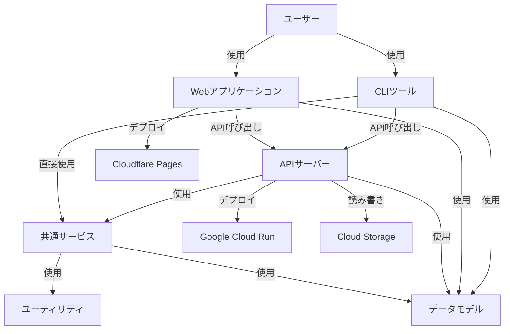
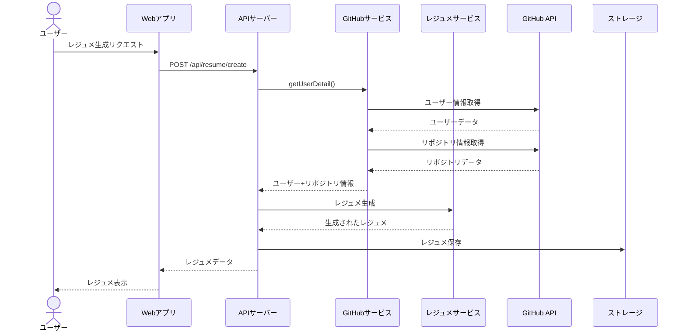
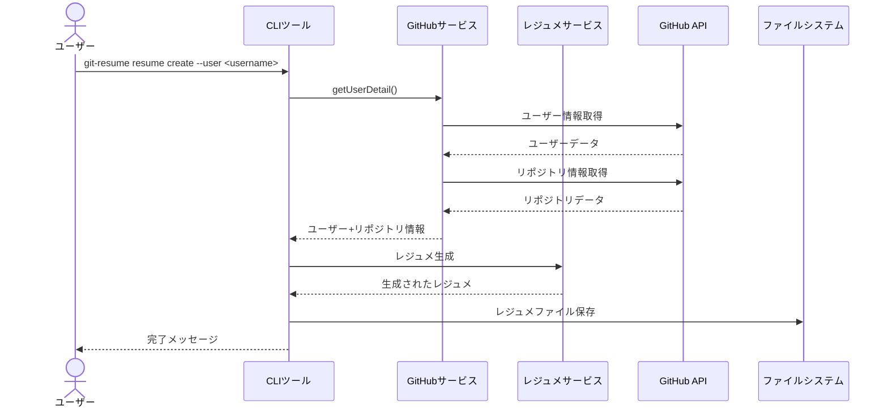
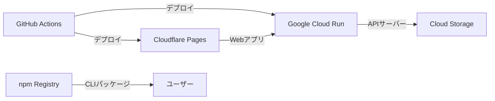

# アーキテクチャ概要図

**更新日**: 2025/3/21
**確認日**: 2025/3/21

## 概要

git-resumeプロジェクトのシステムアーキテクチャ、技術スタック、コンポーネント間の関係性を説明します。このドキュメントは、システム全体の構造を理解し、各コンポーネントの役割と相互作用を把握するための参考となります。

## システム構成

git-resumeは、以下の主要コンポーネントからなるモノレポ構造で実装されています：

```
git-resume/
├── apps/
│   ├── api/     - バックエンドAPI (Node.js)
│   ├── cli/     - コマンドラインツール
│   └── web/     - Webフロントエンド (React)
├── packages/
│   ├── models/  - 共有データモデル
│   ├── services/- 共有サービス機能
│   └── utils/   - ユーティリティ関数
└── infra/       - インフラストラクチャ (Terraform)
```

## アーキテクチャ図

### 全体構成

以下の図は、git-resumeシステムの全体構成を示しています：



### コンポーネント間のデータフロー

以下の図は、ユーザーがレジュメを生成する際の主要なデータフローを示しています：



### CLIツールのフロー

CLIツールを使用してレジュメを生成する場合のフローは以下の通りです：



## 技術スタック

### フロントエンド (Web)

- **フレームワーク**: React
- **言語**: TypeScript
- **ルーティング**: React Router
- **API連携**: Hono.js クライアント
- **ビルドツール**: Vite
- **デプロイメント**: Cloudflare Pages/Workers

### バックエンド (API)

- **ランタイム**: Node.js
- **言語**: TypeScript
- **パッケージ管理**: pnpm
- **ビルドツール**: tsup
- **デプロイメント**: Docker, Google Cloud Run
- **CI/CD**: GitHub Actions

### CLI

- **言語**: TypeScript
- **フレームワーク**: Commander.js
- **ビルドツール**: tsup
- **配布**: npm

### 共通技術

- **モノレポ管理**: Turborepo
- **リント・フォーマット**: Biome
- **バージョン管理**: Git, GitHub
- **インフラ管理**: Terraform

## デプロイメント構成

git-resumeは、以下のように各コンポーネントがデプロイされています：

### 本番環境



### 開発環境

開発環境ではローカルで各コンポーネントを実行します：

- Webアプリ: `pnpm dev --filter=web`（通常 http://localhost:5173）
- APIサーバー: `pnpm dev --filter=api`（通常 http://localhost:3001）
- CLI: `pnpm dev --filter=cli`（ローカルでの直接実行）

## サービス依存関係

git-resumeが依存する外部サービスは以下の通りです：

- **GitHub API**: ユーザー情報、リポジトリデータの取得
- **Google Cloud Platform**: 
  - Cloud Run: APIサーバーのホスティング
  - Cloud Storage: 生成されたレジュメやパッケージの保存
- **Cloudflare**: Webアプリケーションのホスティング
- **npm**: CLIツールの配布

## スケーラビリティと冗長性

- **APIサーバー**: Cloud Runにデプロイされ、自動スケーリングされます
- **ストレージ**: Cloud Storageは高い冗長性と耐久性を提供します
- **Webアプリ**: Cloudflare Pagesは世界中のCDNを通じて配信されます

## セキュリティ考慮事項

- **認証**: GitHub OAuth認証を使用しています
- **API通信**: すべてのAPI通信はHTTPS経由で行われます
- **環境変数**: 機密情報（APIキーなど）は環境変数として管理されています
- **権限スコープ**: 必要最小限のGitHub APIスコープのみを要求しています

## 今後の拡張と改善

1. **マイクロサービス化**: 一部の機能をサーバーレス関数として分離
2. **データベース導入**: 現在はCloud Storageのみを使用していますが、より複雑なクエリのためにデータベースの導入を検討
3. **リアルタイム通知**: WebSocketsを使用したリアルタイム更新機能
4. **分析エンジンの強化**: AIを活用したスキル分析とキャリア提案の改善

## Changelog

- 2025/3/21: 初回作成
