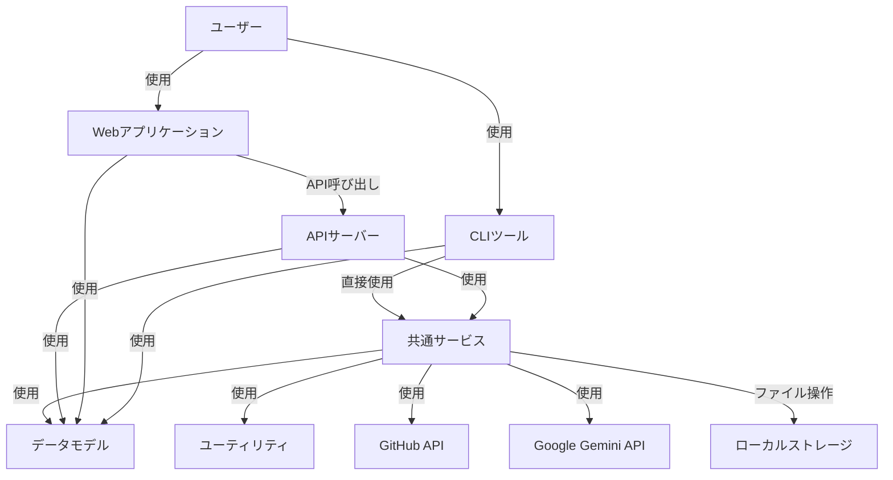
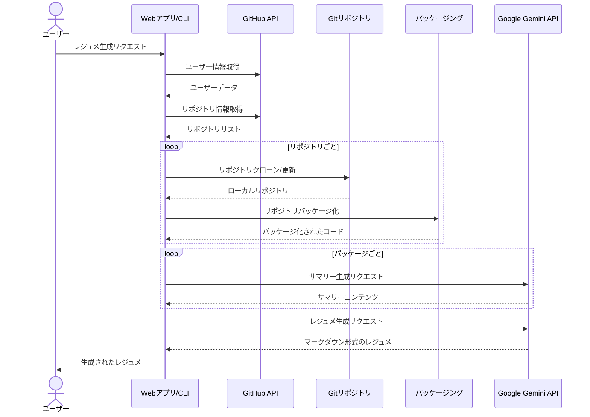
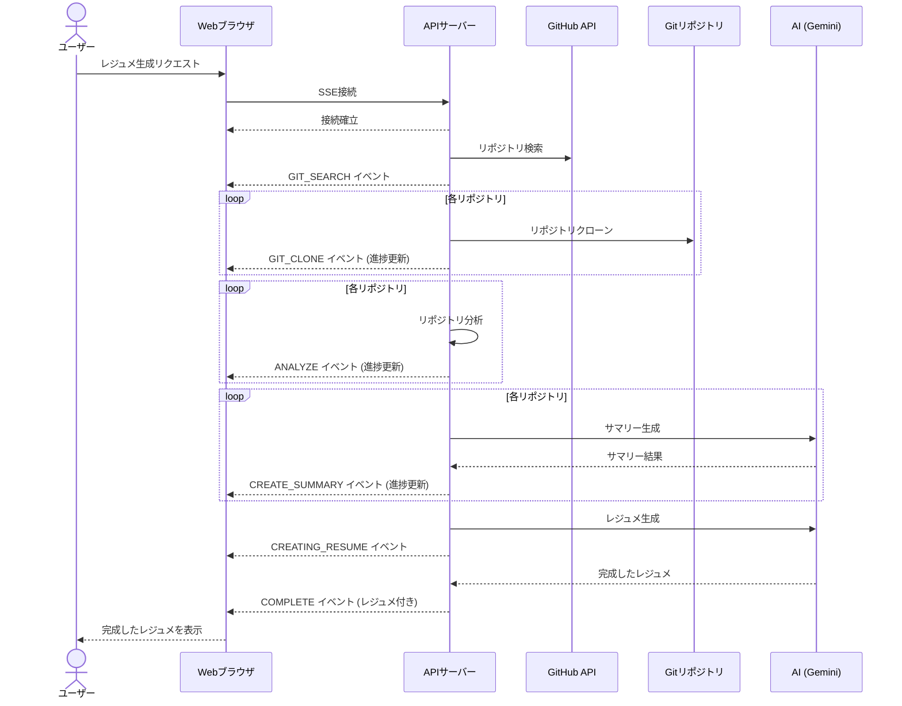

# アーキテクチャ概要図

**更新日**: 2025/3/21
**確認日**: 2025/3/21

## 概要

git-resumeプロジェクトのシステムアーキテクチャ、技術スタック、コンポーネント間の関係性を説明します。このドキュメントは、現在の実装状況に基づき、システム全体の構造と各コンポーネントの役割を把握するための参考となります。

## システム構成

git-resumeは、以下の主要コンポーネントからなるモノレポ構造で実装されています：

```
git-resume/
├── apps/
│   ├── api/     - バックエンドAPI (Node.js + Hono.js)
│   ├── cli/     - コマンドラインツール (Node.js + Commander.js)
│   └── web/     - Webフロントエンド (React + TypeScript)
├── packages/
│   ├── models/  - 共有データモデル
│   ├── services/- 共有サービス機能
│   └── utils/   - ユーティリティ関数
└── infra/       - インフラストラクチャ設定 (Terraform)
```

## アーキテクチャ図

### 全体構成

以下の図は、git-resumeシステムの全体構成を示しています：



### レジュメ生成のプロセスフロー

以下の図は、レジュメ生成の一連のプロセスフローを示しています：



### Server-Sent Events (SSE) フロー

Webアプリケーションでは、Server-Sent Events (SSE) を使用してレジュメ生成プロセスの進捗状況をリアルタイムで表示しています：



## 技術スタック

### フロントエンド (Web)

- **フレームワーク**: React
- **言語**: TypeScript
- **ルーティング**: React Router
- **スタイリング**: TailwindCSS
- **マークダウンレンダリング**: ReactMarkdown + remark-gfm
- **リアルタイム更新**: fetch-event-source (SSE)
- **ビルドツール**: Vite

### バックエンド (API)

- **ランタイム**: Node.js
- **言語**: TypeScript
- **Webフレームワーク**: Hono.js
- **バリデーション**: Valibot
- **ストリーミング**: Server-Sent Events (SSE)
- **ビルドツール**: tsup

### CLI

- **言語**: TypeScript
- **コマンドライン**: Commander.js
- **ビルドツール**: tsup

### 共通技術

- **AIモデル**: Google Gemini API
- **バージョン管理**: Git, GitHub
- **パッケージ管理**: pnpm
- **モノレポ管理**: Turborepo
- **リント・フォーマット**: Biome

## 主要コンポーネントの責務

### API (apps/api)

- GitHubユーザー情報の取得とレジュメ生成処理
- SSEを使用したリアルタイム進捗状況の配信
- GitHubとの認証連携

### CLI (apps/cli)

- ターミナルからのレジュメ生成機能の提供
- リポジトリのクローン、分析、サマリー生成
- ローカルファイルシステムでの結果管理

### Web (apps/web)

- ユーザーフレンドリーなインターフェースの提供
- レジュメ生成プロセスのビジュアライゼーション
- マークダウン形式のレジュメレンダリング

### サービス (packages/services)

- GitHub API連携
- Git操作
- レジュメ生成ロジック
- AI (Google Gemini) との連携

## 開発環境

開発環境ではローカルで各コンポーネントを実行します：

- Webアプリ: `pnpm dev --filter=web`（http://localhost:5173）
- APIサーバー: `pnpm dev --filter=api`（http://localhost:3001）
- CLI: `pnpm dev --filter=cli`（ローカル実行）

## セキュリティ考慮事項

- **GitHub Token**: 環境変数として設定され、APIリクエストの認証に使用
- **AI API Key**: Google Gemini APIとの通信に使用（環境変数で管理）
- **ローカルデータ**: 生成されたレジュメやパッケージはローカルファイルシステムに保存

## 今後の拡張可能性

1. **認証の追加**: ユーザー認証システムの実装
2. **デプロイメント**: Dockerコンテナ化とクラウドデプロイメント
3. **データベース**: レジュメや分析結果の永続化
4. **高度な分析**: より詳細なコード分析と洞察の提供
5. **レジュメテンプレート**: 複数のフォーマットとスタイルのサポート

## Changelog

- 2025/3/21: 初回作成
