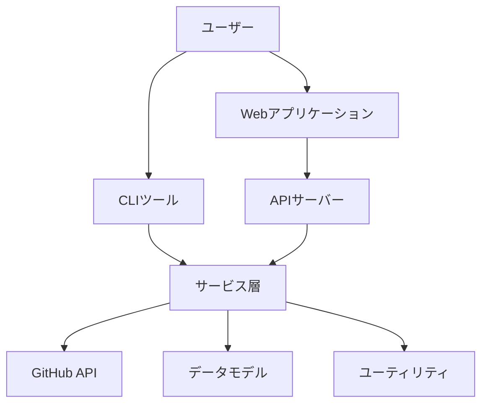

# システムアーキテクチャ

**更新日**: 2025/3/21
**確認日**: 2025/3/21

## 概要

このディレクトリでは、git-resumeプロジェクトのシステムアーキテクチャと技術的設計に関するドキュメントを提供します。アーキテクチャ文書は、開発者がシステムの構造、コンポーネント間の関係、データフロー、設計パターンを理解するための重要なリソースです。

## ディレクトリ内容

このディレクトリには以下のドキュメントが含まれています：

- [システム概要](./overview.md) - システム構成、コンポーネント間の関係、技術スタックの詳細
- [データモデル](./data-models.md) - プロジェクトで使用されるデータモデルと関連性の説明
- [アーキテクチャ決定記録](./adr/) - 重要な技術的決定とその理由の記録

## アーキテクチャ概要

git-resumeプロジェクトは、モノレポ構造を採用した複数のアプリケーションとパッケージで構成されています：

1. **アプリケーション**:
   - `apps/api`: バックエンドAPI（Hono.js）
   - `apps/cli`: コマンドラインインターフェース
   - `apps/web`: Webフロントエンド（React + Remix）

2. **共有パッケージ**:
   - `packages/models`: データモデル定義
   - `packages/services`: 共通サービス機能
   - `packages/utils`: ユーティリティ関数

## アーキテクチャ図

## 技術スタック概要

- **フロントエンド**: React, TypeScript, Remix
- **バックエンド**: Node.js, Hono.js, TypeScript
- **CLI**: Node.js, Commander.js
- **データ処理**: Server-Sent Events (SSE), Streams
- **インフラ**: Cloudflare Pages, Firebase (計画中)
- **ビルドツール**: Turborepo, pnpm

詳細な情報については、各ドキュメントを参照してください。アーキテクチャに関する決定記録は [ADR](./adr/) ディレクトリで確認できます。

## アーキテクチャドキュメントの更新

アーキテクチャに変更を加える場合は、以下の手順に従ってください：

1. 変更内容を詳細に記述した ADR を作成
2. 関連するアーキテクチャドキュメントを更新
3. ダイアグラムやデータモデルの図を最新状態に維持
4. プルリクエストを通じてレビューを依頼

## 関連資料

- [API実装詳細](/apps/api/README.md)
- [開発フロー](/docs/dev-guide/development-flow.md)
- [テンプレート](/docs/dev-guide/templates/)

## Changelog

- 2025/3/21: ADRディレクトリを本ディレクトリ配下に移動し統合
- 2025/3/21: API実装詳細への参照を更新（実装コード側に移動されたため）
- 2025/3/21: 初回作成（docs/architecture/ から移動・再構成）
