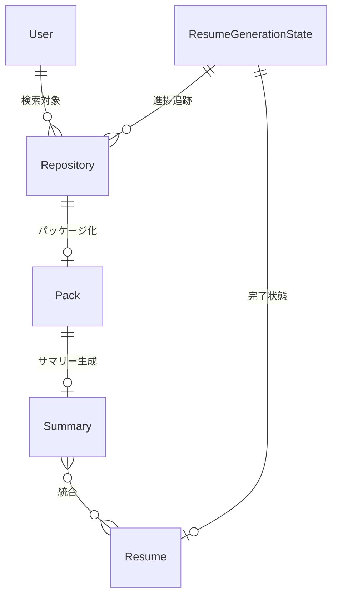

# データモデル図

**更新日**: 2025/3/21
**確認日**: 2025/3/21

## 概要

git-resumeプロジェクトで使用される主要なデータモデルとその関連性を説明します。実際のコードベース分析に基づいて、`packages/models`パッケージで定義されているモデルの構造と使用方法を説明します。

## 主要データモデル

### User

GitHubユーザーの情報を表すモデルです。

```typescript
export type User = {
  id: number;           // GitHubユーザーID
  userName: string;     // GitHubユーザー名
  displayName: string | null; // 表示名
  blog: string | null;  // ブログURL
  avatarUrl: string;    // アバター画像URL
};
```

### Repository

GitHubリポジトリの情報を表すモデルです。

```typescript
export type Repository = {
  id: number;           // リポジトリID
  owner: string;        // オーナー名
  name: string;         // リポジトリ名
  isPrivate: boolean;   // プライベートリポジトリかどうか
  // 以下のフィールドはコメントアウトされており、将来の拡張用
  // description: string;
  // defaultBranch: string;
  // createdAt: Date;
  // updatedAt: Date;
};
```

### Resume

ユーザーのレジュメ情報を表すシンプルなモデルです。

```typescript
export type Resume = {
  body: string;         // レジュメの内容(マークダウン形式)
};
```

### Pack

リポジトリのコードパッケージング情報を表すモデルです。

```typescript
export type Pack = {
  meta: {               // メタデータ
    owner: string;      // リポジトリオーナー
    repo: string;       // リポジトリ名
  };
  body: string;         // パッケージ化されたコード内容
};
```

### Summary

リポジトリのサマリー情報を表すシンプルな型です。

```typescript
export type Summary = string;  // リポジトリのサマリー内容(マークダウン形式)
```

### Events

レジュメ生成プロセスの状態管理に使用されるイベント型の集合です。Server-Sent Events (SSE)でクライアントに進捗状況をリアルタイムに配信するために使用されます。

```typescript
// 接続確立イベントデータ型
export interface ConnectedEventData {
  message: string;
}

// イベントタイプの列挙型
export enum EventType {
  CONNECTED = "connected",
  RESUME_PROGRESS = "resume_progress"
}

// レジュメ生成プロセスの状態タイプの列挙型
export enum ResumeEventType {
  GIT_SEARCH = "GitSearch",
  GIT_CLONE = "GitClone",
  ANALYZE = "Analyze",
  CREATE_SUMMARY = "CreateSummary",
  CREATING_RESUME = "CreatingResume",
  COMPLETE = "Complete"
}

// 各状態を表す型定義（一部抜粋）
export type GitSearchState = {
  type: ResumeEventType.GIT_SEARCH;
  foundCommitSize: number;
  foundRepositories: string[];
};

export type GitCloneState = {
  type: ResumeEventType.GIT_CLONE;
  repositories: {
    name: string;
    state: "waiting" | "cloning" | "cloned";
    updatedAt: Date;
  }[];
};

// 完了イベント型
export type ResumeCompletedEvent = {
  type: ResumeEventType.COMPLETE;
  markdown: string;
};

// 全イベント型の共用体型
export type ResumeGenerationState =
  | GitSearchState
  | GitCloneState
  | AnalyzeState
  | CreateSummaryState
  | CreatingResumeState
  | ResumeCompletedEvent;
```

## データモデル関連図

以下の図は、主要なデータモデル間の関連性を示しています：



### モデル関連性の説明

- **User** (ユーザー)
  - ユーザー名を使用してGitHubからユーザー情報を取得
  - ユーザーが関わったリポジトリを検索するためのキーとなる

- **Repository** (リポジトリ)
  - ユーザーがコントリビュートしたGitHubリポジトリ
  - クローン・分析の対象となる

- **Pack** (パッケージ)
  - リポジトリのコード内容をパッケージ化したもの
  - リポジトリごとに生成され、サマリー作成の入力となる

- **Summary** (サマリー)
  - Google Gemini APIによって生成されたリポジトリ内容のサマリー
  - マークダウン形式の文字列として保存
  - 複数のサマリーを統合してレジュメを生成

- **Resume** (レジュメ)
  - 全リポジトリのサマリーを統合した最終的なレジュメ
  - マークダウン形式の文字列として保存・表示

- **ResumeGenerationState** (生成状態)
  - 各処理ステップの状態を表す型の集合
  - SSEを通じてクライアントにリアルタイム進捗を配信

## 実装上の詳細

### データの流れ

実際のコードベースでは、以下のような処理フローでデータが変換されています：

1. **ユーザー名** → GitHub API → **ユーザー情報**とそのユーザーが関わった**リポジトリ一覧**を取得
2. **リポジトリ** → Gitクローン → ローカルファイルシステムにクローン
3. **ローカルリポジトリ** → パッケージング → **Pack**（コードの構造化データ）
4. **Pack** → Google Gemini API → **Summary**（リポジトリの要約）
5. **複数のSummary** → Google Gemini API → **Resume**（統合レジュメ）

### ファイル永続化

生成されたデータは以下のようにファイルシステムに保存されます：

- **クローンされたリポジトリ**: `generated/git/{owner}/{repo}/`
- **パッケージ**: `generated/packs/{userName}/`
- **サマリー**: `generated/summaries/{userName}/`
- **レジュメ**: `generated/resumes/{userName}.md`

### イベント配信システム

レジュメ生成プロセスは長時間処理のため、SSEを使用して進捗状況をリアルタイムにクライアントに配信します：

1. クライアントがSSEエンドポイントに接続
2. 各処理ステップで状態イベントをクライアントに送信
3. クライアントは受信したイベントに基づいてUIを更新
4. 処理完了時に最終レジュメをイベントデータとして送信

## 将来の拡張可能性

現在のデータモデルはシンプルですが、将来的に以下のような拡張が考えられます：

1. **Repositoryモデルの拡張**: 現在コメントアウトされているフィールドを有効化
2. **Resumeモデルの強化**: メタデータや履歴管理機能の追加
3. **ユーザー認証**: ユーザーアカウントとレジュメの関連付け
4. **カスタムテンプレート**: 異なるレジュメスタイルやフォーマットのサポート
5. **分析データの詳細化**: コード品質やスキル分析の詳細データ構造

## Changelog

- 2025/3/21: コードベース分析に基づき内容を更新
- 2025/3/21: 初回作成
