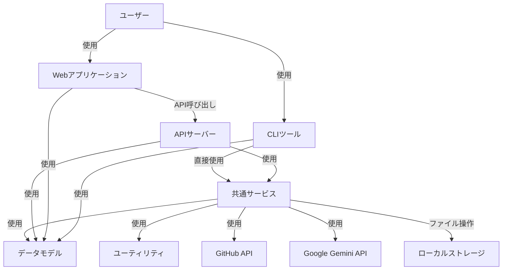
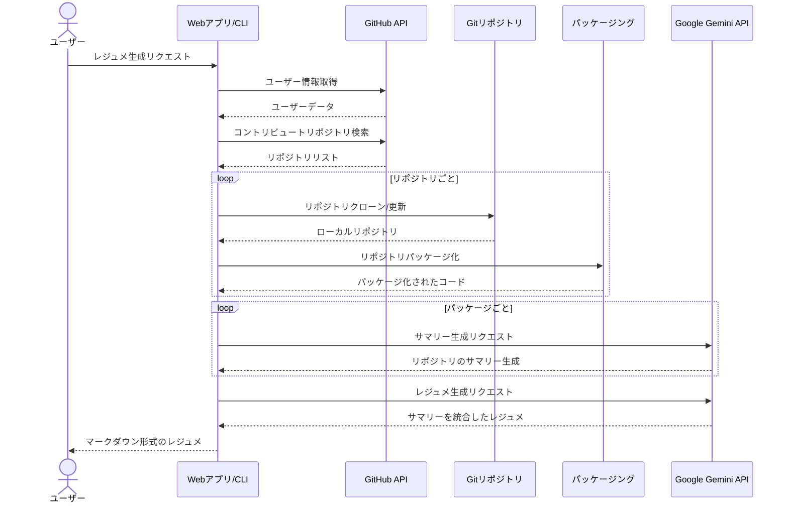
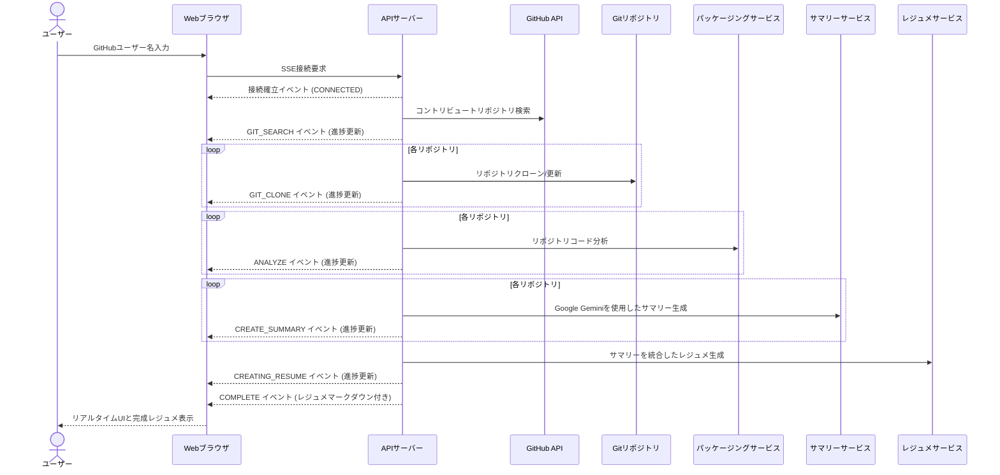

# アーキテクチャ概要図

**更新日**: 2025/3/21
**確認日**: 2025/3/21

## 概要

git-resumeプロジェクトのシステムアーキテクチャ、技術スタック、コンポーネント間の関係性を説明します。このドキュメントは、現在の実装状況に基づき、システム全体の構造と各コンポーネントの役割を把握するための参考となります。

## システム構成

git-resumeは、以下の主要コンポーネントからなるモノレポ構造で実装されています：

```
git-resume/
├── apps/
│   ├── api/     - バックエンドAPI (Node.js + Hono.js)
│   ├── cli/     - コマンドラインツール (Node.js + Commander.js)
│   └── web/     - Webフロントエンド (React + TypeScript)
├── packages/
│   ├── models/  - 共有データモデル
│   ├── services/- 共有サービス機能
│   └── utils/   - ユーティリティ関数
└── infra/       - インフラストラクチャ設定 (Terraform)
```

## アーキテクチャ図

### 全体構成

以下の図は、git-resumeシステムの全体構成を示しています：



### レジュメ生成のプロセスフロー

以下の図は、レジュメ生成の一連のプロセスフローを示しています：



### Server-Sent Events (SSE) フロー

Webアプリケーションでは、Server-Sent Events (SSE) を使用してレジュメ生成プロセスの進捗状況をリアルタイムで表示しています：



## 主要コンポーネントの詳細

### API (apps/api)

APIサーバーは以下の主要エンドポイントを提供しています：

- `GET /api/github/getUser`: ユーザー名からレジュメを生成するシンプルなAPI
- `GET /api/github/:userId/progress`: レジュメ生成の進捗をSSEで配信するストリーミングAPI

これらのエンドポイントは内部的に共有サービスを利用して以下の処理を行います：
1. GitHubユーザーのコントリビュートリポジトリの検索
2. リポジトリのクローンと分析
3. Google Gemini APIを使用したサマリー生成
4. サマリーを統合したレジュメの生成

### CLI (apps/cli)

CLIツールは以下の主要コマンドを提供しています：

- `clone repositories <username>`: GitHubユーザーのリポジトリをクローン
- `pack create <username>`: リポジトリをパッケージ化
- `summary create <username>`: リポジトリのサマリーを生成
- `resume create <username>`: サマリーを統合してレジュメを生成

これらのコマンドは同じ共有サービスを使用してAPIと同様の処理を実行します。

### Web (apps/web)

Webフロントエンドは以下の機能を提供しています：

- ホーム画面: ユーザー名入力フォーム
- レジュメ生成/表示画面: リアルタイム進捗表示とレジュメ表示

レジュメ生成プロセスの視覚的進捗表示には、以下のステップが含まれます：
1. リポジトリ検索 (GIT_SEARCH)
2. リポジトリクローン (GIT_CLONE)
3. コード分析 (ANALYZE)
4. サマリー生成 (CREATE_SUMMARY)
5. レジュメ統合 (CREATING_RESUME)
6. 完了 (COMPLETE)

### データモデル (packages/models)

主要なデータモデルは以下の通りです：

- `User`: GitHubユーザー情報（id, userName, displayName, blog, avatarUrl）
- `Repository`: リポジトリ情報（id, owner, name, isPrivate）
- `Pack`: パッケージ化されたリポジトリコード（meta, body）
- `Summary`: リポジトリのサマリー（string型のマークダウン）
- `Resume`: 生成されたレジュメ（body: string）
- `Events`: SSE用のイベント型定義群

### サービス (packages/services)

主要なサービス機能は以下の通りです：

- `github`: GitHubユーザー情報とリポジトリの取得
- `git`: リポジトリのクローンと管理
- `pack`: リポジトリのコード解析とパッケージ化
- `summary`: Google Gemini APIを使用したサマリー生成
- `resume`: サマリーからレジュメの生成

## 技術スタック

### フロントエンド (Web)

- **フレームワーク**: React
- **言語**: TypeScript
- **ルーティング**: React Router
- **スタイリング**: TailwindCSS
- **マークダウンレンダリング**: ReactMarkdown + remark-gfm
- **リアルタイム更新**: fetch-event-source (SSE)
- **ビルドツール**: Vite

### バックエンド (API)

- **ランタイム**: Node.js
- **言語**: TypeScript
- **Webフレームワーク**: Hono.js
- **バリデーション**: Valibot
- **ストリーミング**: Server-Sent Events (SSE)
- **ビルドツール**: tsup

### CLI

- **言語**: TypeScript
- **コマンドライン**: Commander.js
- **ビルドツール**: tsup

### 共通技術

- **AIモデル**: Google Gemini API
- **バージョン管理**: Git, GitHub
- **パッケージ管理**: pnpm
- **モノレポ管理**: Turborepo
- **リント・フォーマット**: Biome

## 開発環境

開発環境ではローカルで各コンポーネントを実行します：

- Webアプリ: `pnpm dev --filter=web`（http://localhost:5173）
- APIサーバー: `pnpm dev --filter=api`（http://localhost:3001）
- CLI: `pnpm dev --filter=cli`（ローカル実行）

## セキュリティ考慮事項

- **GitHub Token**: 環境変数 `GITHUB_TOKEN` として設定され、APIリクエストの認証に使用
- **AI API Key**: 環境変数 `RESUME_GEMINI_API_KEY` として設定され、Google Gemini APIとの通信に使用
- **ローカルデータ**: 生成されたレジュメやパッケージは `generated/` ディレクトリに保存

## 今後の拡張可能性

1. **認証の追加**: ユーザー認証システムの実装
2. **デプロイメント**: Dockerコンテナ化とクラウドデプロイメント
3. **データベース**: レジュメや分析結果の永続化
4. **高度な分析**: より詳細なコード分析と洞察の提供
5. **レジュメテンプレート**: 複数のフォーマットとスタイルのサポート

## Changelog

- 2025/3/21: コードベース分析に基づき内容を更新
- 2025/3/21: 初回作成
