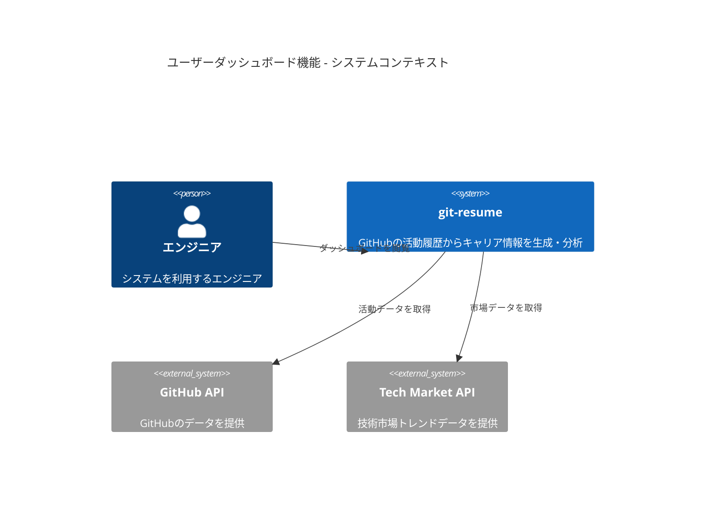
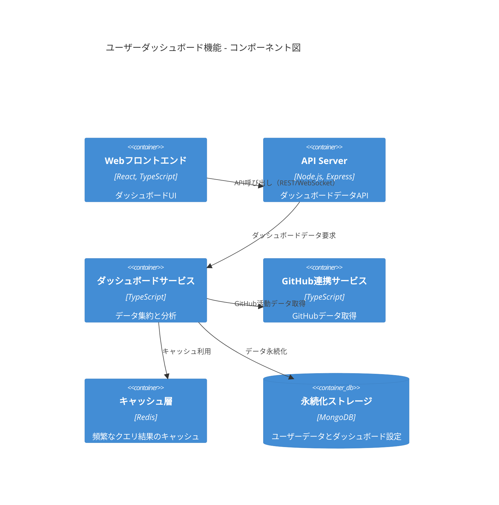

# ユーザーダッシュボード機能 - アーキテクチャ設計

**更新日**: 2025/03/01
**確認日**: 2025/03/01

## アーキテクチャ概要

ユーザーダッシュボード機能は、git-resumeの既存アーキテクチャを拡張し、ユーザーのGitHub活動を視覚的に表示するための新しいコンポーネントを追加します。このドキュメントでは、機能実装に必要なアーキテクチャ変更と設計原則を詳細に説明します。

## システムコンテキスト

## コンポーネント構成

## 設計原則

ユーザーダッシュボード機能の実装において、以下の設計原則を遵守します：

1. **関心の分離**
   - UIコンポーネント、データ取得、ビジネスロジックを明確に分離
   - 各層は単一責任の原則に従い、明確なインターフェースを提供

2. **スケーラビリティ**
   - 高負荷時のパフォーマンスを維持するための水平スケーリング設計
   - マイクロサービスアーキテクチャの採用によるサービス単位での独立したスケーリング

3. **レスポンシブ性**
   - リアルタイムデータ更新のためのWebSocket通信
   - バックグラウンド処理とキャッシングによる応答性の確保

4. **セキュリティ**
   - すべてのAPI呼び出しに認証を要求
   - センシティブデータの適切な暗号化

5. **テスト容易性**
   - モジュラーな設計によるユニットテストの容易化
   - モック可能なインターフェースの提供

## 技術スタックの選定

| コンポーネント | 技術スタック | 選定理由 |
|--------------|--------------|---------|
| フロントエンド | React, TypeScript | 既存プロジェクトとの一貫性、型安全性 |
| グラフ描画 | Chart.js | 軽量さ、カスタマイズ性、導入の容易さ |
| リアルタイム通信 | Socket.IO | WebSocketの抽象化、フォールバック機能 |
| APIサーバー | Express, TypeScript | 既存インフラとの互換性、開発効率 |
| キャッシュ | Redis | 高速なデータアクセス、TTL管理のサポート |
| データベース | MongoDB | スキーマレス設計、JSONとの親和性 |

## 拡張ポイント

将来の機能拡張に備え、以下の拡張ポイントを設計に組み込みます：

1. **カスタムウィジェット**
   - ダッシュボードに追加可能なプラグイン式ウィジェットシステム
   - サードパーティ連携のためのウィジェットAPI

2. **データソース拡張**
   - GitLab、Bitbucketなどの追加のコード管理プラットフォーム連携
   - Stack Overflow、Qiita等の技術コミュニティ活動の統合

3. **分析エンジン**
   - 将来的なAI/ML分析機能の追加に対応するためのプラグイン式分析エンジン

## アーキテクチャ上の制約

1. **パフォーマンス要件**
   - ダッシュボード初期表示: 2秒以内
   - データ更新頻度: リアルタイム更新（WebSocket）または30秒ごとのポーリング
   - 同時ユーザー数: 最大10,000人

2. **セキュリティ要件**
   - OAuthによるGitHub認証
   - セッション管理とJWTによる認証
   - センシティブなユーザーデータはAES-256で暗号化

3. **コンプライアンス**
   - GDPRおよびCCPAに準拠したデータ処理
   - GitHub APIの利用制限を遵守

## 関連ドキュメント

- [データフロー詳細](./data-flow.md)
- [APIパッケージの実装詳細](./packages/api/implements.md)
- [フロントエンド実装](./frontend/README.md)

## Changelog

- 2025/03/01: 初回作成
