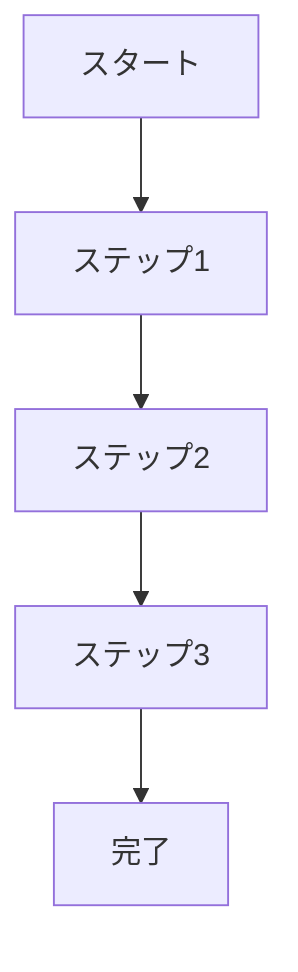

# [機能名] 要件定義書 (PRD)

**更新日**: YYYY/MM/DD
**確認日**: YYYY/MM/DD
**作成者**: [担当者名]
**レビュアー**: [レビュアー名]

## 1. 概要

### 1.1 背景と目的

[この機能が必要となった背景や、解決しようとしている課題について説明してください。ビジネス目標や市場環境、ユーザーニーズなどの文脈を含めると良いでしょう。]

### 1.2 機能概要

[機能の簡潔な説明を1-2段落で記述してください。]

### 1.3 スコープ

[この機能に含まれる範囲と含まれない範囲（将来のフェーズで対応予定の項目など）を明確にしてください。]

## 2. ユーザーストーリーと要件

### 2.1 対象ユーザー

[この機能の主な対象ユーザーを定義してください。必要に応じてペルソナを作成し、そのニーズや行動パターンを説明します。]

### 2.2 ユーザーストーリー

[ユーザーの視点から機能の利用シナリオを記述してください。以下の形式を使用すると効果的です：]

「〜として、私は〜したい。なぜなら〜だからだ。」

例：
- ユーザーとして、私はGitHubの活動履歴を自動的にレジュメに変換したい。なぜなら手動でまとめるのは時間がかかり、見落としが発生するからだ。
- エンジニアとして、私は自分のスキルセットを客観的に可視化したい。なぜなら自己評価だけでは市場価値を正確に把握できないからだ。

### 2.3 機能要件

[機能が満たすべき具体的な要件を箇条書きで列挙してください。各要件は明確で検証可能なものにします。]

#### 2.3.1 必須要件（MVP）

- 要件1: [説明]
- 要件2: [説明]
- ...

#### 2.3.2 オプション要件（Nice to Have）

- 要件1: [説明]
- 要件2: [説明]
- ...

### 2.4 非機能要件

[パフォーマンス、セキュリティ、スケーラビリティなどの非機能要件を記述してください。]

- **パフォーマンス**: [例: データ処理は30秒以内に完了すること]
- **セキュリティ**: [例: すべてのユーザーデータは暗号化して保存すること]
- **可用性**: [例: サービスの稼働率は99.9%を目標とすること]
- **アクセシビリティ**: [例: WCAG 2.1 AAレベルに準拠すること]

## 3. ユーザー体験（UX）

### 3.1 ユーザーフロー

[ユーザーがこの機能を使用する際の一連の流れを説明してください。必要に応じてフローチャートを含めます。]

### 3.2 ワイヤーフレーム / モックアップ

[UIのワイヤーフレームやモックアップを含めてください。これは別途添付ファイルやリンクとして提供することも可能です。]

### 3.3 エッジケースと例外処理

[想定されるエッジケースや例外的な状況、およびその対応方法を記述してください。]

## 4. 市場・競合分析

### 4.1 競合製品/サービス分析

[類似の機能を持つ競合製品やサービスについて分析し、それらと比較した差別化ポイントを記述してください。]

### 4.2 市場トレンドと機会

[関連する市場トレンドや、この機能が活用できるビジネス機会について説明してください。]

## 5. 技術的考慮事項

### 5.1 技術的制約

[実装に影響を与える可能性のある技術的な制約や課題を記述してください。]

### 5.2 既存システムとの統合

[既存のシステムやサービスとの統合要件や相互依存関係を説明してください。]

### 5.3 データ要件

[必要なデータソース、データモデル、データ処理要件などを記述してください。]

## 6. リリース計画

### 6.1 リリース基準

[この機能をリリースするための条件や基準を明確にしてください。]

### 6.2 ロールアウト戦略

[段階的なロールアウト計画や、A/Bテストなどの検証方法について記述してください。]

### 6.3 成功指標（KPI）

[この機能の成功を測定するための主要指標を定義してください。具体的な目標値を含めると良いでしょう。]

- 指標1: [説明と目標値]
- 指標2: [説明と目標値]
- ...

## 7. リスクと緩和策

[実装上のリスクとその緩和策を記述してください。]

| リスク | 影響度 | 可能性 | 緩和策 |
|--------|--------|--------|--------|
| [リスク1] | 高/中/低 | 高/中/低 | [対策] |
| [リスク2] | 高/中/低 | 高/中/低 | [対策] |

## 8. 承認

| 役割 | 名前 | 日付 |
|------|------|------|
| プロダクトマネージャー | | |
| エンジニアリングリード | | |
| デザインリード | | |
| QAリード | | |

## 付録

### A. 関連ドキュメント

- [関連ドキュメントへのリンク]
- [関連ドキュメントへのリンク]

### B. 用語集

| 用語 | 定義 |
|------|------|
| [用語1] | [定義] |
| [用語2] | [定義] |

## Changelog

- YYYY/MM/DD: 初回作成
