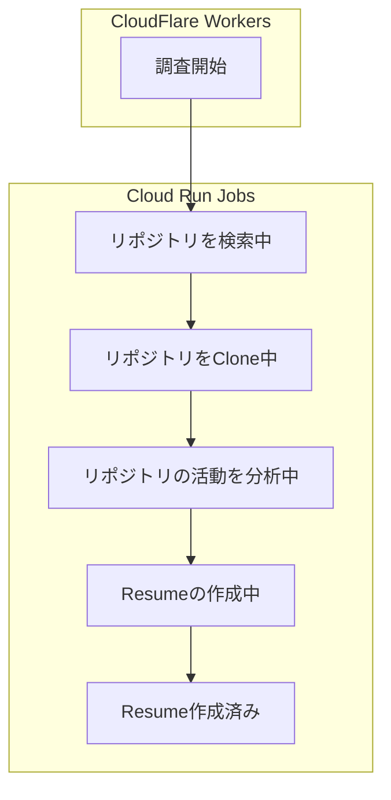

# GitHub分析ジョブアーキテクチャ設計

## 概要

このドキュメントは、Deep Researchシステムの2次調査アーキテクチャにおけるCloudRun Jobsの詳細設計を説明するものです。GitHub User名を入力した後、バックグラウンドで実行される詳細な分析処理（2次調査）のアーキテクチャと実装方針を定義しています。

## 2次調査アーキテクチャの詳細

### 目的と特性

- GitHubの詳細情報収集、リポジトリ分析、AIによるレジュメ生成
- 重い処理のため、結果を30日間キャッシュして再利用
- ユーザーがいつでも離脱できるバックグラウンド処理

### 技術構成

- **本番環境**:
  - **実行環境**: GCP Cloud Run Jobs（サーバーレス、スケーラビリティ）
  - **処理管理**: 内蔵キュー管理（追加インフラ不要）
  - **データ永続化**: Neon.tech（PostgreSQL互換、サーバーレス）

- **ローカル開発環境**:
  - **実行環境**: CLIコマンド実行（Cloud Run Jobsではなく直接コマンド実行）
  - **データベース**: Docker Composeで起動するローカルPostgres
  - **ORM**: Drizzle（TypeScript型安全なSQLビルダー）

- **共通**:
  - **言語・フレームワーク**: TypeScript、Node.js
  - **ライブラリ**:
    - Commander.js（CLIコマンド）
    - @supercharge/promise-pool（並列処理）
    - Gemini API（AI分析）

### 詳細分析パイプライン



**注意**: CloudFlare Workersは「リポジトリを検索中」の初期状態をデータベースに記録するだけで、実際の検索処理はCloud Run Jobsで行います。これはJobs起動待ちをユーザーに感じさせないための設計です。

1. **リポジトリ検索**: ユーザがCommitしたリポジトリの検索
   - GitHub REST APIを使用
   - 過去1年分のリポジトリを検索
   - 検索結果をフィルタリング（言語、スター数など）
   - **実行**: Cloud Run Jobs（CloudFlare Workersは初期状態のDB更新のみ）

2. **リポジトリClone**: 検索結果に基づきリポジトリをClone
   - 並列処理による効率化（最大10並列）
   - 大規模リポジトリの部分クローン
   - クローン失敗時のリトライ機能

3. **Commit抽出**: ユーザのCommitのみを抽出しpack
   - Gitコマンドを使用したユーザーのCommit抽出
   - コミットメタデータの収集（日付、メッセージなど）
   - 効率的なパック処理

4. **AI要約**: リポジトリごとの活動サマリを生成
   - Gemini APIを使用
   - リポジトリの言語、コミット内容、パターンの分析
   - トークン制限に対応した分割処理

5. **AI横断分析**: 複数サマリからマークダウン形式のResumeを生成
   - Gemini APIを使用
   - スキルと経験の抽出
   - 構造化されたマークダウン形式のレジュメ生成

### コマンド構造設計

```
job
├── clone
│   └── repositories <userName> [options]
├── pack
│   └── create <userName>
├── summary
│   └── create <userName> [options]
└── resume
    └── create <userName> [options]
```

各コマンドは独立して実行可能であり、また連続して実行することでパイプライン全体を構成します。これにより、特定のステップだけを再実行したり、デバッグしたりすることが容易になります。

### ローカル開発環境のセットアップ

ローカル開発環境では、以下のセットアップを行います：

1. **PostgreSQLのセットアップ**:
   - Docker Composeを使用してPostgreSQLコンテナを起動
   - 開発用のデータベースを作成
   - マイグレーションスクリプトの実行

2. **Drizzle ORMの設定**:
   - スキーマ定義
   - マイグレーションファイルの生成
   - TypeScript型の生成

3. **環境変数の設定**:
   - データベース接続情報
   - GitHub API トークン
   - Gemini API キー

4. **ジョブコマンドの実行**:
   - `pnpm jobs <command> <subcommand> [options]`で直接実行
   - 例: `pnpm jobs clone repositories username --public-only`

### 進捗管理設計

進捗状態は以下のように定義され、データベースに記録されます：

```typescript
type ProgressStatus = 
  | "SEARCHING"  // リポジトリを検索中
  | "CLONING"    // リポジトリをClone中
  | "ANALYZING"  // リポジトリの活動を分析中
  | "CREATING"   // Resumeの作成中
  | "COMPLETED"  // Resume作成済み
  | "FAILED";    // 処理失敗
```

進捗情報には以下の情報が含まれます：

- 現在のステータス
- 進捗率（0-100%）
- 詳細情報（例: "3/10リポジトリ処理中"）
- 更新元（"worker"または"job"）
- タイムスタンプ

### データベーススキーマ設計

Drizzleを使用して以下のスキーマを定義します：

```typescript
// research_tasks テーブル
export const researchTasks = pgTable('research_tasks', {
  github_username: text('github_username').primaryKey(),
  status: text('status').notNull(),
  progress: integer('progress').notNull().default(0),
  detail: text('detail'),
  updated_by: text('updated_by').notNull(),
  resume: text('resume'),
  created_at: timestamp('created_at').notNull().defaultNow(),
  updated_at: timestamp('updated_at').notNull().defaultNow(),
  expires_at: timestamp('expires_at').notNull(),
});

// 型定義
export type ResearchTask = typeof researchTasks.$inferSelect;
export type NewResearchTask = typeof researchTasks.$inferInsert;
```

### エラーハンドリング設計

エラーハンドリングは以下の方針で実装します：

1. **リトライ機能**: 一時的なエラー（ネットワークエラーなど）に対するリトライ
2. **部分的成功**: 一部のリポジトリが失敗しても、他のリポジトリの処理は継続
3. **エラーログ**: 詳細なエラー情報のログ記録
4. **状態管理**: エラー発生時の状態をデータベースに記録
5. **通知**: 重大なエラー発生時の通知機能

### スケーラビリティ設計

スケーラビリティを確保するための設計方針：

1. **並列処理**: リポジトリのCloneと分析を並列に実行
2. **リソース最適化**: メモリと処理時間の効率的な使用
3. **大規模リポジトリ対応**: 部分クローンと分割処理
4. **トークン制限対応**: AI APIのトークン制限に対応した分割処理
5. **自動スケーリング**: Cloud Run Jobsの自動スケーリング機能の活用

## APIエンドポイント設計

フロントエンドとの連携のために、以下のAPIエンドポイントを実装します：

1. **ジョブ起動API**: 2次調査を開始するAPI
   - エンドポイント: `POST /api/research/:username/start`
   - レスポンス: ジョブID、初期状態

2. **進捗確認API**: 2次調査の進捗を確認するAPI
   - エンドポイント: `GET /api/research/:username/progress`
   - レスポンス: 現在の状態、進捗率、詳細情報

3. **結果取得API**: 2次調査の結果を取得するAPI
   - エンドポイント: `GET /api/research/:username/result`
   - レスポンス: マークダウン形式のレジュメ

## デプロイメント設計

### 本番環境（Cloud Run Jobs）

Cloud Run Jobsへのデプロイメント設計：

1. **Dockerイメージ**: 最適化されたDockerイメージの構築
2. **環境変数**: 適切な環境変数の設定
3. **リソース設定**: メモリと処理時間の設定
4. **認証設定**: 適切な認証設定
5. **CI/CD**: 自動デプロイパイプラインの構築

### ローカル開発環境

ローカル開発環境のセットアップ：

1. **Docker Compose**: PostgreSQLコンテナの起動
   ```yaml
   # docker-compose.yml
   version: '3'
   services:
     postgres:
       image: postgres:16
       environment:
         POSTGRES_USER: resume
         POSTGRES_PASSWORD: resume
         POSTGRES_DB: resume
       ports:
         - "5432:5432"
       volumes:
         - postgres_data:/var/lib/postgresql/data
   
   volumes:
     postgres_data:
   ```

2. **Drizzleセットアップ**:
   ```typescript
   // drizzle.config.ts
   import type { Config } from 'drizzle-kit';
   
   export default {
     schema: './src/schema.ts',
     out: './drizzle',
     driver: 'pg',
     dbCredentials: {
       host: process.env.DB_HOST || 'localhost',
       port: Number(process.env.DB_PORT) || 5432,
       user: process.env.DB_USER || 'resume',
       password: process.env.DB_PASSWORD || 'resume',
       database: process.env.DB_NAME || 'resume',
     },
   } satisfies Config;
   ```

3. **環境変数設定**:
   ```
   # .env
   DB_HOST=localhost
   DB_PORT=5432
   DB_USER=resume
   DB_PASSWORD=resume
   DB_NAME=resume
   GITHUB_TOKEN=your_github_token
   RESUME_GEMINI_API_KEY=your_gemini_api_key
   ```

## 監視設計

システムの健全性を監視するための設計：

1. **ログ記録**: 詳細なログの記録と保存
2. **メトリクス**: 処理時間、成功率などのメトリクス収集
3. **アラート**: 異常検知時のアラート設定
4. **ダッシュボード**: 運用状況の可視化

## セキュリティ考慮事項

セキュリティを確保するための設計：

1. **認証**: 適切な認証設定
2. **データ保護**: 機密情報の適切な取り扱い
3. **リソース制限**: DoS攻撃対策としてのリソース制限
4. **一時ファイル**: 一時的なリポジトリCloneの安全な管理と削除

## 将来の拡張性

このアーキテクチャは、以下の将来的な拡張を考慮して設計されています：

1. **分析範囲の拡大**: 過去3年分など、より広い範囲の分析
2. **追加の分析機能**: コード品質分析、貢献度分析など
3. **他のバージョン管理システム**: GitLab、Bitbucketなどへの対応
4. **より高度なAI分析**: 特定の技術スタックに特化した分析など