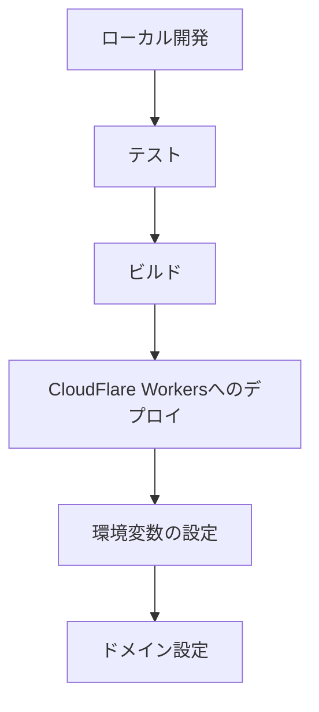

# APIサーバーアーキテクチャ設計

## 概要

このドキュメントは、Deep ResearchシステムのバックエンドAPIサーバーの詳細設計を説明するものです。GitHub User名を入力した後の1次分析（基本情報取得段階）と2次分析（詳細Git活動分析段階）の進捗管理・結果取得を行うためのAPIインターフェースのアーキテクチャと実装方針を定義しています。

## APIサーバーアーキテクチャの詳細

### 目的と特性

- GitHub User名からの基本情報取得とプロフィール情報生成（1次分析）
- 詳細Git活動分析ジョブの起動と進捗管理（2次分析）
- 軽量処理による10秒以内の高速レスポンス
- エッジでの分散実行によるグローバルな低レイテンシ

### 技術構成

- **実行環境**: CloudFlare Workers（エッジでの高速実行、グローバル分散）
- **フレームワーク**: Hono.js（軽量、高速、TypeScriptサポート）
- **API設計**: RESTful API（標準的、理解しやすい、キャッシュ可能）
- **外部API連携**:
  - GitHub API（プロフィール情報取得）
  - Cloud Run Jobs API（2次分析ジョブの起動）
- **データベース連携**: Neon.tech（PostgreSQL互換、サーバーレス）
- **デプロイ**: Wrangler CLI（CloudFlare Workersのデプロイツール）

### APIエンドポイント設計（簡略化版）

```mermaid
graph TD
    A[クライアント] --> B[1次分析(プロフィール取得)兼診断状況(結果含む)読込API]
    A --> D[2次分析実行API]
    
    B --> G[データベース]
    B --> H[GitHub API]
    D --> I[Cloud Run Jobs]
    D --> G
```

#### 1. 1次分析(プロフィール取得)兼診断状況(結果含む)読込API

- **エンドポイント**: `GET /api/github/:username`
- **目的**: GitHub User名に対する現在の2次分析状態、進捗、結果、および1次分析のプロフィール情報を一括取得する
- **処理内容**:
  - データベースからユーザーの2次分析状態を取得
  - GitHub APIからプロフィール情報を取得（1次分析）
  - 状態に応じたレスポンスを返却（進捗情報や結果を含む）
  - STATUSとPROGRESSから総合的な進捗状況を計算
- **レスポンス例（未実行の場合）**:
  ```json
  {
    "secondary_analysis": {
      "exists": false,
      "message": "No Git analysis data found for this username"
    },
    "profile": {
      "login": "octocat",
      "name": "The Octocat",
      "avatar_url": "https://github.com/images/error/octocat_happy.gif",
      "public_repos": 2,
      "followers": 20,
      "following": 0,
      "created_at": "2008-01-14T04:33:35Z"
    }
  }
  ```
- **レスポンス例（実行中の場合）**:
  ```json
  {
    "secondary_analysis": {
      "exists": true,
      "status": "ANALYZING",
      "progress": 60,
      "total_progress": 70,
      "updated_at": "2025-03-30T15:10:00Z"
    },
    "profile": {
      "login": "octocat",
      "name": "The Octocat",
      "avatar_url": "https://github.com/images/error/octocat_happy.gif",
      "public_repos": 2,
      "followers": 20,
      "following": 0,
      "created_at": "2008-01-14T04:33:35Z"
    }
  }
  ```
- **レスポンス例（完了の場合）**:
  ```json
  {
    "secondary_analysis": {
      "exists": true,
      "status": "COMPLETED",
      "progress": 100,
      "total_progress": 100,
      "resume": "# octocat's Resume\n\n## Skills\n\n- JavaScript: Advanced\n- Python: Intermediate\n...",
      "updated_at": "2025-03-30T15:30:00Z"
    },
    "profile": {
      "login": "octocat",
      "name": "The Octocat",
      "avatar_url": "https://github.com/images/error/octocat_happy.gif",
      "public_repos": 2,
      "followers": 20,
      "following": 0,
      "created_at": "2008-01-14T04:33:35Z"
    }
  }
  ```

#### 2. 2次分析実行API

- **エンドポイント**: `POST /api/github/:username/analyze`
- **目的**: 詳細Git活動分析ジョブを起動する
- **処理内容**:
  - データベースに初期状態（SEARCHING）を記録
  - Cloud Run Jobsを起動
- **レスポンス例**:
  ```json
  {
    "status": "SEARCHING",
    "progress": 0,
    "message": "Git analysis started",
    "job_id": "job-123456"
  }
  ```

#### 進捗計算ロジック

STATUSとPROGRESSから総合的な進捗状況を計算するロジックは以下の通りです：

```typescript
function calculateTotalProgress(status: string, progress: number): number {
  // 各ステータスの重み（合計100%）
  const weights = {
    "SEARCHING": 10,
    "CLONING": 20,
    "ANALYZING": 40,
    "CREATING": 30,
    "COMPLETED": 0,
    "FAILED": 0
  };
  
  // 完了したステップの進捗
  let completedProgress = 0;
  
  // 現在のステップより前のステップは100%完了とみなす
  for (const step of Object.keys(weights)) {
    if (step === status) {
      // 現在のステップは、そのステップの重みに対する現在の進捗の割合
      return completedProgress + (weights[step] * progress / 100);
    }
    
    // 完了したステップの重みを加算
    completedProgress += weights[step];
  }
  
  // COMPLETED または FAILED の場合は100%
  return 100;
}
```

このロジックにより、クライアントは単一のAPIコールで現在の状態と総合的な進捗状況を取得できます。

### エラーハンドリング設計

共通のエラーレスポンス形式を定義し、以下のエラーケースに対応します：

- **404 Not Found**: ユーザーが存在しない場合
  ```json
  {
    "error": "User not found",
    "status": 404
  }
  ```

- **429 Too Many Requests**: レート制限に達した場合
  ```json
  {
    "error": "Rate limit exceeded",
    "status": 429,
    "retry_after": 60
  }
  ```

- **500 Internal Server Error**: 内部エラーが発生した場合
  ```json
  {
    "error": "Internal server error",
    "status": 500
  }
  ```

### セキュリティ考慮事項

- **CORS設定**: 許可されたオリジンからのリクエストのみを受け付ける
- **レート制限**: 同一IPアドレスからの過剰なリクエストを制限
- **認証**: 将来的な拡張のための認証基盤の準備
- **機密情報の保護**: 環境変数を使用したシークレット管理

### パフォーマンス最適化

- **キャッシュ戦略**:
  - 1次調査結果のキャッシュなし（常に最新データを取得）
  - 2次調査結果の30日間キャッシュ
- **エッジでの実行**: CloudFlare Workersによるグローバル分散
- **最小限のAPI呼び出し**: 必要最小限のGitHub API呼び出し

## デプロイメント設計

### CloudFlare Workersへのデプロイ



1. **ローカル開発環境**:
   - Wrangler CLIを使用した開発
   - TypeScriptとHono.jsによる実装
   - ローカルでのテスト実行

2. **デプロイ手順**:
   - Wrangler CLIを使用したデプロイ
   - 環境変数の設定（GitHub API Token、Database URL等）
   - ドメイン設定とルーティング

## 今後の展望

- **認証システムの統合**: ユーザー認証とプラン別アクセス制御
- **WebSocketsによるリアルタイム更新**: Pollingに代わるリアルタイム通知
- **キャッシュ最適化**: より効率的なキャッシュ戦略
- **モニタリングとアラート**: システムの健全性監視