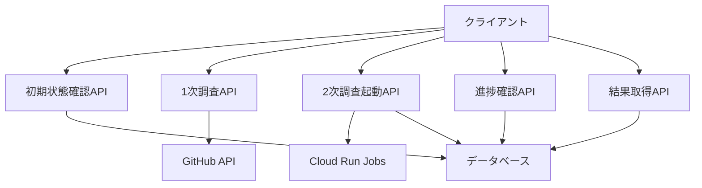
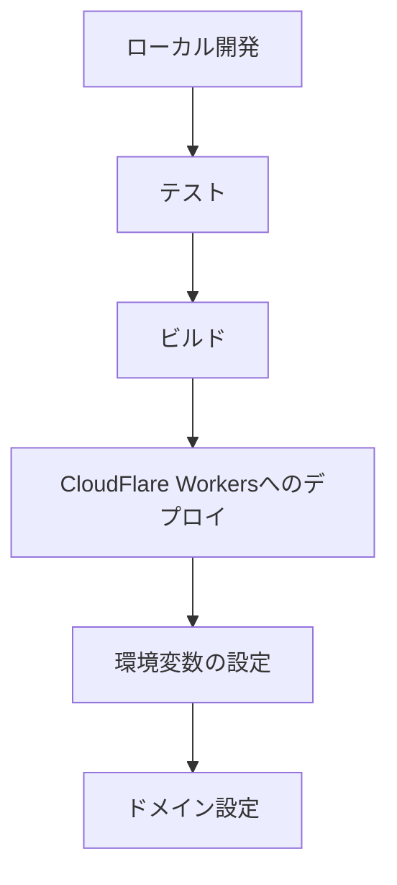

# APIサーバーアーキテクチャ設計

## 概要

このドキュメントは、Deep ResearchシステムのバックエンドAPIサーバーの詳細設計を説明するものです。GitHub User名を入力した後の1次調査（調査計画段階）と2次調査（詳細分析段階）の進捗管理・結果取得を行うためのAPIインターフェースのアーキテクチャと実装方針を定義しています。

## APIサーバーアーキテクチャの詳細

### 目的と特性

- GitHub User名からの基本情報取得と調査計画生成（1次調査）
- 詳細分析ジョブの起動と進捗管理（2次調査）
- 軽量処理による10秒以内の高速レスポンス
- エッジでの分散実行によるグローバルな低レイテンシ

### 技術構成

- **実行環境**: CloudFlare Workers（エッジでの高速実行、グローバル分散）
- **フレームワーク**: Hono.js（軽量、高速、TypeScriptサポート）
- **API設計**: RESTful API（標準的、理解しやすい、キャッシュ可能）
- **外部API連携**:
  - GitHub API（プロフィール情報取得）
  - Cloud Run Jobs API（2次調査ジョブの起動）
- **データベース連携**: Neon.tech（PostgreSQL互換、サーバーレス）

### APIエンドポイント設計



#### 1. 初期状態確認API

- **エンドポイント**: `GET /api/research/:username/status`
- **目的**: GitHub User名に対する現在の調査状態を確認する
- **処理内容**:
  - データベースからユーザーの状態を取得
  - 状態に応じたレスポンスを返却
- **レスポンス例**:
  ```json
  {
    "status": "COMPLETED",
    "progress": 100,
    "updated_at": "2025-03-30T15:00:00Z"
  }
  ```

#### 2. 1次調査API

- **エンドポイント**: `GET /api/research/:username/profile`
- **目的**: GitHub User名からプロフィール情報を取得する
- **処理内容**:
  - GitHub APIからユーザープロフィール情報を取得
  - 基本情報を抽出して返却
- **レスポンス例**:
  ```json
  {
    "login": "octocat",
    "name": "The Octocat",
    "avatar_url": "https://github.com/images/error/octocat_happy.gif",
    "public_repos": 2,
    "followers": 20,
    "following": 0,
    "created_at": "2008-01-14T04:33:35Z"
  }
  ```

#### 3. 2次調査起動API

- **エンドポイント**: `POST /api/research/:username/start`
- **目的**: 詳細分析ジョブを起動する
- **処理内容**:
  - データベースに初期状態（SEARCHING）を記録
  - Cloud Run Jobsを起動
- **レスポンス例**:
  ```json
  {
    "status": "SEARCHING",
    "progress": 0,
    "message": "Analysis started",
    "job_id": "job-123456"
  }
  ```

#### 4. 進捗確認API

- **エンドポイント**: `GET /api/research/:username/progress`
- **目的**: 2次調査の進捗状況を確認する
- **処理内容**:
  - データベースから進捗情報を取得
  - 進捗状況を返却
- **レスポンス例**:
  ```json
  {
    "status": "ANALYZING",
    "progress": 60,
    "updated_at": "2025-03-30T15:10:00Z"
  }
  ```

#### 5. 結果取得API

- **エンドポイント**: `GET /api/research/:username/result`
- **目的**: 2次調査の結果（レジュメ）を取得する
- **処理内容**:
  - データベースからレジュメを取得
  - マークダウン形式で返却
- **レスポンス例**:
  ```json
  {
    "resume": "# octocat's Resume\n\n## Skills\n\n- JavaScript: Advanced\n- Python: Intermediate\n...",
    "status": "COMPLETED",
    "updated_at": "2025-03-30T15:30:00Z"
  }
  ```

### エラーハンドリング設計

共通のエラーレスポンス形式を定義し、以下のエラーケースに対応します：

- **404 Not Found**: ユーザーが存在しない場合
  ```json
  {
    "error": "User not found",
    "status": 404
  }
  ```

- **429 Too Many Requests**: レート制限に達した場合
  ```json
  {
    "error": "Rate limit exceeded",
    "status": 429,
    "retry_after": 60
  }
  ```

- **500 Internal Server Error**: 内部エラーが発生した場合
  ```json
  {
    "error": "Internal server error",
    "status": 500
  }
  ```

### セキュリティ考慮事項

- **CORS設定**: 許可されたオリジンからのリクエストのみを受け付ける
- **レート制限**: 同一IPアドレスからの過剰なリクエストを制限
- **認証**: 将来的な拡張のための認証基盤の準備
- **機密情報の保護**: 環境変数を使用したシークレット管理

### パフォーマンス最適化

- **キャッシュ戦略**:
  - 1次調査結果のキャッシュなし（常に最新データを取得）
  - 2次調査結果の30日間キャッシュ
- **エッジでの実行**: CloudFlare Workersによるグローバル分散
- **最小限のAPI呼び出し**: 必要最小限のGitHub API呼び出し

## デプロイメント設計

### CloudFlare Workersへのデプロイ



1. **ローカル開発環境**:
   - Wrangler CLIを使用した開発
   - TypeScriptとHono.jsによる実装
   - ローカルでのテスト実行

2. **デプロイ手順**:
   - Wrangler CLIを使用したデプロイ
   - 環境変数の設定（GitHub API Token、Database URL等）
   - ドメイン設定とルーティング

## 今後の展望

- **認証システムの統合**: ユーザー認証とプラン別アクセス制御
- **WebSocketsによるリアルタイム更新**: Pollingに代わるリアルタイム通知
- **キャッシュ最適化**: より効率的なキャッシュ戦略
- **モニタリングとアラート**: システムの健全性監視