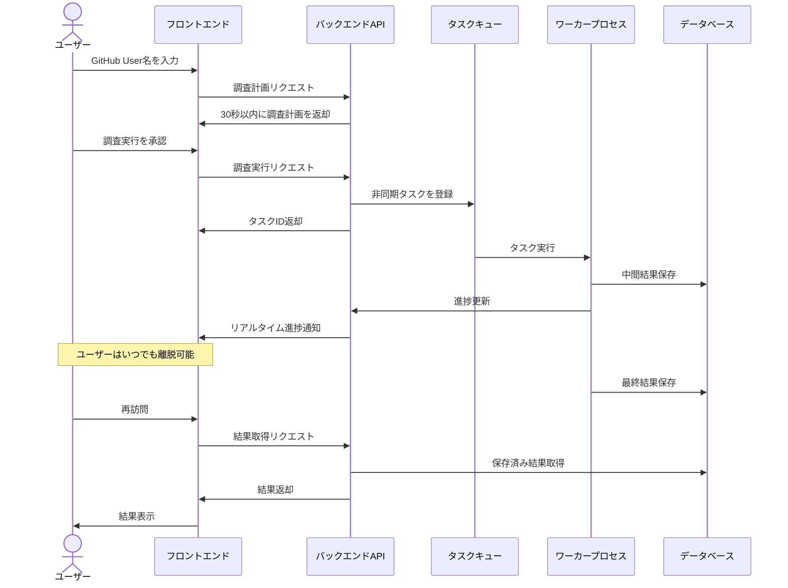

# Epic: Deep Research Architecture and Design

## 目的

Deep Research のように、ユーザが調べたいもの(Github User名)を入力した後、30秒以内に、関連する情報の詳細な調査計画を画面に表示し、その後ユーザが調査を実行した後では、いつ画面を離脱してもよいアーキテクチャの全体構成と設計を考えたい。

## 概要

このエピックでは、ユーザーがGitHub User名を入力するだけで、30秒以内に効率的に情報収集と分析を行うための調査計画を表示し、その後ユーザーがいつでも安全に離脱できるアーキテクチャを設計・実装します。モダンなウェブ技術とダークテーマベースのグラデーションリッチなUIを採用し、直感的な操作性と視覚的に魅力的な結果表示を提供します。

ユーザーは調査計画を確認した後、実行ボタンを押すだけで自動的に調査が進行し、いつでも安全に離脱できる仕組みを提供します。非同期処理アーキテクチャにより、バックグラウンドでの処理が継続され、ユーザーが再訪問した際には最新の結果を確認できます。

## 関連ドキュメント

- [進捗状況](./PROGRESS.md) - エピックの現在の進捗状況と次のマイルストーン
- [アーキテクチャ設計](./ARCHITECTURE.md) - システム全体のアーキテクチャと設計思想
- [ユーザーガイド](./USER-GUIDE.md) - 機能の使用方法と操作手順
- [UI設計](./UI.md) - ユーザーインターフェースの詳細設計
- [モックアップ](./mocks/) - UIモックアップとプロトタイプ

## 主要機能

1. **迅速な調査計画生成**
   - GitHub User名からの30秒以内の調査計画生成
   - 視覚的に魅力的なプログレスインジケーター
   - 初期情報の即時表示と段階的詳細化

2. **非同期処理アーキテクチャ**
   - バックグラウンドでの調査実行と進捗管理
   - リアルタイム進捗表示（SSE/WebSocket）
   - 離脱しても調査を継続できる堅牢な設計

3. **インタラクティブな結果表示**
   - データビジュアライゼーションを活用した結果表示
   - タブ形式の整理された情報構造
   - フィルタリングとソート機能

4. **データ永続化と再開**
   - 調査結果の自動保存
   - セッション管理による正確な再開
   - 複数デバイスからのアクセス

5. **カスタマイズと拡張**
   - 調査範囲と深度のカスタマイズ
   - 複数形式でのエクスポート機能
   - 通知設定とインテグレーション

## 技術スタック

### フロントエンド
- **フレームワーク**: React, TypeScript
- **ルーティング**: React Router
- **スタイリング**: Tailwind CSS
- **状態管理**: React Context API / Redux Toolkit
- **データフェッチ**: React Query / SWR
- **UI/UXデザイン**: ダークテーマ、グラデーション、グラスモーフィズム

### バックエンド
- **サーバー**: Node.js, Express
- **API**: RESTful API + GraphQL（オプション）
- **認証**: JWT / OAuth 2.0
- **リアルタイム通信**: Server-Sent Events / WebSocket

### データ処理
- **非同期キュー**: Bull / Celery
- **データ分析**: データ処理パイプライン
- **外部API連携**: GitHub API, その他関連APIサービス

### インフラストラクチャ
- **データベース**: MongoDB（調査結果の保存）
- **キャッシュ**: Redis / Memcached
- **コンテナ化**: Docker, Kubernetes
- **CI/CD**: GitHub Actions / CircleCI
- **モニタリング**: Prometheus, Grafana

## ユーザーフロー

## 期待される成果

- ユーザーがGitHub User名を入力してから30秒以内に調査計画を表示
- ユーザーがいつでも安全に離脱でき、再訪問時に調査の続きを確認できる
- 視覚的に魅力的で直感的なユーザーインターフェース
- スケーラブルで堅牢なバックエンドアーキテクチャ
- 将来の機能拡張に対応できる柔軟な設計

## 次のステップ

1. 詳細設計ドキュメントの完成
2. プロトタイプの実装
3. ユーザビリティテストの実施
4. フィードバックに基づく改善
5. 本番環境への展開準備
