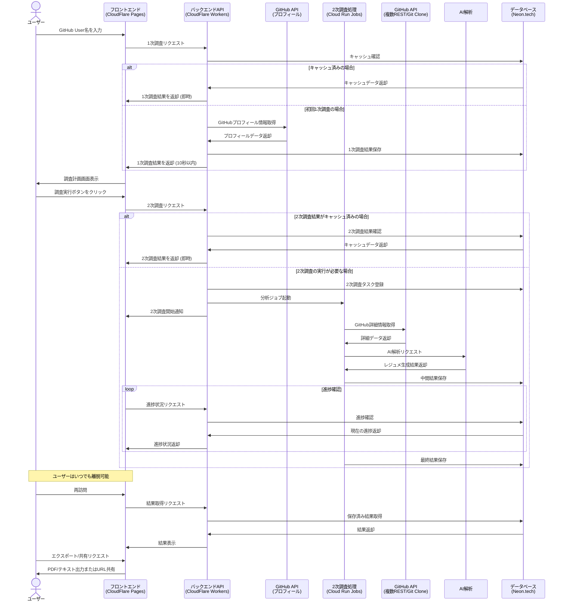

# Epic: Deep Research Architecture and Design

## 目的

Deep Research のように、ユーザが調べたいもの(Github User名)を入力した後、10秒以内に、関連する情報の詳細な調査計画を画面に表示し、その後ユーザが調査を実行した後では、いつ画面を離脱してもよいアーキテクチャの全体構成と設計を考えたい。

## 概要

このエピックでは、ユーザーがGitHub User名を入力するだけで、効率的に情報収集と分析を行うための2段階調査プロセスを実装します。

**1次調査（調査計画段階）**：
- GitHubプロフィール情報をRESTで1回だけAPIを叩いて取得する軽量な処理
- CloudFlare Workersで10秒以内に実行完了
- 基本的なプロフィール情報のみを表示し、詳細な調査計画を提示

**2次調査（詳細分析段階）**：
- GitHubの複数のREST APIやGit Clone、AIによる解析などを行う重い処理
- CloudRun Jobsで時間をかけて実行
- バックグラウンドで処理が継続され、ユーザーはいつでも安全に離脱可能

モダンなウェブ技術とダークテーマベースのグラデーションリッチなUIを採用し、直感的な操作性と視覚的に魅力的な結果表示を提供します。非同期処理アーキテクチャにより、ユーザーが再訪問した際には最新の結果を確認できます。

## 関連ドキュメント

- [進捗状況](./PROGRESS.md) - エピックの現在の進捗状況と次のマイルストーン
- [アーキテクチャ設計](./ARCHITECTURE.md) - システム全体のアーキテクチャと設計思想
- [ユーザーガイド](./USER-GUIDE.md) - 機能の使用方法と操作手順
- [UI設計](./UI.md) - ユーザーインターフェースの詳細設計
- [モックアップ](./mocks/) - UIモックアップとプロトタイプ

## 主要機能

1. **1次調査：迅速な調査計画生成**
   - GitHub User名からの10秒以内の基本情報取得と調査計画生成
   - GitHubプロフィール情報をRESTで1回だけAPIを叩いて取得（CloudFlare Workers）
   - 視覚的に魅力的なプログレスインジケーター
   - 調査計画生成中の文字とアニメーションをGithubユーザ名をInputした画面と同じ画面に表示
   - 計画完了後に調査計画画面(=/github/[userName])にリダイレクト

2. **2次調査：非同期処理アーキテクチャ**
   - GitHubの複数のREST APIやGit Clone、AIによる解析などを行う重い処理
   - バックグラウンドでの調査実行と進捗管理（CloudRun Jobs）
   - 進捗管理はCloudRun Jobsの仕組みを利用し実装コードを減らす
   - リアルタイム進捗表示（Pollingで低コストに実装）
   - 離脱しても調査を継続できる堅牢なUI/設計

3. **シンプルな結果表示**
   - データビジュアライゼーションを活用した結果表示
   - 画面上部セクションに基本的なGithubプロフィールに関する情報を表示（1次調査結果）
   - メインのセクションは、紙やPDFのレジュメをイメージしたマークダウンだけで記述されたシンプルなレジュメを記載
   - Githubの活動結果から自動生成されたレジュメを表示（2次調査結果）

4. **データ永続化と再開**
   - 1次調査と2次調査の結果を自動保存
   - 一度調査されたGithubアカウントは結果を30日保存
   - 他の閲覧ユーザを含めて再訪問時に高速に表示
   - 2次調査が完了していない場合は進捗状況を表示

5. **エクスポートとシェア機能**
   - テキスト形式およびPDF形式でのエクスポート機能
   - 共有ボタンから以下共有が可能
     - クリップボードへのコピー
     - 当該Githubアカウントの調査結果URLをクリップボードにコピー (結果は30日間保存されることを記載)

## 技術スタック

### フロントエンド
- **インフラ**: CloudFlare Pages
- **フレームワーク**: React, TypeScript
- **ルーティング**: React Router (SPA Mode)
- **スタイリング**: Tailwind CSS
- **リアルタイム通信**: Polling (CloudRun Jobsの進捗をバックエンドAPIサーバで取得するだけのシンプルな実装)

### バックエンド API Server（1次調査）
- **インフラ**: CloudFlare Workers
- **サーバー**: Hono.js
- **API**: RESTful API
- **外部API連携**: GitHub API（プロフィール情報のみ）
- **処理内容**: GitHubプロフィール情報の取得と基本的な調査計画の生成（10秒以内）
- **認証**: 現在は実装なし (誰でも閲覧可能)

### Github分析バッチ処理（2次調査）
- **インフラ**: GCP Cloud Run Jobs
- **非同期キュー**: なし (CloudRun Jobsに内蔵された仕組みを利用)
- **外部API連携**: 
  - GitHub 複数REST API
  - Git Clone
  - AI解析
- **処理内容**: 詳細なGitHub情報の収集、リポジトリ分析、AIによるレジュメ生成

### データベース 
- **求められる要件**: 
  - Github分析バッチ処理の主体であるCloudRun Jobsからのデータ更新が可能であること (ステータス保存、結果保存)
  - PostgresSQL互換であること
- **インフラ**: Neon.tech
- **保存データ**:
  - 1次調査結果（GitHubプロフィール情報）
  - 2次調査結果（詳細分析、AIレジュメ）
  - 調査ステータス情報

## ユーザーフロー

## 期待される成果

- ユーザーがGitHub User名を入力してから10秒以内に基本情報と調査計画を表示（1次調査）
- 詳細な分析とAIレジュメ生成をバックグラウンドで実行（2次調査）
- ユーザーがいつでも安全に離脱でき、再訪問時に調査の続きを確認できる
- 視覚的に魅力的で直感的なユーザーインターフェース
- スケーラブルで堅牢なバックエンドアーキテクチャ
- 将来の機能拡張に対応できる柔軟な設計
