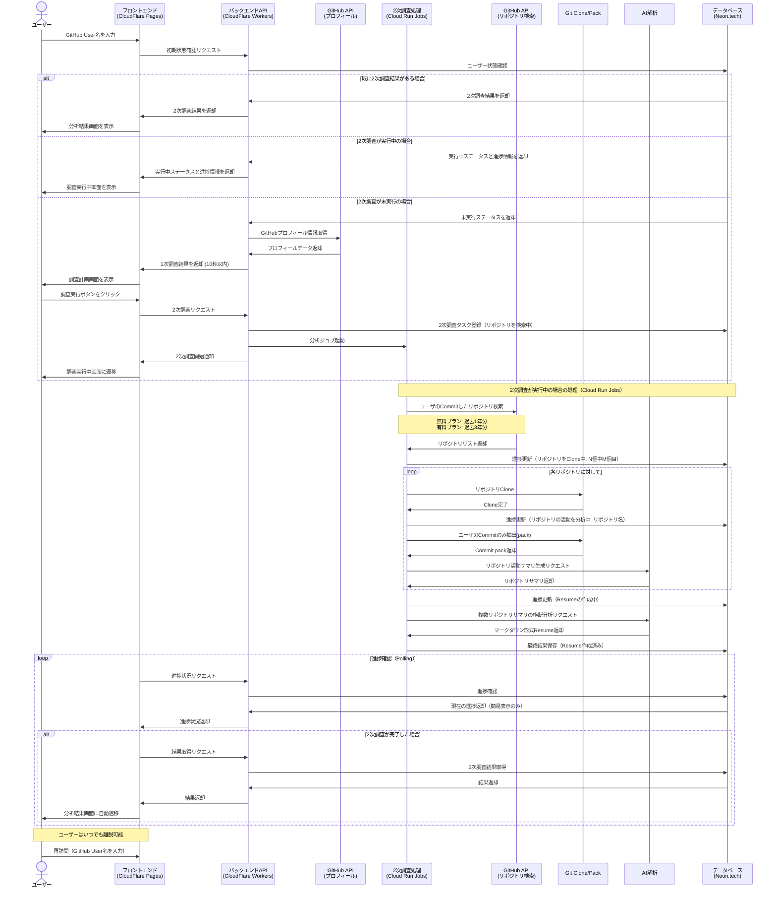

# Epic: Deep Research Architecture and Design

## 目的

このエピックの目的は、**将来のUIやAPIの設計や実装に向けた、アーキテクチャを設計すること**のみです。Deep Research のように、ユーザが調べたいもの(Github User名)を入力した後、10秒以内に関連する情報の詳細な調査計画を画面に表示し、その後ユーザが調査を実行した後ではいつ画面を離脱してもよいシステムを実現するための、アーキテクチャの全体構成と設計を定義します。

## 概要

このエピックでは、アーキテクチャ設計の観点から、効率的な情報収集と分析を行うための2段階調査プロセスを定義します。具体的な実装やUIの詳細ではなく、システム全体の構造、コンポーネント間の関係、データフロー、技術選定の根拠に焦点を当てています。

**調査プロセスの2段階設計**:

1. **1次調査（調査計画段階）**:
   - 目的: 基本的なGitHubプロフィール情報の取得と調査計画の生成
   - 特徴: 軽量処理、10秒以内の高速レスポンス、キャッシュなし
   - 結果: 調査計画画面の表示

2. **2次調査（詳細分析段階）**:
   - 目的: 詳細なGitHub活動の分析とレジュメ生成
   - 特徴: 重い処理、バックグラウンド実行、30日間のキャッシュ
   - 結果: マークダウン形式のレジュメ

このドキュメントに含まれるUIモック、ユーザーガイド、詳細設計などの付属資料は、**単に抽象と具体を往復して検討した参考材料にすぎません**。これらは、アーキテクチャの検証や具体化のために作成されたものであり、最終的な実装の詳細を規定するものではありません。

## 関連ドキュメント

以下のドキュメントは、アーキテクチャ設計を検討する過程で作成された参考資料です：

- [進捗状況](./PROGRESS.md) - アーキテクチャ設計の進捗状況
- [アーキテクチャ設計](./ARCHITECTURE.md) - システム全体のアーキテクチャと設計思想の詳細
- [ユーザーガイド](./USER-GUIDE.md) - アーキテクチャが実現すべき機能の参考資料
- [UI設計](./UI.md) - アーキテクチャが支えるべきUIの参考資料
- [モックアップ](./mocks/) - アーキテクチャの検証のための具体例

## アーキテクチャの主要コンポーネント

### 1. 1次調査アーキテクチャ

**目的と特性**:
- GitHub User名からの10秒以内の基本情報取得と調査計画生成
- 軽量処理のため、キャッシュせず常に最新データを取得

**技術構成**:
- **実行環境**: CloudFlare Workers（エッジでの高速実行、グローバル分散）
- **フレームワーク**: Hono.js（軽量、高速、TypeScriptサポート）
- **API通信**: GitHub APIへの直接アクセス（RESTで1回のみ）
- **処理内容**: プロフィール情報取得のみ（リポジトリ詳細なし）

### 2. 2次調査アーキテクチャ

**目的と特性**:
- GitHubの詳細情報収集、リポジトリ分析、AIによるレジュメ生成
- 重い処理のため、結果を30日間キャッシュして再利用

**技術構成**:
- **実行環境**: GCP Cloud Run Jobs（サーバーレス、スケーラビリティ）
- **処理管理**: 内蔵キュー管理（追加インフラ不要）
- **データ永続化**: Neon.tech（PostgreSQL互換、サーバーレス）

**詳細分析パイプライン**:
1. **リポジトリ検索**: ユーザがCommitしたリポジトリの検索
   - 無料プラン: 過去1年分
   - 有料プラン: 過去3年分

2. **リポジトリClone**: 検索結果に基づきリポジトリをClone

3. **Commit抽出**: ユーザのCommitのみを抽出しpack

4. **AI要約**: リポジトリごとの活動サマリを生成

5. **AI横断分析**: 複数サマリからマークダウン形式のResumeを生成

**進捗状態と簡易表示**:
システムは以下の進捗状態を管理し、簡易表示します：

| 進捗状態 | 状態概要 | 更新元 |
|---------|---------|-------|
| リポジトリを検索中 | 直近 x 年以内にユーザが活動したことがあるリポジトリを検索 | CloudFlare Workers |
| リポジトリをClone中 | 直近 x 年以内にユーザが活動したリポジトリをClone（Clone対象のリポジトリ総数も表示） | Cloud Run Jobs |
| リポジトリの活動を分析中 | リポジトリごとにユーザのCommitログを詳細に分析中 | Cloud Run Jobs |
| Resumeの作成中 | 上記全体をまとめて、Resumeを作成中 | Cloud Run Jobs |
| Resume作成済み | 分析が完了し、結果の閲覧が可能 | Cloud Run Jobs |

**注意**: 「リポジトリを検索中」ステップはCloudFlare Workersによって記録されます。これはCloud Run Jobsの起動まで時間がかかる場合があり、2次調査段階の重複実行を避けるためです。このステップまたはこれ以降のステップがDBに記録されていることをもって2次調査が進行または完了していることがわかります。それ以降の進捗状態の更新は全てCloud Run Jobsから行われます。

### 3. 状態管理アーキテクチャ

**目的と特性**:
- 調査状態（未実行/実行中/完了）の管理と適切な画面遷移
- ユーザーの離脱と再訪問を考慮したセッション管理

**技術構成**:
- **状態追跡**: データベースでの状態保存
- **進捗通知**: Pollingによるリアルタイム更新
- **再開機能**: GitHub User名による状態復元

### 4. データ永続化アーキテクチャ

**目的と特性**:
- 2次調査の結果と状態を効率的に保存
- 30日間のデータ保持ポリシーの実現

**技術構成**:
- **データベース**: Neon.tech（PostgreSQL互換）
- **保存対象**: 2次調査結果と状態のみ（1次調査結果は非保存）
- **データライフサイクル**: 30日経過データの自動クリーンアップ

### 5. フロントエンドアーキテクチャ

**目的と特性**:
- 直感的なユーザーインターフェースの提供
- バックエンドとの効率的な通信

**技術構成**:
- **実行環境**: CloudFlare Pages（グローバルCDN）
- **フレームワーク**: React + TypeScript（コンポーネント指向）
- **ルーティング**: React Router（SPA Mode）
- **スタイリング**: Tailwind CSS（開発効率、カスタマイズ性）
- **通信方式**: RESTful API + Polling（実装の単純さ）

## 技術スタック選定理由

### フロントエンド
- **CloudFlare Pages**: グローバルCDNによる高速配信、CI/CD統合、バックエンドとの親和性
- **React + TypeScript**: コンポーネント指向開発、型安全性、エコシステムの充実
- **React Router (SPA Mode)**: クライアントサイドルーティング、状態保持、ユーザー体験向上
- **Tailwind CSS**: 開発効率、カスタマイズ性、バンドルサイズ最適化
- **Polling**: 実装の単純さ、サーバーリソースの効率的利用

### バックエンド API Server（1次調査）
- **CloudFlare Workers**: エッジでの高速実行、グローバル分散、コールドスタート時間の最小化
- **Hono.js**: 軽量、高速、TypeScriptサポート、CloudFlare Workersとの親和性
- **RESTful API**: 標準的、理解しやすい、キャッシュ可能
- **GitHub API直接アクセス**: 軽量処理のため、中間キャッシュなしで直接アクセス

### Github分析バッチ処理（2次調査）
- **GCP Cloud Run Jobs**: サーバーレス、スケーラビリティ、従量課金、管理オーバーヘッド削減
- **内蔵キュー管理**: 追加インフラ不要、実装の単純化、運用コスト削減
- **Git操作**: リポジトリのCloneと分析のための軽量ライブラリ
- **AI分析**:
  - リポジトリごとのサマリ生成: 個別リポジトリの活動パターン分析
  - 横断分析: 複数リポジトリのパターンから総合的なスキルと経験を抽出
  - マークダウン形式Resume生成: 構造化された読みやすいフォーマット

### データベース 
- **Neon.tech**: PostgreSQL互換、サーバーレス、スケーラビリティ、CloudRun Jobsからのアクセス容易性
- **PostgreSQL**: 構造化データ、トランザクション、クエリ機能、エコシステム
- **用途**: 2次調査結果と状態の保存（1次調査結果は保存しない）

## データモデル概要

システムで永続化が必要な最小限のデータモデルは以下の通りです：

```
ResearchTask
  - github_username: String (PK) // GitHub User名（検索キー）
  - status: String // "SEARCHING", "CLONING", "ANALYZING", "CREATING", "COMPLETED", "FAILED"
  - progress: Integer // 0-100の進捗率
  - detail: String // 現在の処理の詳細情報（例: "3/10リポジトリ処理中"）
  - updated_by: String // "worker" または "job"
  - resume: Text // 完成したマークダウン形式のResume（status=COMPLETEDの場合のみ）
  - created_at: Timestamp
  - updated_at: Timestamp
  - expires_at: Timestamp // 作成から30日後
```

注:
1. 1次調査結果はキャッシュせず常に最新データを取得するため、データベースには保存しません。
2. ユーザー情報（プラン種別など）は認証システムと連携する将来実装のために予約し、現段階では最小限のモデルとします。
3. 中間結果の詳細保存は将来実装の目標とし、現段階では進捗状態と簡易的な詳細情報のみを保存します。
4. GitHub User名をプライマリキーとすることで、同一ユーザーの重複調査を防止し、再訪問時の状態復元を容易にします。
5. 結果データ（resume）を同一テーブルに保存することで、クエリの単純化とデータ整合性を確保します。

## ユーザーフローとシステムアーキテクチャ

GitHub User名を入力した後、システムは以下の3つの分岐を処理します：

1. **既に前回の2次調査結果がある場合**: そのまま分析結果画面を表示
2. **2次調査が実行中の場合**: 調査実行中の画面を表示（進捗状況を含む）
3. **2次調査が未実行の場合**: 1次調査を実行した上で、調査計画画面を表示



## 状態遷移設計

GitHub User名入力後の状態遷移は以下のように設計されています：

```
[GitHub User名入力] → [状態確認]
  ↓
  ├── [2次調査結果あり] → [分析結果画面]
  │
  ├── [2次調査実行中] → [調査実行中画面] → [進捗更新] → [完了時] → [分析結果画面]
  │
  └── [2次調査未実行] → [1次調査実行] → [調査計画画面] → [実行ボタンクリック] → [調査実行中画面]
```

2次調査の進捗ステップは以下のように定義され、更新元が明確に区別されます：

```
[調査開始] 
   ↓
[リポジトリを検索中] // CloudFlare Workersが記録（2次調査の重複実行防止のため）
   ↓
[リポジトリをClone中] // Cloud Run Jobsが記録（以降すべてCloud Run Jobsが更新）
   ↓
[リポジトリの活動を分析中] // Cloud Run Jobsが記録
   ↓
[Resumeの作成中] // Cloud Run Jobsが記録
   ↓
[Resume作成済み] // Cloud Run Jobsが記録
```

この状態遷移設計により、ユーザーは常に適切な画面を見ることができ、システムの現在の状態を理解できます。また、ユーザーがいつでも離脱し、再訪問した際にも適切な画面に誘導されます。

## スケーラビリティと性能考慮事項

- **1次調査の高速化**:
  - CloudFlare Workersのグローバル分散による低レイテンシ
  - GitHub APIへの直接アクセス（キャッシュなし）
  - 最小限のAPI呼び出し

- **2次調査のスケーラビリティ**:
  - CloudRun Jobsの自動スケーリング
  - リポジトリ処理の並列化（複数リポジトリを並行処理）
  - リソース使用量に基づく最適化
  - 大規模リポジトリ対応のための処理制限（サイズ、コミット数など）

- **データベースのスケーリング**:
  - 読み取り/書き込み分離
  - 適切なインデックス設計
  - 定期的なデータクリーンアップ（30日経過データ）

## セキュリティ考慮事項

- **API制限とレート制限**:
  - GitHub API使用量の監視と制限
  - DoS攻撃対策としてのレート制限
  - プラン別の処理範囲制限（無料: 1年分、有料: 3年分）

- **データ保護**:
  - 機密情報の適切な取り扱い
  - 必要最小限のデータ収集
  - 一時的なリポジトリCloneの安全な管理と削除

- **認証と認可**:
  - 将来的な認証システムの拡張性を考慮した設計
  - プラン別アクセス制御（無料/有料）

## 将来の拡張性

このアーキテクチャは、以下の将来的な拡張を考慮して設計されています：

- 中間結果の詳細保存と表示
- 複数のGitHubアカウントの比較分析
- 他のバージョン管理システム（GitLab、Bitbucketなど）への対応
- より高度なAI分析と推奨機能
- ユーザー認証と個人化された分析

## 結論

このアーキテクチャ設計は、GitHubユーザー情報の効率的な収集と分析を実現するための基盤を提供します。1次調査（キャッシュなしの軽量処理）と2次調査（キャッシュありの重い処理）の明確な分離、適切な技術選定、スケーラビリティと拡張性の考慮により、将来の実装に向けた堅固な基盤となります。

特に、2次調査の進捗管理において、最初の「リポジトリを検索中」ステップをCloudFlare Workersが記録し、それ以降の進捗状態の更新をCloud Run Jobsが行うという設計により、2次調査の重複実行を防止しつつ、ユーザーに適切な進捗情報を提供することができます。この設計は、Cloud Run Jobsの起動に時間がかかる場合があることを考慮し、システムの堅牢性を高めています。

進捗状態の簡易表示により、ユーザーは現在の処理状況を理解しやすくなります。中間結果の詳細保存は将来実装の目標とし、現段階では進捗ステップの簡易表示のみを提供します。

付属のモックアップやユーザーガイドは、このアーキテクチャが実現すべき機能の理解を助けるための参考資料であり、実際の実装詳細は今後の開発フェーズで決定されます。
