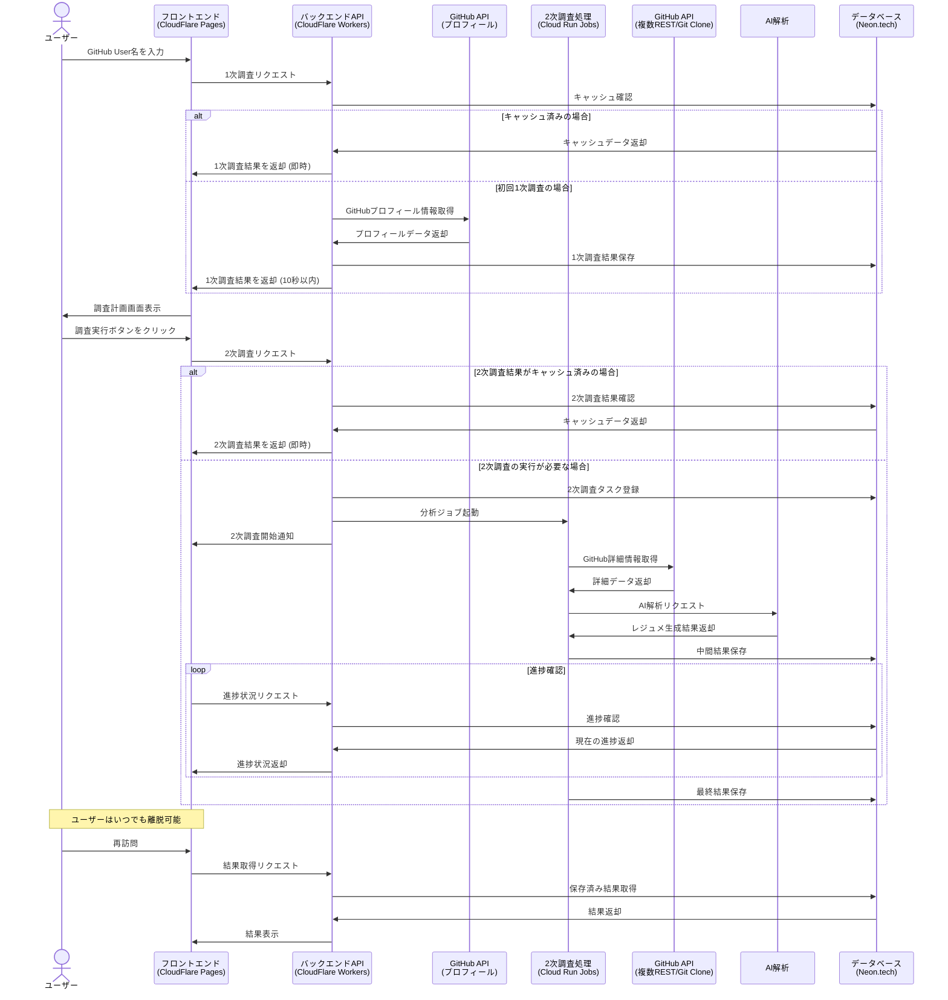

# Epic: Deep Research Architecture and Design

## 目的

このエピックの目的は、**将来のUIやAPIの設計や実装に向けた、アーキテクチャを設計すること**のみです。Deep Research のように、ユーザが調べたいもの(Github User名)を入力した後、10秒以内に関連する情報の詳細な調査計画を画面に表示し、その後ユーザが調査を実行した後ではいつ画面を離脱してもよいシステムを実現するための、アーキテクチャの全体構成と設計を定義します。

## 概要

このエピックでは、アーキテクチャ設計の観点から、効率的な情報収集と分析を行うための2段階調査プロセスを定義します。具体的な実装やUIの詳細ではなく、システム全体の構造、コンポーネント間の関係、データフロー、技術選定の根拠に焦点を当てています。

**1次調査（調査計画段階）**：
- GitHubプロフィール情報をRESTで1回だけAPIを叩いて取得する軽量な処理
- CloudFlare Workersで10秒以内に実行完了
- 基本的なプロフィール情報のみを取得し、調査計画を生成するアーキテクチャ

**2次調査（詳細分析段階）**：
- GitHubの複数のREST APIやGit Clone、AIによる解析などを行う重い処理
- CloudRun Jobsで時間をかけて実行
- バックグラウンドで処理が継続され、ユーザーはいつでも安全に離脱可能なアーキテクチャ

このドキュメントに含まれるUIモック、ユーザーガイド、詳細設計などの付属資料は、**単に抽象と具体を往復して検討した参考材料にすぎません**。これらは、アーキテクチャの検証や具体化のために作成されたものであり、最終的な実装の詳細を規定するものではありません。

## 関連ドキュメント

以下のドキュメントは、アーキテクチャ設計を検討する過程で作成された参考資料です：

- [進捗状況](./PROGRESS.md) - アーキテクチャ設計の進捗状況
- [アーキテクチャ設計](./ARCHITECTURE.md) - システム全体のアーキテクチャと設計思想の詳細
- [ユーザーガイド](./USER-GUIDE.md) - アーキテクチャが実現すべき機能の参考資料
- [UI設計](./UI.md) - アーキテクチャが支えるべきUIの参考資料
- [モックアップ](./mocks/) - アーキテクチャの検証のための具体例

## アーキテクチャの主要コンポーネント

1. **1次調査アーキテクチャ**
   - GitHub User名からの10秒以内の基本情報取得と調査計画生成のための構造
   - GitHubプロフィール情報をRESTで1回だけAPIを叩いて取得するための設計（CloudFlare Workers）
   - 高速レスポンスを実現するためのキャッシュ戦略

2. **2次調査アーキテクチャ**
   - GitHubの複数のREST APIやGit Clone、AIによる解析などを行う重い処理のための構造
   - バックグラウンドでの調査実行と進捗管理のための設計（CloudRun Jobs）
   - 進捗管理はCloudRun Jobsの仕組みを利用し実装コードを減らす戦略

3. **データ永続化アーキテクチャ**
   - 1次調査と2次調査の結果を効率的に保存するための構造
   - 30日間のデータ保持ポリシーを実現するための設計
   - キャッシュ戦略とデータベース設計

4. **フロントエンドアーキテクチャ**
   - SPAとしての全体構造
   - バックエンドとの通信方式（RESTful API、Polling）
   - 状態管理と画面遷移の設計

## 技術スタック選定理由

### フロントエンド
- **CloudFlare Pages**: グローバルCDNによる高速配信、CI/CD統合、バックエンドとの親和性
- **React + TypeScript**: コンポーネント指向開発、型安全性、エコシステムの充実
- **React Router (SPA Mode)**: クライアントサイドルーティング、状態保持、ユーザー体験向上
- **Tailwind CSS**: 開発効率、カスタマイズ性、バンドルサイズ最適化
- **Polling**: 実装の単純さ、サーバーリソースの効率的利用

### バックエンド API Server（1次調査）
- **CloudFlare Workers**: エッジでの高速実行、グローバル分散、コールドスタート時間の最小化
- **Hono.js**: 軽量、高速、TypeScriptサポート、CloudFlare Workersとの親和性
- **RESTful API**: 標準的、理解しやすい、キャッシュ可能

### Github分析バッチ処理（2次調査）
- **GCP Cloud Run Jobs**: サーバーレス、スケーラビリティ、従量課金、管理オーバーヘッド削減
- **内蔵キュー管理**: 追加インフラ不要、実装の単純化、運用コスト削減

### データベース 
- **Neon.tech**: PostgreSQL互換、サーバーレス、スケーラビリティ、CloudRun Jobsからのアクセス容易性
- **PostgreSQL**: 構造化データ、トランザクション、クエリ機能、エコシステム

## システムアーキテクチャ図



## データモデル概要

```
User
  - id: UUID
  - created_at: Timestamp
  - last_login: Timestamp

GitHubProfile (1次調査結果)
  - github_username: String (PK)
  - profile_data: JSONB
  - created_at: Timestamp
  - expires_at: Timestamp (+30日)

ResearchTask (2次調査タスク)
  - id: UUID (PK)
  - github_username: String (FK -> GitHubProfile)
  - status: Enum (PENDING, IN_PROGRESS, COMPLETED, FAILED)
  - progress: Integer (0-100)
  - created_at: Timestamp
  - updated_at: Timestamp
  - completed_at: Timestamp
  - cloud_run_job_id: String

ResearchResult (2次調査結果)
  - task_id: UUID (FK -> ResearchTask)
  - result_data: JSONB
  - resume_markdown: Text
  - created_at: Timestamp
  - expires_at: Timestamp (+30日)
```

## スケーラビリティと性能考慮事項

- **1次調査の高速化**:
  - CloudFlare Workersのグローバル分散による低レイテンシ
  - 効率的なキャッシュ戦略
  - 最小限のAPI呼び出し

- **2次調査のスケーラビリティ**:
  - CloudRun Jobsの自動スケーリング
  - バッチ処理の並列化
  - リソース使用量に基づく最適化

- **データベースのスケーリング**:
  - 読み取り/書き込み分離
  - 適切なインデックス設計
  - 定期的なデータクリーンアップ（30日経過データ）

## セキュリティ考慮事項

- **API制限とレート制限**:
  - GitHub API使用量の監視と制限
  - DoS攻撃対策としてのレート制限

- **データ保護**:
  - 機密情報の適切な取り扱い
  - 必要最小限のデータ収集

- **認証と認可**:
  - 将来的な認証システムの拡張性を考慮した設計

## 将来の拡張性

このアーキテクチャは、以下の将来的な拡張を考慮して設計されています：

- 複数のGitHubアカウントの比較分析
- 他のバージョン管理システム（GitLab、Bitbucketなど）への対応
- より高度なAI分析と推奨機能
- ユーザー認証と個人化された分析

## 結論

このアーキテクチャ設計は、GitHubユーザー情報の効率的な収集と分析を実現するための基盤を提供します。1次調査と2次調査の明確な分離、適切な技術選定、スケーラビリティと拡張性の考慮により、将来の実装に向けた堅固な基盤となります。

付属のモックアップやユーザーガイドは、このアーキテクチャが実現すべき機能の理解を助けるための参考資料であり、実際の実装詳細は今後の開発フェーズで決定されます。
