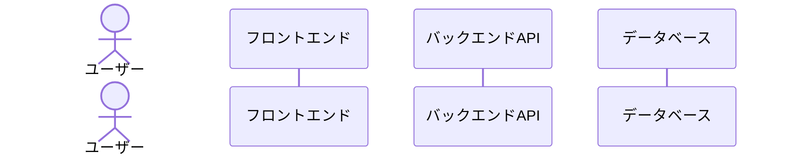

# Epic: Deep Research Architecture and Design

## 目的

Deep Research のように、ユーザが調べたいもの(Github User名)を入力した後、10秒以内に、関連する情報の詳細な調査計画を画面に表示し、その後ユーザが調査を実行した後では、いつ画面を離脱してもよいアーキテクチャの全体構成と設計を考えたい。

## 概要

このエピックでは、ユーザーがGitHub User名を入力するだけで、10秒以内に効率的に情報収集と分析を行うための調査計画を表示し、その後ユーザーがいつでも安全に離脱できるアーキテクチャを設計・実装します。モダンなウェブ技術とダークテーマベースのグラデーションリッチなUIを採用し、直感的な操作性と視覚的に魅力的な結果表示を提供します。

ユーザーは調査計画を確認した後、実行ボタンを押すだけで自動的に調査が進行し、いつでも安全に離脱できる仕組みを提供します。非同期処理アーキテクチャにより、バックグラウンドでの処理が継続され、ユーザーが再訪問した際には最新の結果を確認できます。

## 関連ドキュメント

- [進捗状況](./PROGRESS.md) - エピックの現在の進捗状況と次のマイルストーン
- [アーキテクチャ設計](./ARCHITECTURE.md) - システム全体のアーキテクチャと設計思想
- [ユーザーガイド](./USER-GUIDE.md) - 機能の使用方法と操作手順
- [UI設計](./UI.md) - ユーザーインターフェースの詳細設計
- [モックアップ](./mocks/) - UIモックアップとプロトタイプ

## 主要機能

1. **迅速な調査計画生成**
   - GitHub User名からの10秒以内の調査計画生成
   - 視覚的に魅力的なプログレスインジケーター (調査計画生成中の文字とアニメーションをGithubユーザ名をInputした画面と同じ画面に表示し、計画完了後に調査計画画面(=/github/[userName])にリダイレクト)

2. **非同期処理アーキテクチャ**
   - バックグラウンドでの調査実行と進捗管理(進捗管理はCloudRun Jobsの仕組みを利用し実装コードを減らす)
   - リアルタイム進捗表示（Pollingで低コストに実装）
   - 離脱しても調査を継続できる堅牢なUI/設計

3. **シンプルな結果表示**
   - データビジュアライゼーションを活用した結果表示
   - 画面上部セクションに基本的なGithubプロフィールに関する情報を表示
   - メインのセクションは、紙やPDFのレジュメをイメージしたマークダウンだけで記述されたシンプルなレジュメを記載(Githubの活動結果から自動生成されたレジュメを表示)

4. **データ永続化と再開**
   - 調査結果の自動保存
   - 一度調査されたGithubアカウントは結果を30日保存し、他の閲覧ユーザを含めて再訪問時に高速に表示

5. **エクスポートとシェア機能**
   - テキスト形式およびPDF形式でのエクスポート機能
   - 共有ボタンから以下共有が可能
     - クリップボードへのコピー
     - 当該Githubアカウントの調査結果URLをクリップボードにコピー (結果は30日間保存されることを記載)

## 技術スタック

### フロントエンド
- **インフラ**: CloudFlare Pages
- **フレームワーク**: React, TypeScript
- **ルーティング**: React Router (SPA Mode)
- **スタイリング**: Tailwind CSS
- **リアルタイム通信**: Polling (CloudRun Jobsの進捗をバックエンドAPIサーバで取得するだけのシンプルな実装)

### バックエンド API Server
- **インフラ**: CloudFlare Workers
- **サーバー**: Hono.js
- **API**: RESTful API
- **認証**: 現在は実装なし (誰でも閲覧可能)

### Github分析バッチ処理
- **インフラ**: GCP Cloud Run Jobs
- **非同期キュー**: なし (CloudRun Jobsに内蔵された仕組みを利用)
- **外部API連携**: GitHub API

### データベース 
- **求められる要件**: 
  - Github分析バッチ処理の主体であるCloudRun Jobsからのデータ更新が可能であること (ステータス保存、結果保存)
  - PostgresSQL互換であること
- **インフラ**: Neon.tech

## ユーザーフロー
[AIへの指示]: 以下のMermaid内容が古いため最新の情報に合わせて作り直して下さい

## 期待される成果

- ユーザーがGitHub User名を入力してから10秒以内に調査計画を表示
- ユーザーがいつでも安全に離脱でき、再訪問時に調査の続きを確認できる
- 視覚的に魅力的で直感的なユーザーインターフェース
- スケーラブルで堅牢なバックエンドアーキテクチャ
- 将来の機能拡張に対応できる柔軟な設計
