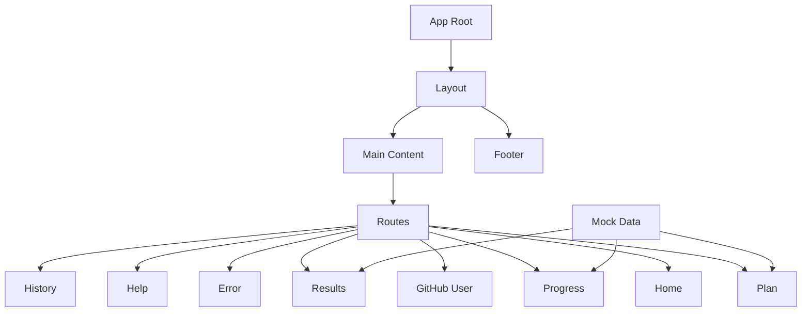
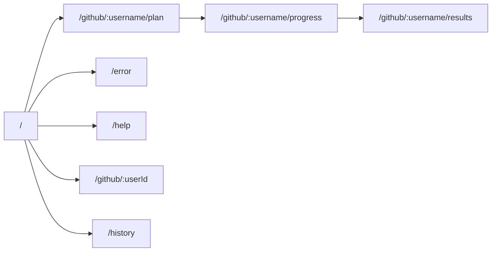

# UI Gap adjustment アーキテクチャ

## 設計方針

このエピックでは、以下の設計方針に基づいて実装を行います：

1. **既存コードの保全**
   - 既存のコードは可能な限り編集・削除せず、新しいファイルや新しいURLパスとして追加実装
   - 既存のUIは引き続き利用可能な状態を維持

2. **モックデータの活用**
   - 外部通信を行わないモックデータを作成・利用
   - 実際のAPIが実装されるまでの間、フロントエンドの開発を進めるための仮データ

3. **コンポーネントの再利用**
   - 共通コンポーネント（フッターなど）を作成し、各画面で再利用
   - デザインの一貫性を保ちつつ、開発効率を向上

4. **段階的な実装**
   - 共通コンポーネント → ルーティング → 各画面の順で実装
   - 各段階でテストを行い、問題を早期に発見・修正

## アーキテクチャ構成

## コンポーネント構成

### 共通コンポーネント
- **Layout**: 全画面共通のレイアウトを提供
- **Footer**: 著作権表示、リンクなどを含むフッター
- **LoadingIndicator**: ローディング表示（スケルトン、スピナー、プログレスバー）
- **Card**: ガラスモーフィズム風のカードコンポーネント
- **HR**: 水平区切り線コンポーネント
- **SectionTitle**: セクションタイトルコンポーネント
- **StepCard**: ステップカードコンポーネント
- **UserInfoCard**: ユーザー情報カードコンポーネント
- **ShareButton**: 共有ボタンコンポーネント

### 画面コンポーネント
- **Home**: ホーム画面（GitHub ユーザー名入力フォーム）
- **Plan**: 調査計画画面（基本情報、調査計画概要、予想時間表示、アクションボタン）
- **Progress**: 調査進行画面（進捗バー、ステップリスト、離脱安全インジケーター）
- **Results**: 調査結果画面（基本情報、レジュメ本文、アクションボタン）
- **Error**: エラー画面（エラー情報、トラブルシューティング）
- **Help**: ヘルプ・サポート画面（ユーザーガイド、FAQ、サポート連絡先）
- **History**: 履歴画面（過去に調査したGitHubユーザーのリスト）

### モックデータ
- **GitHubUser**: GitHub ユーザーの基本情報
- **ResearchPlan**: 調査計画の情報
- **ResearchStepStatus**: 調査進行状況の情報
- **ResumeResult**: レジュメ結果の情報

## ルーティング設計

- `/`: ホーム画面
- `/github/:username/plan`: 調査計画画面
- `/github/:username/progress`: 調査進行画面
- `/github/:username/results`: 調査結果画面
- `/error`: エラー画面
- `/help`: ヘルプ・サポート画面
- `/github/:userId`: 既存の GitHub ユーザー画面（維持）
- `/history`: 履歴画面

## 状態管理

このエピックでは、外部通信を行わないモックデータを使用するため、複雑な状態管理は必要ありません。各コンポーネント内でのローカルステートを使用し、必要に応じてpropsを通じてデータを受け渡します。

将来的にはAPIと連携する際に、より適切な状態管理の仕組み（Context APIなど）を導入することを検討します。