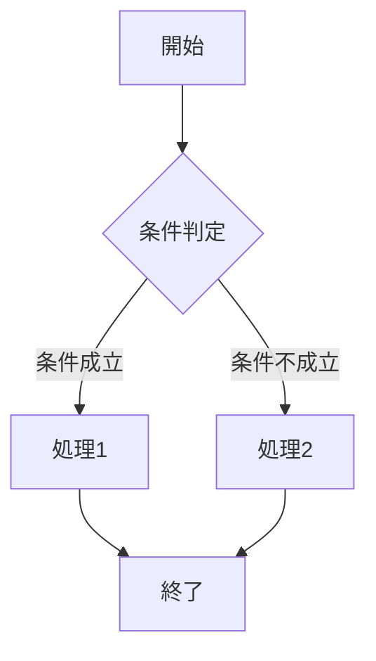
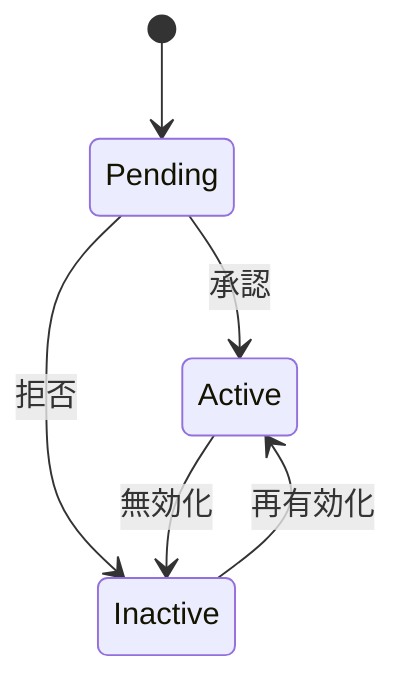

# サンプル機能詳細仕様

**更新日**: 2025/3/24
**確認日**: 2025/3/24

## 目的

このドキュメントは、サンプル機能の詳細仕様を定義するものです。ユーザー向けの概要と開発者向けの技術詳細の中間に位置し、機能の内部仕様を含めた詳細な解説を提供します。

## 機能要件

### 必須要件

1. **要件1**: サンプル機能の主要な要件を説明
   - 詳細1.1: 要件の詳細を説明
   - 詳細1.2: 要件の別の詳細を説明

2. **要件2**: サンプル機能の別の要件を説明
   - 詳細2.1: 要件の詳細を説明
   - 詳細2.2: 要件の別の詳細を説明

### オプション要件

1. **オプション要件1**: 優先度の低い要件を説明
2. **オプション要件2**: 別の優先度の低い要件を説明

## 機能仕様

### ユーザーインターフェース

#### 画面レイアウト

```
+----------------------------------+
|            ヘッダー              |
+----------------------------------+
|                                  |
|            メイン領域            |
|                                  |
+----------------------------------+
|            フッター              |
+----------------------------------+
```

#### UI要素

| 要素 | 種類 | 説明 | 動作 |
|------|------|------|------|
| 要素1 | ボタン | 「実行」ボタン | クリックで処理を実行 |
| 要素2 | 入力フィールド | テキスト入力 | ユーザー入力を受け付け |
| 要素3 | ドロップダウン | オプション選択 | 選択肢から1つを選択 |

### ビジネスロジック

#### 処理フロー



#### ルール

1. **ルール1**: ビジネスロジックのルールを説明
   - 条件: ルールが適用される条件
   - 動作: ルールに基づく動作

2. **ルール2**: 別のビジネスロジックのルールを説明
   - 条件: ルールが適用される条件
   - 動作: ルールに基づく動作

### データ仕様

#### エンティティ

**サンプルエンティティ**:

| 属性 | 型 | 必須 | 説明 |
|------|------|------|------|
| id | UUID | はい | 一意識別子 |
| name | 文字列 | はい | 名前 |
| description | 文字列 | いいえ | 説明 |
| status | 列挙型 | はい | ステータス（active/inactive/pending） |
| createdAt | 日時 | はい | 作成日時 |
| updatedAt | 日時 | はい | 更新日時 |

#### 状態遷移



## 非機能要件

### パフォーマンス

- 応答時間: 平均500ms以下
- スループット: 1秒あたり100リクエスト以上
- 同時接続: 最大1000ユーザー

### セキュリティ

- 認証: ユーザー認証必須
- 認可: 役割ベースのアクセス制御
- データ保護: 機密データの暗号化

### 可用性

- 稼働時間: 99.9%以上
- バックアップ: 日次
- 障害復旧: RTO 4時間、RPO 1時間

## テスト基準

### 受け入れ基準

1. **基準1**: 機能が満たすべき基準を説明
2. **基準2**: 機能が満たすべき別の基準を説明

### テストシナリオ

1. **シナリオ1**: テストシナリオを説明
   - 前提条件: テストの前提条件
   - 手順: テスト手順
   - 期待結果: 期待される結果

2. **シナリオ2**: 別のテストシナリオを説明
   - 前提条件: テストの前提条件
   - 手順: テスト手順
   - 期待結果: 期待される結果

## メタデータ

**更新・確認情報**:
- 最終更新日: 2025/03/24
- 最終確認日: 2025/03/24

**文書情報**:
- ステータス: サンプル
- バージョン: 0.1.0

## 関連ドキュメント

- [機能概要](./overview.md)
- [技術詳細](./technical-details.md)
- [プロダクト概要](../../README.md)

## Changelog

- 2025/3/24: 初回作成