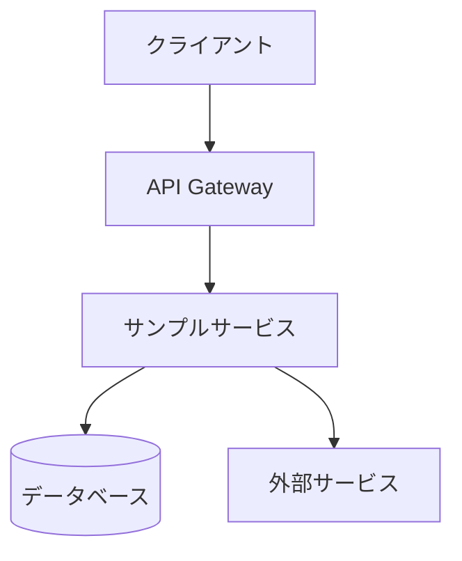

# サンプル機能技術詳細

**更新日**: 2025/3/24
**確認日**: 2025/3/24

## 技術概要

このドキュメントは、サンプル機能の技術的な詳細を開発者向けに説明するものです。実際のプロジェクトでは、この文書を実際の機能の技術詳細に置き換えてください。

## アーキテクチャ

サンプル機能は以下のコンポーネントで構成されています：



## 主要コンポーネント

### クライアント
- フレームワーク: React
- 主要ライブラリ: Redux, Axios
- エントリーポイント: `apps/web/app/routes/sample-feature.tsx`

### バックエンド
- 言語: TypeScript
- フレームワーク: Express
- 主要ライブラリ: Prisma, Zod
- エントリーポイント: `apps/api/src/routes/api/sample-feature.ts`

### データモデル
```typescript
// サンプルデータモデル
interface SampleModel {
  id: string;
  name: string;
  description: string;
  createdAt: Date;
  updatedAt: Date;
}
```

## API仕様

### エンドポイント

| メソッド | パス | 説明 |
|---------|------|------|
| GET | /api/sample-feature | サンプル機能のリソース一覧を取得 |
| GET | /api/sample-feature/:id | 特定のサンプルリソースを取得 |
| POST | /api/sample-feature | 新しいサンプルリソースを作成 |
| PUT | /api/sample-feature/:id | 既存のサンプルリソースを更新 |
| DELETE | /api/sample-feature/:id | サンプルリソースを削除 |

### リクエスト/レスポンス例

**リクエスト**:
```http
GET /api/sample-feature/123
```

**レスポンス**:
```json
{
  "id": "123",
  "name": "サンプル名",
  "description": "サンプル説明",
  "createdAt": "2025-03-24T00:00:00Z",
  "updatedAt": "2025-03-24T00:00:00Z"
}
```

## 実装詳細

### パフォーマンス最適化
- キャッシュ戦略: Redis
- クエリ最適化: インデックス、クエリプラン

### セキュリティ対策
- 認証: JWT
- 認可: RBAC
- 入力検証: Zod

### エラーハンドリング
- エラーコード一覧
- リトライ戦略
- フォールバックメカニズム

## テスト戦略

- ユニットテスト: Jest
- 統合テスト: Supertest
- E2Eテスト: Playwright

## デプロイメント

- CI/CD: GitHub Actions
- 環境: 開発、ステージング、本番
- ロールバック手順

## メタデータ

**更新・確認情報**:
- 最終更新日: 2025/03/24
- 最終確認日: 2025/03/24

**文書情報**:
- ステータス: サンプル
- バージョン: 0.1.0

## 関連ドキュメント

- [機能概要](./overview.md)
- [詳細仕様](./specs.md)
- [アーキテクチャ概要](../../../guide/developer/architecture/README.md)

## Changelog

- 2025/3/24: 初回作成