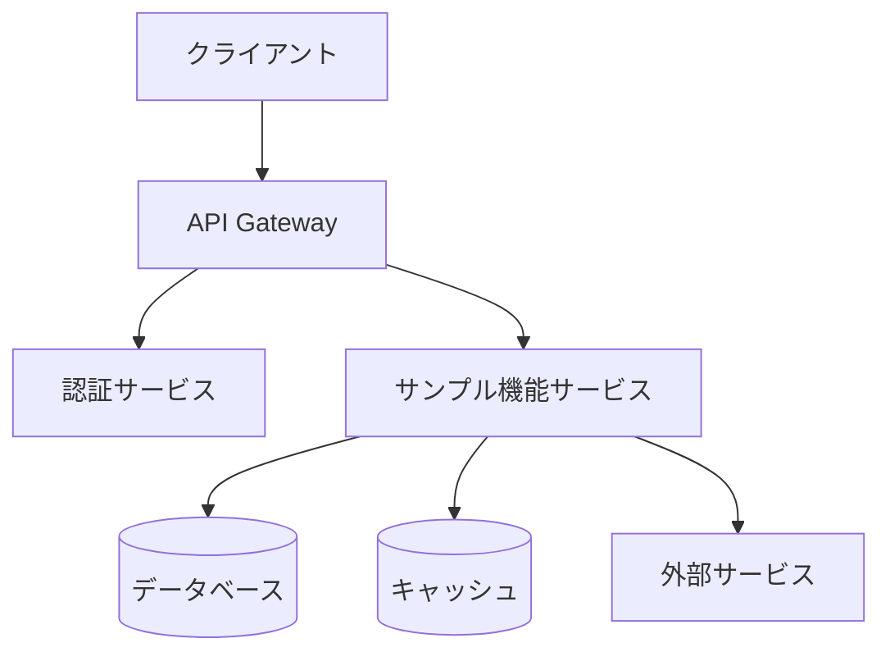

# サンプル機能システム全体設計概要

**更新日**: 2025/3/24
**確認日**: 2025/3/24

## 目的

このドキュメントは、サンプル機能のシステム全体設計の概要を提供します。アーキテクチャ、主要コンポーネント、データフロー、技術スタックなど、システム全体の技術的な側面を説明します。

## システムアーキテクチャ概要

サンプル機能は、以下の図に示すようなマイクロサービスアーキテクチャに基づいて設計されています：

### 主要コンポーネント

1. **クライアント層**:
   - Webフロントエンド (React/TypeScript)
   - モバイルアプリ (React Native)

2. **API層**:
   - API Gateway (Express.js)
   - 認証・認可 (JWT)

3. **サービス層**:
   - サンプル機能サービス (Node.js)
   - 関連マイクロサービス

4. **データ層**:
   - 主データベース (PostgreSQL)
   - キャッシュ (Redis)
   - オブジェクトストレージ (S3互換)

## 技術スタック

### フロントエンド

- **フレームワーク**: React 18
- **言語**: TypeScript 5.0
- **状態管理**: Redux Toolkit
- **UIライブラリ**: MUI (Material-UI) v5
- **APIクライアント**: Axios
- **テスト**: Jest, React Testing Library
- **ビルドツール**: Vite

### バックエンド

- **フレームワーク**: Express.js
- **言語**: TypeScript 5.0
- **APIドキュメント**: OpenAPI/Swagger
- **バリデーション**: Zod
- **ORM**: Prisma
- **テスト**: Jest, Supertest
- **ビルドツール**: tsup

### インフラストラクチャ

- **コンテナ化**: Docker
- **オーケストレーション**: Kubernetes
- **CI/CD**: GitHub Actions
- **モニタリング**: Prometheus, Grafana
- **ロギング**: ELK Stack

## データフロー

サンプル機能の主要なデータフローは以下の通りです：

1. **ユーザーリクエスト**:
   - クライアントからAPIゲートウェイへのリクエスト
   - 認証・認可の検証
   - 適切なサービスへのルーティング

2. **データ処理**:
   - サービスでのビジネスロジック実行
   - データベースとの相互作用
   - キャッシュの活用

3. **レスポンス**:
   - サービスからクライアントへのレスポンス
   - エラーハンドリングとリトライ
   - データの変換と整形

## システム間連携

サンプル機能は以下のシステムと連携します：

| システム | 連携方法 | 目的 |
|---------|----------|------|
| 認証システム | REST API | ユーザー認証・認可 |
| 通知システム | メッセージキュー | イベント通知 |
| 外部API | REST API | 外部データ取得 |

## 非機能要件の実現方法

### スケーラビリティ

- 水平スケーリング: Kubernetesによるオートスケーリング
- 垂直スケーリング: リソース割り当ての最適化
- データベースシャーディング: 大規模データ対応

### パフォーマンス

- キャッシング戦略: Redis, CDN
- クエリ最適化: インデックス、クエリプラン
- 非同期処理: バックグラウンドジョブ

### セキュリティ

- 認証: JWT, OAuth 2.0
- 認可: RBAC (Role-Based Access Control)
- データ保護: 暗号化 (転送中・保存時)
- 脆弱性対策: 定期的なセキュリティレビュー

### 可用性

- 冗長構成: マルチAZ/リージョンデプロイ
- 障害検出: ヘルスチェック、監視アラート
- 自動復旧: 自己修復メカニズム

## デプロイメント戦略

- **環境**: 開発、テスト、ステージング、本番
- **デプロイ方法**: ブルー/グリーンデプロイ
- **ロールバック**: 自動ロールバックメカニズム
- **フィーチャーフラグ**: 段階的ロールアウト

## 監視とオブザーバビリティ

- **メトリクス**: Prometheus
- **ダッシュボード**: Grafana
- **ロギング**: ELK Stack
- **トレーシング**: OpenTelemetry
- **アラート**: PagerDuty

## 技術的負債と将来の拡張性

- **現在の制約**: 制約1, 制約2
- **改善計画**: 計画1, 計画2
- **将来の拡張**: 拡張1, 拡張2

## メタデータ

**更新・確認情報**:
- 最終更新日: 2025/03/24
- 最終確認日: 2025/03/24

**文書情報**:
- ステータス: 作成中
- バージョン: 0.1.0

## 関連ドキュメント

- [システムドキュメントガイド](../README.md)
- [システム全体設計書](./system.md)
- [製品要件定義書](../../requirements/PRD.md)

## Changelog

- 2025/3/24: 初回作成