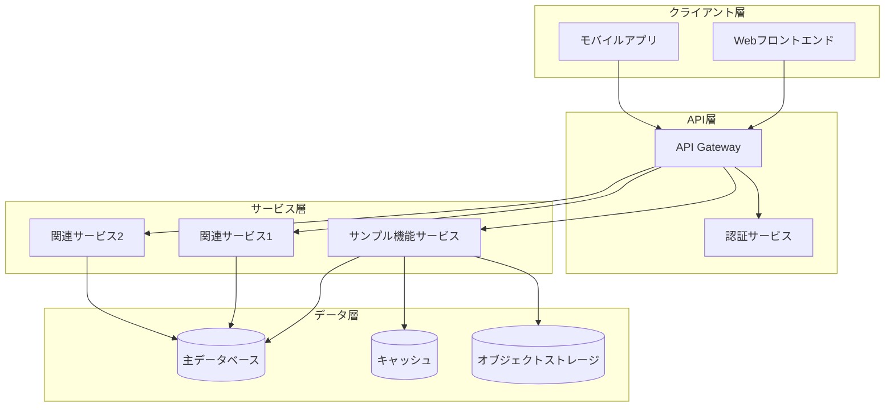
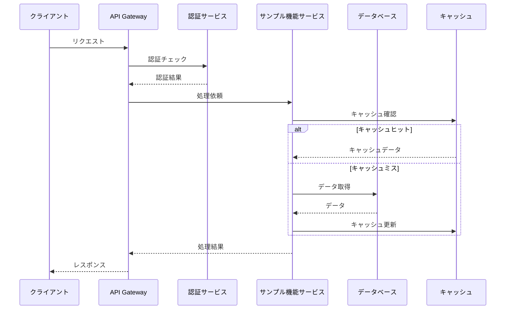
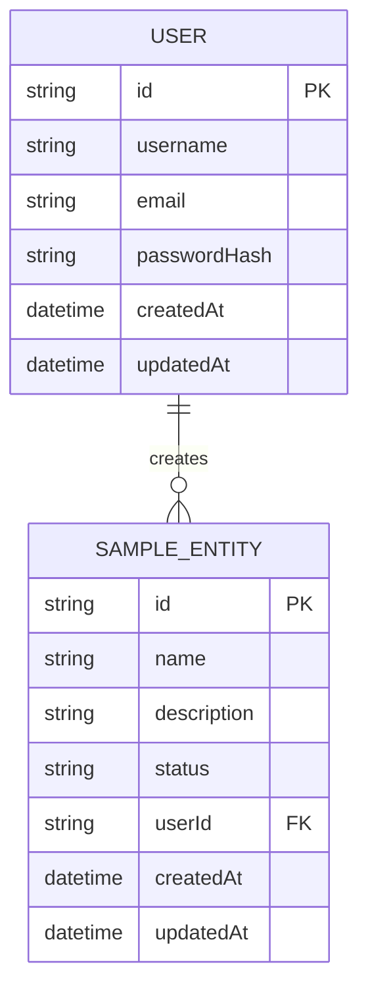

# サンプル機能システム全体設計書

**更新日**: 2025/3/24
**確認日**: 2025/3/24

## 1. はじめに

### 1.1 目的

このドキュメントは、サンプル機能のシステム全体設計を詳細に定義するものです。開発チームがシステムを実装するための技術的な基準と指針を提供します。

### 1.2 スコープ

このドキュメントでは、サンプル機能のアーキテクチャ、コンポーネント、インターフェース、データモデル、非機能要件の実現方法などを詳細に説明します。

### 1.3 参照ドキュメント

- [製品要件定義書](../../requirements/PRD.md)
- [システム全体設計概要](./README.md)
- [技術スタック標準](../../../../../../../docs/guide/developer/architecture/tech-stack.md)

### 1.4 用語と略語

| 用語/略語 | 定義 |
|----------|------|
| API | Application Programming Interface |
| JWT | JSON Web Token |
| RBAC | Role-Based Access Control |
| ORM | Object-Relational Mapping |

## 2. システムアーキテクチャ

### 2.1 アーキテクチャスタイル

サンプル機能は、以下の理由からマイクロサービスアーキテクチャを採用しています：

- スケーラビリティ: 個別のサービスを独立してスケールできる
- 柔軟性: 技術スタックをサービスごとに最適化できる
- 耐障害性: サービスの障害が他のサービスに波及しにくい
- 開発効率: チームごとに独立して開発・デプロイできる

### 2.2 システム構成図



### 2.3 コンポーネント間の相互作用



## 3. コンポーネント詳細設計

### 3.1 クライアント層

#### 3.1.1 Webフロントエンド

- **技術スタック**: React, TypeScript, Redux Toolkit, MUI
- **責任範囲**: ユーザーインターフェース、状態管理、APIとの通信
- **主要コンポーネント**:
  - ページコンポーネント: 各画面のレイアウトと構成
  - 共通コンポーネント: 再利用可能なUI要素
  - APIクライアント: バックエンドとの通信
  - 状態管理: グローバル状態とローカル状態の管理

#### 3.1.2 モバイルアプリ

- **技術スタック**: React Native, TypeScript, Redux Toolkit
- **責任範囲**: モバイル向けユーザーインターフェース、オフライン対応
- **主要コンポーネント**:
  - 画面コンポーネント: 各画面のレイアウトと構成
  - ネイティブ連携: デバイス機能との連携
  - オフラインサポート: データの永続化と同期

### 3.2 API層

#### 3.2.1 API Gateway

- **技術スタック**: Express.js, TypeScript
- **責任範囲**: リクエストのルーティング、認証・認可、レート制限
- **主要機能**:
  - ルーティング: 適切なサービスへのリクエスト転送
  - 認証: JWTトークンの検証
  - 認可: アクセス権限の確認
  - レート制限: DoS攻撃対策
  - ロギング: リクエスト・レスポンスのログ記録

#### 3.2.2 認証サービス

- **技術スタック**: Express.js, TypeScript, JWT
- **責任範囲**: ユーザー認証、トークン管理
- **主要機能**:
  - ユーザー認証: ユーザー名/パスワード検証
  - トークン発行: JWTトークンの生成
  - トークン検証: トークンの有効性確認
  - セッション管理: ユーザーセッションの追跡

### 3.3 サービス層

#### 3.3.1 サンプル機能サービス

- **技術スタック**: Express.js, TypeScript, Prisma
- **責任範囲**: サンプル機能のビジネスロジック、データアクセス
- **主要機能**:
  - 機能1: 詳細説明
  - 機能2: 詳細説明
  - データアクセス: データベースとの相互作用
  - キャッシュ管理: パフォーマンス最適化

### 3.4 データ層

#### 3.4.1 主データベース

- **技術**: PostgreSQL
- **責任範囲**: 永続的なデータ保存
- **主要テーブル**:
  - テーブル1: 説明
  - テーブル2: 説明
  - 関連: テーブル間の関係

#### 3.4.2 キャッシュ

- **技術**: Redis
- **責任範囲**: 頻繁にアクセスされるデータのキャッシュ
- **キャッシュ戦略**:
  - TTL: キャッシュの有効期限
  - 無効化: データ更新時のキャッシュ無効化
  - パターン: キャッシュパターン（Read-Through, Write-Behindなど）

## 4. データモデル

### 4.1 エンティティ関連図 (ERD)



### 4.2 データベーススキーマ

#### 4.2.1 users テーブル

| カラム名 | データ型 | 制約 | 説明 |
|---------|---------|------|------|
| id | UUID | PRIMARY KEY | ユーザーID |
| username | VARCHAR(50) | NOT NULL, UNIQUE | ユーザー名 |
| email | VARCHAR(100) | NOT NULL, UNIQUE | メールアドレス |
| password_hash | VARCHAR(100) | NOT NULL | パスワードハッシュ |
| created_at | TIMESTAMP | NOT NULL | 作成日時 |
| updated_at | TIMESTAMP | NOT NULL | 更新日時 |

#### 4.2.2 sample_entities テーブル

| カラム名 | データ型 | 制約 | 説明 |
|---------|---------|------|------|
| id | UUID | PRIMARY KEY | エンティティID |
| name | VARCHAR(100) | NOT NULL | 名前 |
| description | TEXT | | 説明 |
| status | VARCHAR(20) | NOT NULL | ステータス |
| user_id | UUID | FOREIGN KEY | 作成者ID |
| created_at | TIMESTAMP | NOT NULL | 作成日時 |
| updated_at | TIMESTAMP | NOT NULL | 更新日時 |

### 4.3 データ移行計画

- **初期データ**: 初期データの投入方法
- **マイグレーション**: スキーマ変更の適用方法
- **ロールバック**: 問題発生時の対応方法

## 5. API設計

### 5.1 RESTful API

#### 5.1.1 エンドポイント一覧

| メソッド | パス | 説明 | 認証 |
|---------|------|------|------|
| GET | /api/sample-entities | エンティティ一覧取得 | 必須 |
| GET | /api/sample-entities/:id | 特定エンティティ取得 | 必須 |
| POST | /api/sample-entities | 新規エンティティ作成 | 必須 |
| PUT | /api/sample-entities/:id | エンティティ更新 | 必須 |
| DELETE | /api/sample-entities/:id | エンティティ削除 | 必須 |

#### 5.1.2 リクエスト/レスポンス例

**リクエスト**:
```http
POST /api/sample-entities
Content-Type: application/json
Authorization: Bearer <token>

{
  "name": "サンプル名",
  "description": "サンプル説明",
  "status": "active"
}
```

**レスポンス**:
```http
HTTP/1.1 201 Created
Content-Type: application/json

{
  "id": "123e4567-e89b-12d3-a456-426614174000",
  "name": "サンプル名",
  "description": "サンプル説明",
  "status": "active",
  "userId": "123e4567-e89b-12d3-a456-426614174001",
  "createdAt": "2025-03-24T00:00:00Z",
  "updatedAt": "2025-03-24T00:00:00Z"
}
```

### 5.2 エラーハンドリング

#### 5.2.1 エラーレスポンス形式

```json
{
  "error": {
    "code": "VALIDATION_ERROR",
    "message": "入力データが不正です",
    "details": [
      {
        "field": "name",
        "message": "名前は必須です"
      }
    ]
  }
}
```

#### 5.2.2 エラーコード一覧

| コード | HTTPステータス | 説明 |
|--------|---------------|------|
| UNAUTHORIZED | 401 | 認証エラー |
| FORBIDDEN | 403 | 権限エラー |
| NOT_FOUND | 404 | リソースが見つからない |
| VALIDATION_ERROR | 422 | 入力データ検証エラー |
| INTERNAL_ERROR | 500 | 内部サーバーエラー |

## 6. 非機能要件の実現方法

### 6.1 パフォーマンス

#### 6.1.1 キャッシング戦略

- **アプリケーションキャッシュ**: Redis
- **CDN**: 静的アセット配信
- **データベースキャッシュ**: クエリキャッシュ

#### 6.1.2 最適化手法

- **インデックス最適化**: 頻繁に使用されるクエリのインデックス
- **クエリ最適化**: N+1問題の回避
- **非同期処理**: 重い処理のバックグラウンド実行

### 6.2 スケーラビリティ

#### 6.2.1 水平スケーリング

- **ステートレス設計**: セッション状態の外部化
- **ロードバランシング**: トラフィック分散
- **オートスケーリング**: 負荷に応じた自動スケール

#### 6.2.2 垂直スケーリング

- **リソース最適化**: メモリ、CPU使用の効率化
- **コネクションプーリング**: データベース接続の再利用

### 6.3 セキュリティ

#### 6.3.1 認証・認可

- **JWT認証**: トークンベースの認証
- **RBAC**: 役割ベースのアクセス制御
- **API鍵**: 外部サービス連携用

#### 6.3.2 データ保護

- **転送時暗号化**: HTTPS/TLS
- **保存時暗号化**: 機密データの暗号化
- **入力検証**: インジェクション攻撃対策

### 6.4 可用性

#### 6.4.1 冗長構成

- **マルチAZ**: 複数のアベイラビリティゾーン
- **フェイルオーバー**: 障害時の自動切り替え

#### 6.4.2 障害対策

- **サーキットブレーカー**: カスケード障害の防止
- **リトライ戦略**: 一時的な障害からの回復
- **グレースフルデグラデーション**: 部分的な機能低下

## 7. デプロイメント

### 7.1 環境構成

- **開発環境**: 開発者用
- **テスト環境**: 自動テスト用
- **ステージング環境**: リリース前検証用
- **本番環境**: エンドユーザー向け

### 7.2 CI/CD

- **ビルドパイプライン**: GitHub Actions
- **テスト自動化**: ユニット、統合、E2Eテスト
- **デプロイ自動化**: 環境ごとの自動デプロイ

### 7.3 デプロイ戦略

- **ブルー/グリーンデプロイ**: ゼロダウンタイム
- **カナリアリリース**: 段階的なトラフィック移行
- **フィーチャーフラグ**: 機能の段階的有効化

## 8. 監視とオブザーバビリティ

### 8.1 ロギング

- **アプリケーションログ**: 構造化ログ
- **アクセスログ**: リクエスト・レスポンスログ
- **エラーログ**: 例外とスタックトレース

### 8.2 メトリクス

- **システムメトリクス**: CPU、メモリ、ディスク
- **アプリケーションメトリクス**: レスポンス時間、エラー率
- **ビジネスメトリクス**: ユーザーアクション、コンバージョン

### 8.3 アラート

- **閾値ベースアラート**: メトリクス閾値超過
- **異常検知**: 通常パターンからの逸脱
- **エスカレーション**: 重要度に応じた通知先

## 9. 開発ガイドライン

### 9.1 コーディング規約

- **命名規則**: キャメルケース、スネークケース
- **コードフォーマット**: Prettier, ESLint
- **コメント**: JSDoc形式

### 9.2 テスト戦略

- **ユニットテスト**: 個別関数・コンポーネント
- **統合テスト**: コンポーネント間連携
- **E2Eテスト**: ユーザーフロー全体

### 9.3 バージョン管理

- **ブランチ戦略**: GitFlow
- **コミットメッセージ**: Conventional Commits
- **プルリクエスト**: テンプレート、レビュープロセス

## メタデータ

**更新・確認情報**:
- 最終更新日: 2025/03/24
- 最終確認日: 2025/03/24

**文書情報**:
- ステータス: ドラフト
- バージョン: 0.1.0
- 承認者: 未定

## 関連ドキュメント

- [システム全体設計概要](./README.md)
- [パッケージ仕様概要](../package-specs/README.md)
- [テスト戦略概要](../test-specs/README.md)

## Changelog

- 2025/3/24: 初回ドラフト作成