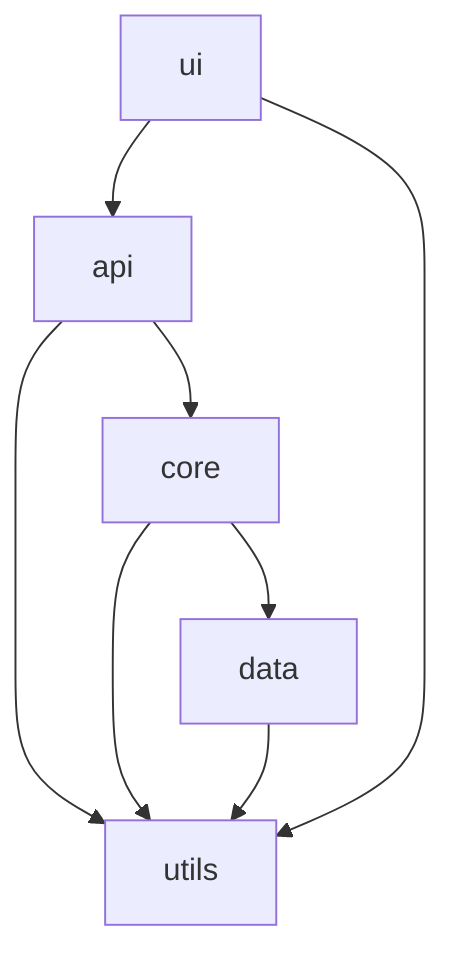

# サンプル機能パッケージ仕様概要

**更新日**: 2025/3/24
**確認日**: 2025/3/24

## 目的

このドキュメントは、サンプル機能を構成する各パッケージの仕様概要を提供します。各パッケージの責任範囲、内部構造、外部インターフェース、依存関係などを説明し、開発者がコードベースを理解し効率的に実装するための指針となります。

## パッケージ構成

サンプル機能は、以下の主要パッケージで構成されています：

```
sample-feature/
├── api/                  # API定義とルーティング
├── core/                 # コアビジネスロジック
├── data/                 # データアクセス層
├── utils/                # ユーティリティ関数
└── ui/                   # ユーザーインターフェース
```

## パッケージ一覧と概要

| パッケージ名 | 責任範囲 | 主要コンポーネント | 依存パッケージ |
|------------|----------|------------------|--------------|
| api | APIエンドポイント、リクエスト処理、レスポンス生成 | コントローラー、バリデーター、ミドルウェア | core, utils |
| core | ビジネスロジック、ドメインモデル、サービス | サービス、ドメインモデル、バリデーションロジック | data, utils |
| data | データアクセス、永続化、キャッシュ | リポジトリ、データモデル、マッパー | utils |
| utils | 共通ユーティリティ、ヘルパー関数 | ロガー、エラーハンドラー、日付ユーティリティ | なし |
| ui | ユーザーインターフェース、状態管理 | コンポーネント、フック、状態管理 | utils |

## パッケージ間の依存関係



## パッケージ設計原則

サンプル機能のパッケージ設計は、以下の原則に基づいています：

1. **関心の分離**: 各パッケージは明確に定義された責任を持ち、単一の関心事に集中する
2. **依存関係の方向**: 依存関係は上位レベル（UI）から下位レベル（データ）に向かう
3. **インターフェース分離**: パッケージ間の相互作用は明確に定義されたインターフェースを通じて行う
4. **再利用性**: 共通機能は再利用可能なユーティリティパッケージに配置する
5. **テスト容易性**: 各パッケージは独立してテスト可能な設計とする

## 各パッケージの詳細

### api パッケージ

APIパッケージは、外部からのリクエストを受け付け、適切な処理を行い、レスポンスを返す責任を持ちます。

**主要コンポーネント**:
- コントローラー: リクエストの受付と処理の振り分け
- バリデーター: 入力データの検証
- ミドルウェア: 認証、ロギング、エラーハンドリングなど

**外部インターフェース**:
- RESTful APIエンドポイント
- GraphQL APIエンドポイント（将来拡張）

**詳細仕様**: [api パッケージ仕様](./api/README.md)

### core パッケージ

コアパッケージは、ビジネスロジックとドメインモデルを実装する責任を持ちます。

**主要コンポーネント**:
- サービス: ビジネスロジックの実装
- ドメインモデル: ビジネスエンティティとルール
- バリデーションロジック: ビジネスルールに基づく検証

**外部インターフェース**:
- サービスインターフェース: 他のパッケージから呼び出し可能な関数

**詳細仕様**: [core パッケージ仕様](./core/README.md)

### data パッケージ

データパッケージは、データの永続化、取得、変換を担当します。

**主要コンポーネント**:
- リポジトリ: データアクセスの抽象化
- データモデル: データベースのエンティティ
- マッパー: ドメインモデルとデータモデルの変換

**外部インターフェース**:
- リポジトリインターフェース: データ操作のための抽象化されたメソッド

**詳細仕様**: [data パッケージ仕様](./data/README.md)

### utils パッケージ

ユーティリティパッケージは、他のパッケージで共通して使用される機能を提供します。

**主要コンポーネント**:
- ロガー: ログ記録機能
- エラーハンドラー: 例外処理と変換
- 日付ユーティリティ: 日付操作関数

**外部インターフェース**:
- ユーティリティ関数: 他のパッケージから呼び出し可能な関数

**詳細仕様**: [utils パッケージ仕様](./utils/README.md)

### ui パッケージ

UIパッケージは、ユーザーインターフェースと状態管理を担当します。

**主要コンポーネント**:
- コンポーネント: 再利用可能なUI要素
- フック: カスタムReactフック
- 状態管理: グローバル状態とローカル状態

**外部インターフェース**:
- 公開コンポーネント: 他のUIから使用可能なコンポーネント

**詳細仕様**: [ui パッケージ仕様](./ui/README.md)

## パッケージ間の通信

パッケージ間の通信は、以下のパターンに従います：

1. **同期呼び出し**: 直接的な関数呼び出し
2. **非同期呼び出し**: Promise/async-awaitベースの非同期処理
3. **イベント駆動**: イベントエミッターを使用した疎結合通信
4. **状態共有**: Reduxなどの状態管理ツールを使用した状態共有

## パッケージの拡張性

各パッケージは、将来の拡張を考慮して設計されています：

1. **プラグインアーキテクチャ**: 機能拡張のためのプラグインシステム
2. **設定可能性**: 環境変数や設定ファイルによるカスタマイズ
3. **抽象化**: インターフェースを通じた実装の差し替え

## パッケージのテスト戦略

各パッケージは、以下のテスト戦略に従ってテストされます：

1. **ユニットテスト**: 個々の関数とクラスのテスト
2. **統合テスト**: パッケージ内のコンポーネント間の相互作用テスト
3. **コントラクトテスト**: パッケージ間のインターフェースのテスト

## メタデータ

**更新・確認情報**:
- 最終更新日: 2025/03/24
- 最終確認日: 2025/03/24

**文書情報**:
- ステータス: 作成中
- バージョン: 0.1.0

## 関連ドキュメント

- [システムドキュメントガイド](../README.md)
- [システム全体設計](../overview-specs/README.md)
- [テスト仕様](../test-specs/README.md)

## Changelog

- 2025/3/24: 初回作成