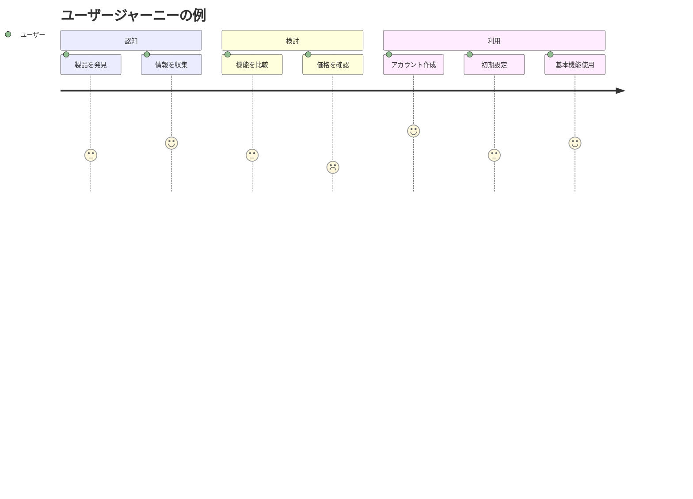

# ユーザージャーニー

**更新日**: 2025/3/24
**確認日**: 2025/3/24

## 目的

- ユーザーがプロダクトを使用する際の一連の体験を可視化する
- ユーザーの感情や課題を各ステップで理解する
- 改善すべきポイントや機会を特定する
- チーム全体でユーザー体験の理解を共有する

## ユーザージャーニーの構成要素

各ユーザージャーニーは以下の要素で構成されています：

1. **ペルソナ**: どのユーザーのジャーニーか
2. **目標**: ユーザーが達成しようとしていること
3. **フェーズ**: ジャーニーの主要な段階
4. **アクション**: 各フェーズでユーザーが行う具体的な行動
5. **思考**: ユーザーが考えていること
6. **感情**: ユーザーの感情状態（満足度など）
7. **タッチポイント**: ユーザーとプロダクトの接点
8. **機会**: 改善や最適化の可能性がある領域

## 主要ジャーニー一覧

現在、以下のユーザージャーニーが定義されています：

| ジャーニー名 | 関連ペルソナ | 目標 |
|--------------|--------------|------|
| (まだジャーニーが定義されていません) | | |

## ジャーニーマップの例

## ユーザージャーニーの活用方法

1. **ペインポイントの特定**: ユーザーが困難を感じるポイントを特定し、優先的に改善
2. **機能の優先順位付け**: ジャーニー上の重要なステップをサポートする機能を優先
3. **UX改善**: 感情スコアが低いステップのユーザー体験を向上
4. **マーケティング戦略**: ユーザーの認知・検討プロセスに合わせたコンテンツ作成

## メタデータ

**更新・確認情報**:
- 最終更新日: 2025/03/24
- 最終確認日: 2025/03/24

**文書情報**:
- ステータス: 作成中
- バージョン: 0.1.0

## 関連ドキュメント

- [プロダクト概要](../README.md)
- [ユーザーペルソナ](../personas/README.md)
- [ドキュメントガイドライン](../../README.md)

## Changelog

- 2025/3/24: 初回作成