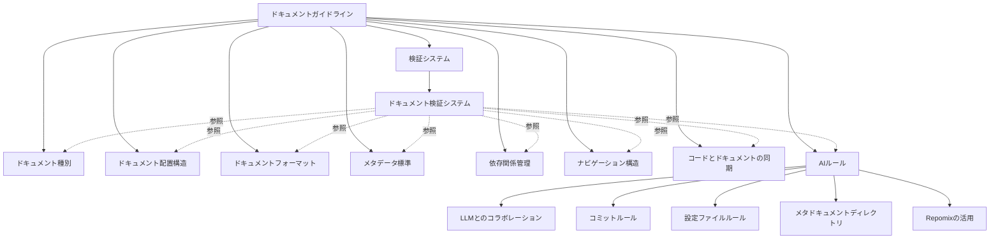

# ドキュメントルール一覧と概要

## 目的

- プロジェクトのドキュメントルールを一覧化し、全体像を把握しやすくする
- 各ルールの目的と概要を簡潔に説明し、詳細へのリンクを提供する
- ルール間の関連性を明示し、体系的な理解を促進する

## ドキュメントルールの体系

ドキュメントルールは以下のカテゴリに分類されます：

1. **基本ルール**: ドキュメントの基本的な構造や種別を定義するルール
2. **フォーマットルール**: ドキュメントの書式や表現方法を定義するルール
3. **メタデータルール**: ドキュメントの属性情報を定義するルール
4. **関係性ルール**: ドキュメント間の関連性を定義するルール
5. **プロセスルール**: ドキュメントの作成・更新・管理プロセスを定義するルール
6. **AIルール**: AIとの協働におけるドキュメント管理を定義するルール

## ルール一覧

### 基本ルール

- [ドキュメント種別](./types.md): プロジェクトに必要なドキュメントの種別を定義
  - 目的: 各ドキュメント種別の目的と内容を明確にし、適切な種別選択を支援
  - 概要: プロジェクト概要、ビジョン・ミッション、ロードマップ一覧など16種類のドキュメント種別を定義

- [ドキュメント配置構造](./structure.md): ドキュメントの配置構造を定義
  - 目的: ドキュメントの発見性を高め、効率的なアクセスを実現
  - 概要: 対象者中心、責任分離、ルールとコンテンツの分離、時間軸による分類の4原則に基づく構造

### フォーマットルール

- [ドキュメントフォーマット](./format.md): ドキュメントのフォーマットを定義
  - 目的: 一貫性のあるドキュメントを作成し、可読性と理解しやすさを向上
  - 概要: ファイル形式、見出し、リスト、リンク、画像、コード、メタデータなどの書式ルール

### メタデータルール

- [ドキュメントメタデータ標準](./documents/metadata.md): ドキュメントのメタデータ標準を定義
  - 目的: 属性情報を標準化し、管理と検索を容易にする
  - 概要: 更新・確認情報、文書情報などのメタデータフィールドと形式を定義

### 関係性ルール

- [ドキュメント依存関係管理](./documents/relations.md): ドキュメント間の依存関係を管理するルールを定義
  - 目的: 変更時の影響範囲を把握しやすくし、知識の整合性を維持
  - 概要: 依存関係メタデータの標準形式、依存関係の種類、管理のベストプラクティスを定義

- [ナビゲーション構造の強化](./documents/navigation.md): ドキュメント間の移動を容易にするルールを定義
  - 目的: 必要な情報への効率的なアクセスを実現し、コンテキストを維持
  - 概要: ドキュメントポータル、ブレッドクラム、関連ドキュメントセクション、インデックスページの活用方法

### プロセスルール

- [コードとドキュメントの同時更新原則](./documents/code-doc-sync.md): コードとドキュメントの同期を維持するルールを定義
  - 目的: コードとドキュメントの乖離を防ぎ、常に最新の状態を維持
  - 概要: 変更影響範囲の特定、大きな変更の計画、コミットとPRの作成、レビュープロセスなどの実践ガイドライン

- [ドキュメント検証システム](./validation.md): ドキュメントの検証と自動修正の仕組みを定義
  - 目的: 品質と一貫性を自動的に検証し、問題を早期に発見
  - 概要: AIプロンプトベースの検証システム、主要プロンプトパターン、検証項目、検証プロセスを定義

### AIルール

- [LLMとのコラボレーションガイドライン](./ai/collaboration.md): LLMとのコラボレーションを効率化するルールを定義
  - 目的: ドキュメント作成・更新・参照の品質を向上させる
  - 概要: LLMがドキュメントを作成・更新・参照する際のガイドライン、LLMと人間の役割分担を定義

- [AIのコミットルール](./ai/commit.md): AIが適切にコミットの提案とメッセージを記録するためのルールを定義
  - 目的: コミットメッセージの一貫性と明確性を確保
  - 概要: コミットメッセージの標準形式、変更種類の定義、コミット単位の考え方を定義

- [AIの設定ファイルルール](./ai/config.md): AIのセットアップが適切に行われていることを確認するルールを定義
  - 目的: AIツールの効果的な活用を促進
  - 概要: Cline、Roo Codeなどの設定ファイルの確認方法、標準構造、管理のベストプラクティスを定義

- [LLM向けメタドキュメントディレクトリ](./ai/meta-directory.md): LLM向けの特別なガイドラインを提供するルールを定義
  - 目的: LLMがプロジェクトを効率的に理解・操作するための支援
  - 概要: .llm-guides/ディレクトリの構造、重要ドキュメント一覧、プロンプトテンプレートなどの活用方法

- [AIのRepomixの活用](./ai/tools/repomix.md): AIがRepomixを効果的に活用するためのルールを定義
  - 目的: 大規模コードベースの効率的な理解と分析を支援
  - 概要: Repomixの効果的な活用ルール、使用シナリオ、最適な設定パラメータ、使用例、分析結果の活用方法

## ルール間の関連性

## AIインストラクション

このルールを読んだAIは以下の行動をとってください：

- ドキュメントルールの全体像を把握し、各ルールの目的と概要を理解する
- ルール間の関連性を認識し、体系的な理解に基づいた提案を行う
- 特定のタスクに関連するルールを特定し、適切なルールを参照・適用する
- ルールの不足や矛盾を発見した場合は、改善提案を行う