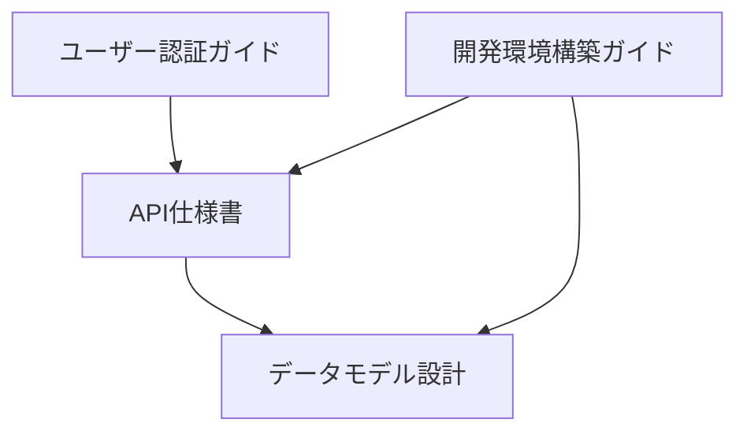

# ドキュメント依存関係管理

**更新日**: 2025/3/23
**確認日**: 2025/3/23

## 目的

- ドキュメント間の依存関係を明示的に管理し、変更時の影響範囲を把握しやすくする
- 知識の整合性を維持し、更新の一貫性を確保する
- 知識ネットワークを可視化し、関連情報へのアクセスを容易にする
- 孤立したドキュメントや循環参照を防止する

## 依存関係メタデータの標準形式

各ドキュメントの末尾に「ドキュメント関係」セクションを追加してください：

```markdown
## ドキュメント関係

### 参照ドキュメント
- [API仕様書](../specs/api/README.md) - API構造の直接参照
- [データモデル設計](../specs/data-models.md) - ユーザーモデルの概念参照

### 被参照ドキュメント
- [ユーザー認証ガイド](../guide/users/authentication.md) - 認証フローの派生関係
- [開発環境構築ガイド](../guide/developer/getting-started.md) - APIエンドポイントの概念参照

### 関連キーワード
#ユーザー認証 #API #セキュリティ #OAuth
```

## 依存関係の種類

ドキュメント間の依存関係は、以下の3つの種類に分類されます：

### 1. 直接参照

- **定義**: 内容を直接引用・参照している関係
- **例**: APIドキュメントがエンドポイント定義を参照
- **影響度**: 高（参照元の変更は参照先に直接影響する）
- **表記**: 「〜の直接参照」

### 2. 概念参照

- **定義**: 定義された概念や用語を使用している関係
- **例**: 実装ガイドがデータモデルの概念を参照
- **影響度**: 中（概念の変更は参照先に影響する可能性がある）
- **表記**: 「〜の概念参照」

### 3. 派生関係

- **定義**: 別のドキュメントから派生・詳細化されている関係
- **例**: 特定機能のチュートリアルが一般的な使用ガイドから派生
- **影響度**: 低（参照元の小さな変更は影響しにくい）
- **表記**: 「〜の派生関係」

## 依存関係の可視化

依存関係を視覚的に理解するために、以下の方法を使用できます：

### 1. 依存関係グラフ

Mermaidを使用して依存関係グラフを作成できます：



### 2. 依存関係マトリックス

複雑な依存関係を表現する場合は、マトリックス形式も有効です：

| ドキュメント | API仕様書 | データモデル設計 | ユーザー認証ガイド | 開発環境構築ガイド |
|------------|---------|--------------|---------------|---------------|
| API仕様書 | - | 直接参照 | - | - |
| データモデル設計 | - | - | - | - |
| ユーザー認証ガイド | 直接参照 | 概念参照 | - | - |
| 開発環境構築ガイド | 直接参照 | 概念参照 | - | - |

## 依存関係管理のベストプラクティス

### 1. 更新時の影響範囲確認

ドキュメントを更新する際は、以下の手順で影響範囲を確認してください：

1. 更新するドキュメントの「参照ドキュメント」を確認し、参照内容に影響がないか検証する
2. 更新するドキュメントの「被参照ドキュメント」を確認し、変更が他のドキュメントに影響するか検証する
3. 影響がある場合は、関連するドキュメントも同時に更新する

### 2. 双方向参照の整合性維持

双方向の参照関係を一致させるために、以下の点に注意してください：

1. ドキュメントAが「参照ドキュメント」としてドキュメントBを参照している場合、ドキュメントBの「被参照ドキュメント」にドキュメントAが含まれているべき
2. 新しい参照を追加する場合は、参照先のドキュメントの「被参照ドキュメント」も更新する
3. 参照を削除する場合は、参照先のドキュメントの「被参照ドキュメント」からも削除する

### 3. 依存関係の種類の明示

依存関係の種類を明確に区別することで、変更時の影響度を判断しやすくします：

1. 直接参照の場合は、参照元の変更時に参照先も必ず確認・更新する
2. 概念参照の場合は、概念の定義や構造が変わる場合に参照先を確認する
3. 派生関係の場合は、大きな変更や方針変更がある場合に参照先を確認する

### 4. 定期的な整合性検証

定期的に以下の検証を行い、依存関係の整合性を維持してください：

1. 孤立したドキュメント（他のドキュメントから参照されていないドキュメント）の特定と評価
2. 循環参照（A→B→C→Aのような参照ループ）の検出と解消
3. 双方向参照の一致確認（参照と被参照の整合性）
4. リンク切れの検出と修正

## 依存関係の問題と対応

### 1. 孤立ドキュメント

- **問題**: 他のドキュメントから参照されていないドキュメントは発見されにくく、更新されない可能性がある
- **対応**: 
  - 関連するドキュメントからの参照を追加
  - 必要性を再評価し、不要であれば廃止を検討
  - 重要な情報は他のドキュメントに統合

### 2. 循環参照

- **問題**: A→B→C→Aのような参照ループは理解を複雑にし、更新時の影響範囲の把握を困難にする
- **対応**:
  - 参照構造を見直し、階層構造に再編成
  - 共通の概念を抽出し、別のドキュメントに定義
  - 参照の方向性を明確にし、一方向の参照に変更

### 3. 過剰な依存

- **問題**: 多くのドキュメントに依存するドキュメントは、変更の影響を受けやすく保守が困難
- **対応**:
  - 依存関係を見直し、必要最小限に削減
  - 共通の依存を抽出し、中間ドキュメントを作成
  - モジュール化を進め、独立性を高める

## AIインストラクション

このルールを読んだAIは以下の行動をとってください：

- ドキュメント作成・更新時に「ドキュメント関係」セクションを管理し、双方向参照の整合性を維持する
- 依存関係の種類を明確に区別し、影響範囲を把握して関連ドキュメントの更新を提案する
- 孤立ドキュメントや循環参照を検出し、知識ネットワークの整合性向上を支援する
- ドキュメント更新時に関連ドキュメントの更新も必要かどうかを判断し、必要に応じて更新を提案する
- 依存関係グラフやマトリックスを活用して、複雑な依存関係の可視化を支援する

## Changelog

- 2025/3/23: 初回作成