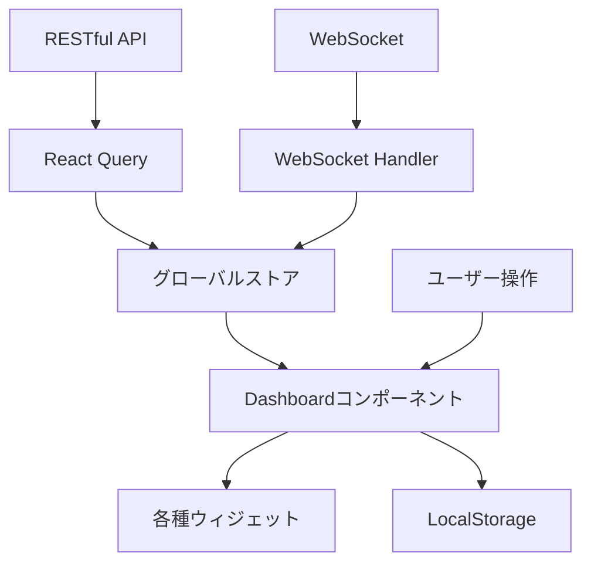

# ユーザーダッシュボード機能 - フロントエンド概要

**更新日**: 2025/03/01
**確認日**: 2025/03/01

## 概要

このドキュメントでは、ユーザーダッシュボード機能のフロントエンド実装に関する技術的な概要を説明します。ダッシュボードのUI設計、コンポーネント構成、状態管理戦略などについて詳細に記載しています。

## 対象範囲

この変更は、`apps/web`パッケージに以下の変更をもたらします：

1. ダッシュボード画面の新規作成
2. ダッシュボードウィジェットのコンポーネント実装
3. リアルタイムデータ更新のためのWebSocket連携
4. ウィジェットのドラッグ＆ドロップ機能

## 既存コードへの影響

この実装は以下の既存コンポーネントに影響します：

- `apps/web/app/routes/` - 新規ルート追加
- `apps/web/app/components/` - 共通コンポーネントの拡張
- `apps/web/app/hooks/` - カスタムフックの追加
- `apps/web/app/store/` - グローバル状態の拡張

## 技術選定

ダッシュボード機能の実装には以下の技術を採用します：

| 技術/ライブラリ | 用途 | 選定理由 |
|---------------|-----|---------|
| React | UIフレームワーク | プロジェクト標準 |
| React Query | サーバー状態管理 | キャッシュとリアルタイム更新の簡略化 |
| Chart.js | グラフ描画 | 軽量で高速、カスタマイズ容易性 |
| React Grid Layout | ウィジェットレイアウト | レスポンシブグリッドとドラッグ＆ドロップサポート |
| Socket.IO Client | WebSocket通信 | サーバーサイドと同じライブラリで一貫性確保 |
| Tailwind CSS | スタイリング | プロジェクト標準 |

## コンポーネント構造

```
Dashboard
├── DashboardHeader
│   ├── TimeRangeSelector
│   ├── RefreshButton
│   └── LayoutSelector
├── WidgetGrid (React Grid Layout)
│   ├── SkillsWidget
│   │   ├── SkillsChart
│   │   └── SkillsList
│   ├── ActivityWidget
│   │   ├── ActivityTimeline
│   │   └── ActivitySummary
│   ├── ReposWidget
│   │   ├── ReposList
│   │   └── RepoStats
│   ├── LanguagesWidget
│   │   └── LanguagesPieChart
│   └── MarketTrendsWidget
│       ├── TrendsList
│       └── TrendChart
└── DashboardFooter
    ├── ExportButton
    └── SettingsButton
```

## 状態管理戦略

ダッシュボードの状態管理は以下の方針で実装します：

1. **グローバル状態**
   - ユーザー設定
   - ダッシュボードレイアウト
   - テーマ設定

2. **ローカル状態**
   - ウィジェット固有の状態（展開/折りたたみ、フィルタなど）
   - UI操作状態（ドラッグ中、リサイズ中など）

3. **サーバー状態**
   - ダッシュボードデータ（React Queryで管理）
   - WebSocketからのリアルタイム更新

## データフロー



## レスポンシブ設計

以下のブレイクポイントに対応したレスポンシブデザインを実装します：

- モバイル: < 640px
- タブレット: 640px - 1024px
- デスクトップ: > 1024px

各ブレイクポイントごとに：
- ウィジェットのグリッドレイアウトが再構成される
- 一部のウィジェットは折りたたみ表示になる
- 情報密度が調整される

## アクセシビリティ

以下のアクセシビリティ要件を満たす実装を行います：

- キーボードナビゲーション対応
- スクリーンリーダー対応（適切なARIAラベル）
- 色コントラスト比（WCAG AAレベル）
- フォーカス可視化

## パフォーマンス最適化

以下のパフォーマンス最適化を実装します：

1. **コンポーネントの遅延ロード**
   - ウィジェットコンポーネントをダイナミックインポート
   - 画面外ウィジェットの遅延レンダリング

2. **状態の最適化**
   - メモ化によるレンダリング最適化
   - 不要な再レンダリングの回避

3. **データ取得の最適化**
   - キャッシュの活用
   - データの段階的ロード

## 関連ドキュメント

- [UIコンポーネント詳細](./ui-components.md)
- [ダッシュボード画面設計](./screens/dashboard-screen.md)

## Changelog

- 2025/03/01: 初回作成
