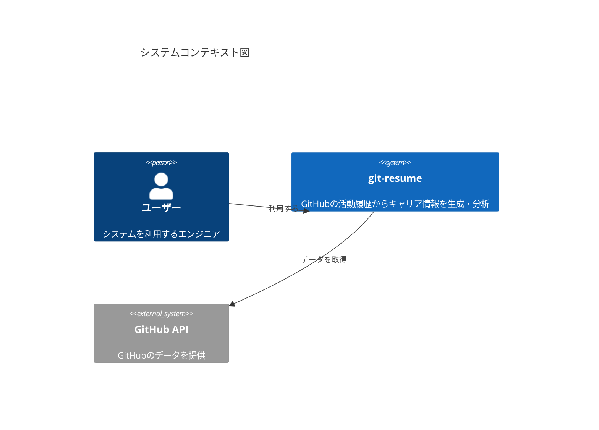
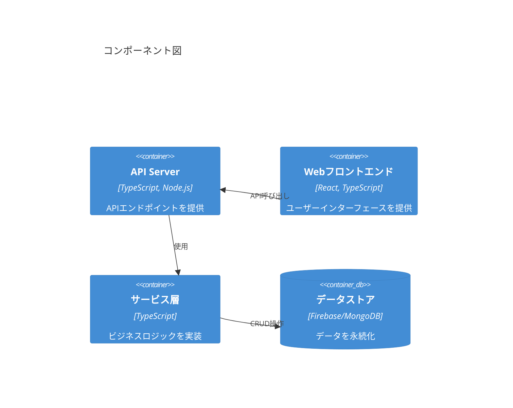
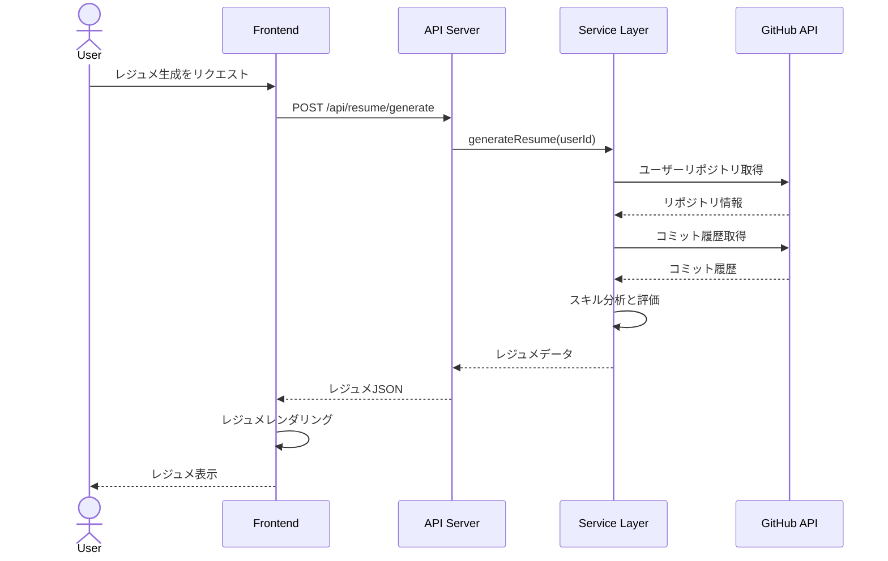

# [機能名] 技術設計書 (TDD)

**更新日**: YYYY/MM/DD
**確認日**: YYYY/MM/DD
**作成者**: [担当者名]
**レビュアー**: [レビュアー名]
**関連PRD**: [リンク]

## 1. 概要

### 1.1 目的

[この技術設計書の目的と、実装する機能の簡潔な説明を記述してください。]

### 1.2 背景

[技術的な観点から、この機能の実装が必要となった背景や理由を説明してください。]

### 1.3 設計原則

[この機能の実装において遵守すべき設計原則やアーキテクチャガイドラインを記述してください。]

## 2. アーキテクチャ概要

### 2.1 システムコンテキスト

[この機能が全体システムの中でどのように位置づけられるかを説明してください。必要に応じてコンテキスト図を含めます。]



### 2.2 コンポーネント構成

[機能を構成する主要コンポーネントとその関係性を説明してください。]



## 3. 詳細設計

### 3.1 データモデル

[実装に必要なデータモデル、スキーマ、エンティティ関係を詳細に記述してください。]

```typescript
// データモデルの例
interface User {
  id: string;
  username: string;
  githubId: string;
  email: string;
  createdAt: Date;
  updatedAt: Date;
}

interface Repository {
  id: string;
  name: string;
  owner: string;
  description: string;
  languages: Record<string, number>;
  stars: number;
  forks: number;
  createdAt: Date;
  updatedAt: Date;
}
```

### 3.2 API設計

[実装する予定のAPI（RESTful、GraphQL、gRPCなど）の詳細を記述してください。]

#### 3.2.1 エンドポイント定義

| エンドポイント | メソッド | 説明 | リクエスト例 | レスポンス例 |
|----------------|----------|------|-------------|-------------|
| `/api/v1/[リソース]` | GET | [説明] | `{ ... }` | `{ ... }` |
| `/api/v1/[リソース]` | POST | [説明] | `{ ... }` | `{ ... }` |

#### 3.2.2 認証・認可

[APIの認証・認可方式について説明してください。]

### 3.3 アルゴリズム・ロジック

[特に複雑なアルゴリズムやビジネスロジックについて、詳細に記述してください。疑似コードやフローチャートを使用すると効果的です。]

```
// 疑似コードの例
function calculateSkillLevel(commits, pullRequests, codeReviews) {
    let score = 0;
    
    // コミット数による評価
    if (commits > 1000) score += 5;
    else if (commits > 500) score += 3;
    else if (commits > 100) score += 1;
    
    // PRとコードレビューによる評価
    score += Math.min(5, pullRequests / 20);
    score += Math.min(5, codeReviews / 30);
    
    // 最終スコアを10段階で正規化
    return Math.min(10, Math.round(score));
}
```

### 3.4 UIコンポーネント設計

[フロントエンドの実装が必要な場合、UIコンポーネントの構造や状態管理について記述してください。]

#### 3.4.1 コンポーネント階層

```
App
└── Dashboard
    ├── Header
    │   ├── UserProfile
    │   └── Navigation
    ├── ResumeBuilder
    │   ├── TemplateSelector
    │   ├── ContentEditor
    │   └── ExportOptions
    └── SkillAnalytics
        ├── SkillChart
        └── RecommendationPanel
```

#### 3.4.2 状態管理

[Reduxストア設計、Context API、またはその他の状態管理アプローチについて説明してください。]

### 3.5 処理フロー

[主要なユースケースや機能の処理フローを記述してください。シーケンス図やアクティビティ図を含めると効果的です。]



## 4. 技術的考慮事項

### 4.1 パフォーマンス

[パフォーマンス要件と最適化戦略を記述してください。キャッシング、クエリ最適化、非同期処理など。]

### 4.2 スケーラビリティ

[システムの拡張性を確保するための設計上の考慮事項を記述してください。]

### 4.3 セキュリティ

[セキュリティ上の考慮事項と対策を記述してください。認証・認可、データ保護、入力バリデーションなど。]

### 4.4 テスト戦略

[この機能のテスト方針と具体的なテスト計画を記述してください。]

#### 4.4.1 単体テスト

[単体テストの範囲と方法を説明してください。]

#### 4.4.2 統合テスト

[統合テストの範囲と方法を説明してください。]

#### 4.4.3 E2Eテスト

[E2Eテストの範囲と方法を説明してください。]

### 4.5 監視とロギング

[運用時の監視とロギングの戦略を記述してください。]

## 5. 実装計画

### 5.1 タスク分解

[実装を複数のタスクに分解し、それぞれの見積もり時間と依存関係を記述してください。]

| ID | タスク | 説明 | 見積もり時間(人日) | 依存関係 |
|----|-------|------|------------------|----------|
| 1 | [タスク名] | [説明] | [見積もり] | - |
| 2 | [タスク名] | [説明] | [見積もり] | 1 |

### 5.2 マイルストーン

[主要なマイルストーンとその達成基準を記述してください。]

### 5.3 リソース要件

[実装に必要なリソース（人員、環境、ツールなど）を記述してください。]

## 6. 運用計画

### 6.1 デプロイメント戦略

[機能のデプロイ方法と手順を記述してください。Blue-Green、カナリアリリース、フィーチャーフラグなど。]

### 6.2 バックアップと復旧

[データのバックアップと復旧手順を記述してください。]

### 6.3 モニタリングとアラート

[本番環境での監視計画とアラート設定を記述してください。]

## 7. 代替案と決定

[設計プロセスで検討した代替案と、最終的な選択に至った理由を記述してください。]

| 選択肢 | 利点 | 欠点 | 選択/却下の理由 |
|-------|------|------|----------------|
| [選択肢1] | [利点] | [欠点] | [理由] |
| [選択肢2] | [利点] | [欠点] | [理由] |

## 8. 未解決の課題

[設計時点で未解決の課題や課題と、それらに対するアプローチを記述してください。]

## 9. 付録

### 9.1 参考文献

- [参考文献1]
- [参考文献2]

### 9.2 用語集

| 用語 | 定義 |
|------|------|
| [用語1] | [定義] |
| [用語2] | [定義] |

## Changelog

- YYYY/MM/DD: 初回作成
