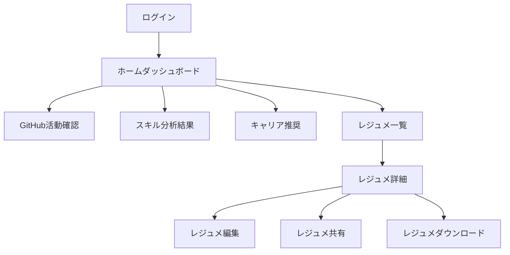

# ユーザーガイド

**更新日**: 2025/3/21
**確認日**: 2025/3/21

## 概要

git-resumeは、エンジニアのキャリア管理と成長をサポートするためのツールです。GitHubの活動履歴からレジュメを自動生成し、キャリアプランニングや自己マーケティング戦略の立案をサポートします。このガイドでは、git-resumeの基本的な使い方から高度な機能まで、順を追って説明します。

## 目次

- [始め方](#始め方)
- [Webアプリケーションの使い方](#webアプリケーションの使い方)
- [CLIツールの使い方](#cliツールの使い方)
- [レジュメの生成と管理](#レジュメの生成と管理)
- [リポジトリ分析機能](#リポジトリ分析機能)
- [キャリアプランニング機能](#キャリアプランニング機能)
- [トラブルシューティング](#トラブルシューティング)
- [よくある質問](#よくある質問)

## 始め方

### Webアプリケーションの利用

Webアプリケーションは以下のURLからアクセス可能です：

```
https://git-resume.example.com
```

初回アクセス時には、GitHubアカウントとの連携が必要です：

1. ホーム画面の「GitHubでログイン」ボタンをクリック
2. GitHubの認証画面で必要な権限を確認し、承認
3. git-resumeのダッシュボードにリダイレクトされます

### CLIツールのインストール

CLIツールは、npmを使用して簡単にインストールできます：

```bash
# グローバルインストール
npm install -g @resume/cli

# インストール確認
git-resume --version
```

## Webアプリケーションの使い方

Webアプリケーションには以下の主要な画面があります：

### ホームダッシュボード

```
/home
```

ダッシュボードでは、以下の情報を確認できます：

- GitHub活動の概要
- スキルの分析結果
- キャリア推奨事項
- 最近生成したレジュメ

操作フロー：



### GitHubユーザー情報ページ

```
/github/:userId
```

GitHubの活動データを詳細に確認できます：

- プロフィール情報
- リポジトリ一覧
- コミット履歴
- 言語使用率
- コントリビューション状況

### レジュメ生成・管理ページ

レジュメの生成と管理を行います：

1. 「新規レジュメ作成」ボタンをクリック
2. 分析したいリポジトリを選択（デフォルトでは全リポジトリ）
3. レジュメ形式を選択（Markdown, PDF, HTMLなど）
4. 「生成」ボタンをクリック
5. 生成完了後、プレビューが表示されます
6. 必要に応じて編集、ダウンロード、共有が可能

## CLIツールの使い方

CLIツールでは、コマンドラインから以下の主要機能を利用できます：

### ユーザー情報の取得

```bash
# GitHubユーザー情報の取得
git-resume github <username>

# 例
git-resume github ToyB0x
```

### リポジトリのクローン

```bash
# リポジトリのクローンまたは更新
git-resume clone <username/repository>

# 例
git-resume clone ToyB0x/git-resume
```

### レジュメの生成

```bash
# レジュメの生成
git-resume resume create --user <username> [options]

# 例: Markdown形式でレジュメを生成
git-resume resume create --user ToyB0x --format markdown

# 例: 特定のリポジトリのみを分析
git-resume resume create --user ToyB0x --repos repo1,repo2,repo3
```

利用可能なオプション：

| オプション | 説明 | デフォルト値 |
|---------|------|------------|
| `--format` | 出力フォーマット（markdown, pdf, html） | `markdown` |
| `--output` | 出力ファイルパス | `./resume-{username}.md` |
| `--repos` | 分析対象のリポジトリ（カンマ区切り） | すべてのリポジトリ |
| `--private` | プライベートリポジトリも含める | `false` |

### リポジトリの分析

```bash
# リポジトリのコード分析
git-resume pack create --repository <path>

# 例
git-resume pack create --repository ./my-project

# リポジトリのサマリー生成
git-resume summary create --repository <path>

# 例
git-resume summary create --repository ./my-project
```

## レジュメの生成と管理

git-resumeは、GitHubの活動データを分析して以下の情報を含むレジュメを生成します：

1. **プロフィール情報**
   - GitHub上の基本情報（名前、ユーザー名、ブログなど）

2. **技術スキル**
   - 使用言語とその割合
   - フレームワークやライブラリの使用経験
   - コード品質や開発スタイルの分析

3. **プロジェクト経験**
   - 貢献したプロジェクトの一覧
   - 各プロジェクトでの役割と貢献度
   - コードの特徴や成果

4. **活動統計**
   - コミット頻度
   - PR/イシュー活動
   - コラボレーション状況

### レジュメのカスタマイズ

生成されたレジュメは、Webインターフェース上で編集できます：

- セクションの追加・削除・並べ替え
- 内容の編集・修正
- 強調したい項目のハイライト
- プロジェクト説明の詳細化

### レジュメの共有

レジュメは以下の方法で共有できます：

- 公開URLの生成（期限設定可能）
- PDFダウンロード
- メール送信
- LinkedInプロフィールとの連携

## リポジトリ分析機能

リポジトリ分析機能では、コードベースを深く分析し、以下の情報を提供します：

1. **コード構造**
   - ファイル構成
   - モジュール間の依存関係
   - アーキテクチャパターンの検出

2. **言語・フレームワーク**
   - 使用言語の割合
   - 主要ライブラリ・フレームワーク
   - 開発環境やツール

3. **コード品質**
   - 複雑性メトリクス
   - ベストプラクティスの遵守度
   - リファクタリング候補

4. **コントリビューション**
   - 貢献者とその役割
   - コミットパターン
   - チーム開発の特徴

## キャリアプランニング機能

キャリアプランニング機能では、GitHubの活動分析から以下の提案を行います：

1. **スキルギャップの特定**
   - 現在のスキルセットの評価
   - 業界トレンドとの比較
   - 習得すべきスキルの提案

2. **キャリアパス提案**
   - 現在のスキルセットに基づく職種の提案
   - 次のステップのための行動計画
   - 業界での位置づけ分析

3. **自己マーケティング戦略**
   - プロフィールの強化ポイント
   - オープンソース貢献の機会
   - ネットワーキングの提案

## トラブルシューティング

### Webアプリケーション

| 問題 | 解決策 |
|-----|--------|
| GitHubログインが失敗する | ブラウザのCookieとキャッシュをクリアし、再試行してください |
| レジュメ生成が進まない | GitHubのレート制限に達している可能性があります。しばらく待ってから再試行してください |
| データが正しく表示されない | ページを更新するか、ログアウト後に再ログインしてください |

### CLIツール

| 問題 | 解決策 |
|-----|--------|
| `Command not found` | npmのグローバルパスが環境変数に設定されているか確認してください |
| GitHubトークンエラー | 環境変数に有効なGitHubトークンが設定されているか確認してください |
| 接続タイムアウト | ネットワーク接続を確認し、GitHubのステータスページを確認してください |

## よくある質問

### 一般的な質問

**Q: git-resumeは無料で使えますか？**  
A: 基本機能は無料で使用できます。高度な分析機能やカスタム機能は有料プランで提供される予定です。

**Q: どのようなGitHub権限が必要ですか？**  
A: 基本的には読み取り専用の権限（public_repo）が必要です。プライベートリポジトリも分析したい場合は、追加の権限が必要になります。

**Q: 生成されたレジュメのデータは保存されますか？**  
A: はい、アカウントに紐づけて保存されます。ただし、「プライベートモード」で生成した場合は保存されません。

### 技術的な質問

**Q: 大規模リポジトリの分析にはどれくらい時間がかかりますか？**  
A: リポジトリのサイズによりますが、通常は数分から10分程度です。非常に大きなリポジトリの場合は、さらに時間がかかる場合があります。

**Q: オフライン環境でも使用できますか？**  
A: CLIツールは一度ダウンロードしたデータをキャッシュするので、制限付きで使用可能です。ただし、初回分析やデータ更新には接続が必要です。

**Q: APIはありますか？**  
A: はい、RESTful APIが提供されています。詳細は[API仕様書](/docs/api/README.md)を参照してください。

## Changelog

- 2025/3/21: 初回作成
